# ImStocker Studio Guide

## Beginning of work

### First launch 

The IMS Studio software is available for download on the main site [https://imstocker.com/](https://imstocker.com/)

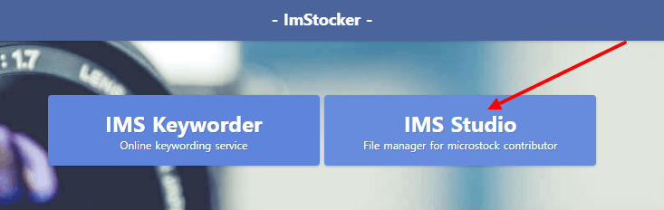

When you click on the IMS Studio button, a window for selecting the user's operating system will open. Select and click on the download button

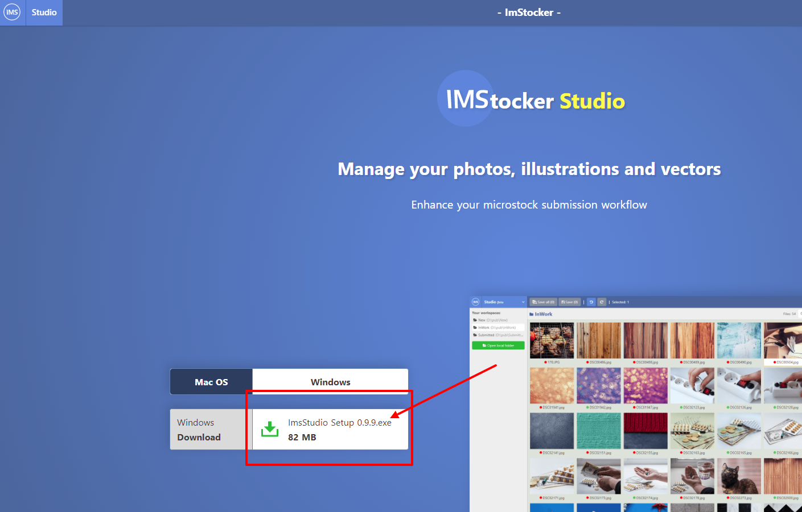

After installation and launch, you will be greeted with a welcome window, from which you can log in and register in the program:

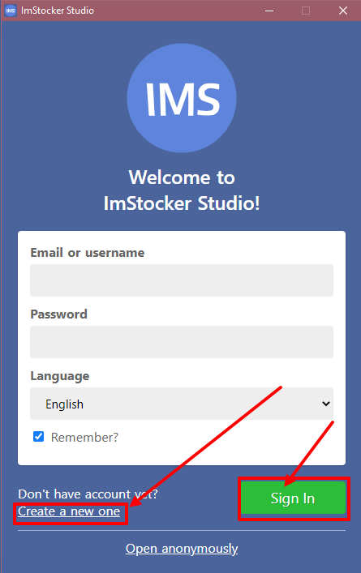

Registration in the service is quick and easy, without filling out questionnaires.

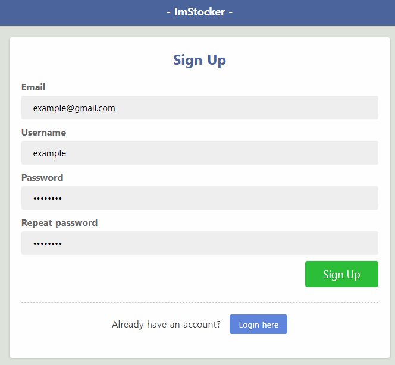

And for cases when the deadline is upon you and every second counts, there is a way to enter instantly and anonymously, skipping the registration stage:

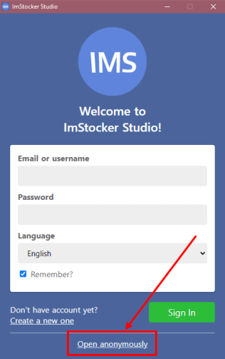

When you first enter the program, you will see the **main window**, which will politely tell you how to start your work with **IMStocker Studio**:

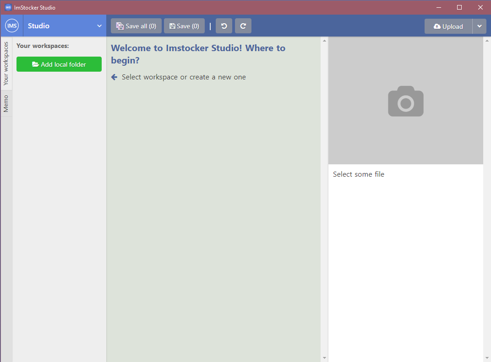

### Main window

The functionality is divided into the following areas:

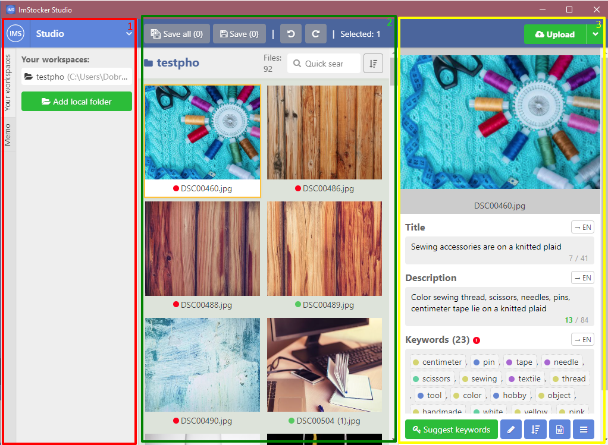

**1** - Basic program control, context menu, workspaces, metadata buffer tool

**2** - Contents of the workspace, navigation within the folder, saving, canceling actions

**3** - File preview, boxes for filling metadata: title, description, keywords

### Main menu

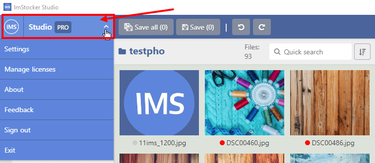

The main program control menu contains **Settings**, the ability to update the program to the **PRO** version, brief information about the program, a feedback button with the developer, as well as the ability to change the user and exit..

In the **Program Settings**, you can change the language of use, configure the default rules for checking metadata, and change the display mode for thumbnails:

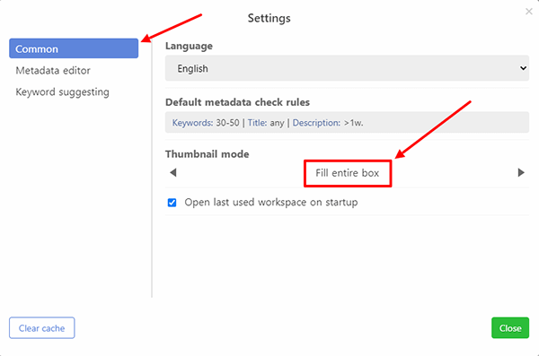

### Working areas

The main interactions with files in **IMStocker Studio** take place through “**workspaces**”. Workplace is a folder that contains the files for editing. To get started, you need to add a new folder using the "**Add local folder**" button:

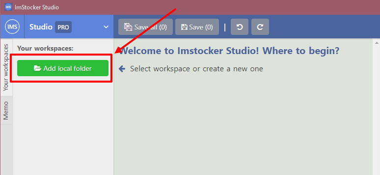

The folder can contain files of 2 regular types: **JPG** and **EPS**, as well as the combined **JPG + EPS** format supported by **IMStocker studio**.
The contents of the selected folder appear in the thumbnail display area.

Right there you can sort them in a way convenient for you or quickly find the file you need:

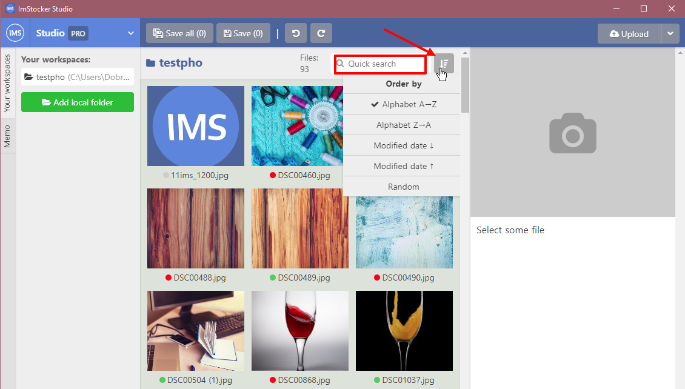

### Context menu

When you right-click on any of the files in the workspace, the context menu appears:

It allows you to quickly open a file in File Explorer, copy or paste copied metadata, as well as rename or move a file to another Workspace / Folder.

### File status

When loading the contents of a folder in the thumbnail display area, each file will receive an indicator of how much of its metadata is filled (a circle in the file name):

**Green** - everything is filled

**Red** - partially filled

**Gray** - nothing is filled

You can configure the default metadata validation rules in the **common settings**:

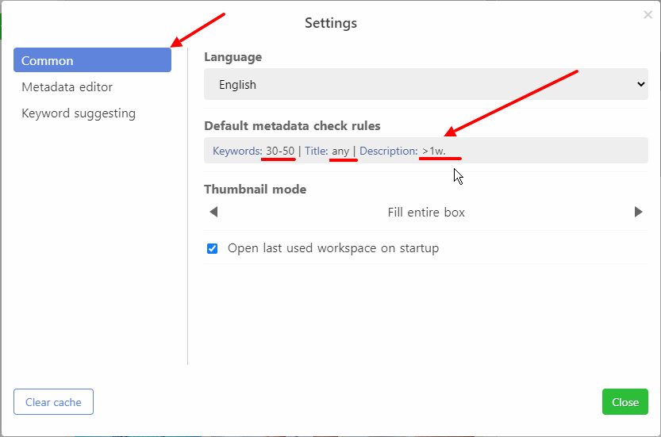

## Editing files

### Editing metadata

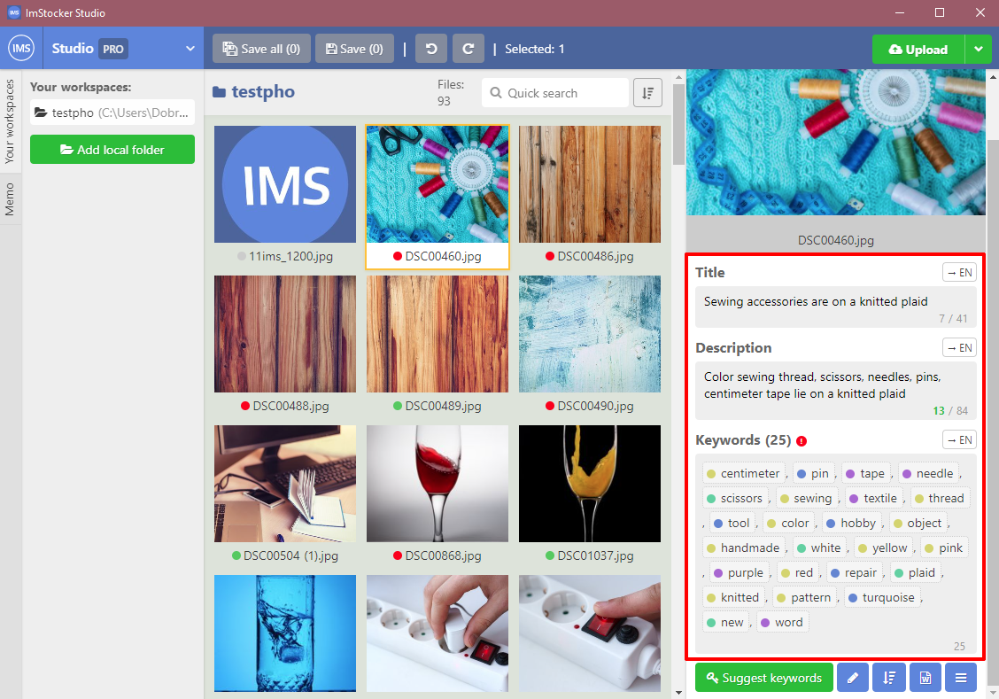

Metadata editing of the selected file occurs on the right side of the program. The editor consists of three boxes: **Title**, **Description**, **Keywords**.

After the metadata editing of one or several files, you can either save currently selected file, or all the changes at once, as well as undo or redo any changes you made:

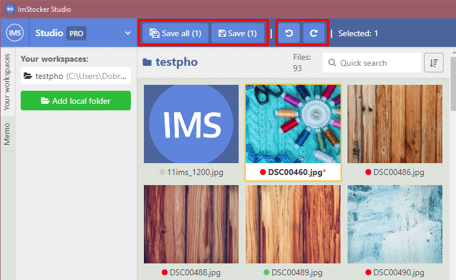

For user's convenience , there is a mechanism for changing the visual display of keywords. It is located in **Settings** - **Metadata Editor**:

In the lower right corner of the program there are several tools that greatly simplify the work with keywords:

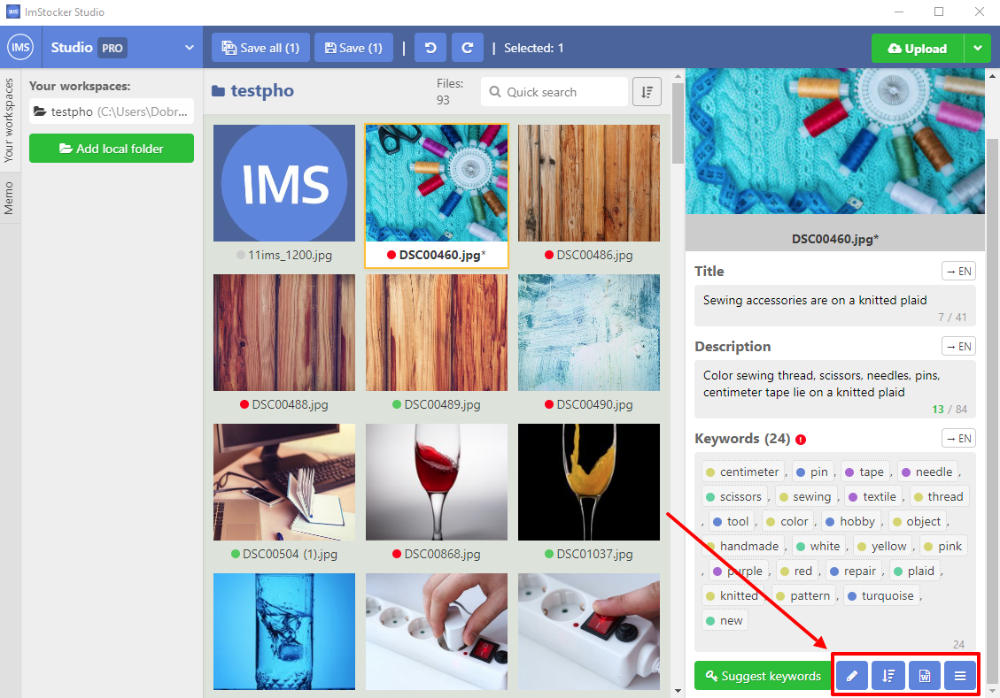

   - The "**Transform keywords**" button allows you to make quick changes to all keywords at the same time: translate words into singular / plural, as well as the ability to remove the same root / similar words, words exceeding the set limit and words with errors.
   
   - The “**Sort keywords**” button allows for the convenience of displaying to sort keywords by popularity, number of downloads, alphabet in forward and reverse order, as well as randomly.
   
   - The "**Templates**"  button allows you to create your own set of keywords, and quickly apply it if necessary, greatly simplifying the work with keywords if you are working with a large number of similar pictures / photos.
   
   - The “**Menu**” button allows you to work with the functions of import / export of metadata, as well as with the buffer of metadata.

### Browsing for keywords

In the lower right corner of the program, you can also find the integrated browsing service **ImStocker Keyworder**, which allows you to quickly browse keywords on stocks using a number of convenient filters.

In order to use the **ImStocker Keyworder** service, you need to select one or several files to which you will search for words, and click the "**Suggest keywords**" button:

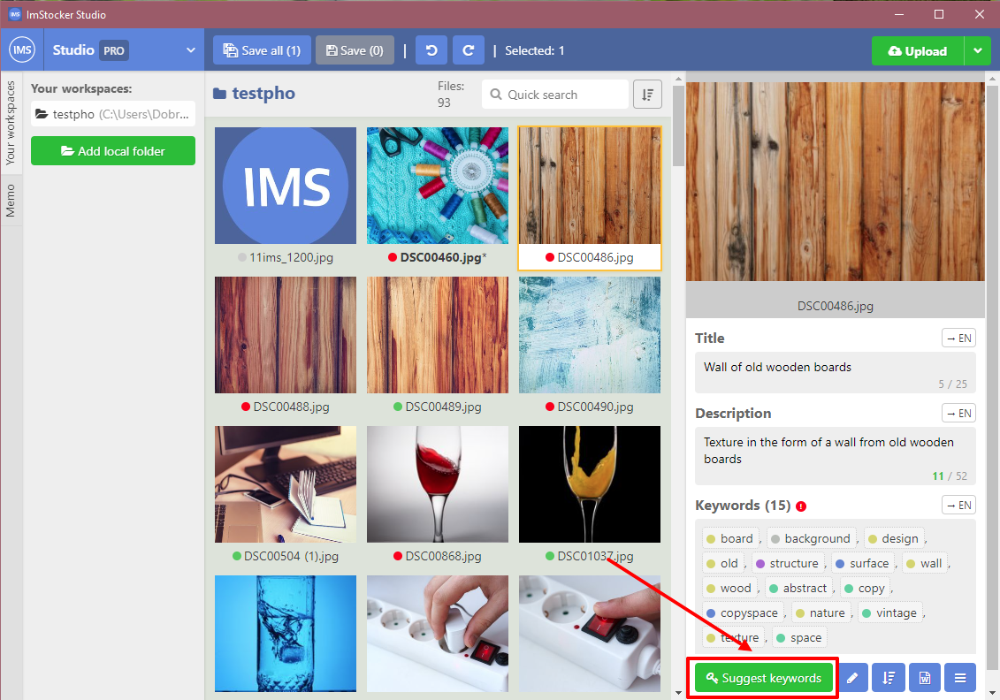

To get the first results, it is enough to:

  **1** Enter one keyword and press **Enter** or the search button
  
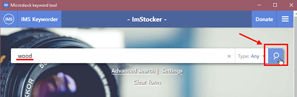

  **2** Choose one picture or more that associated with the chosen word from suggested images:
  
 

The keywords in the search result box can be quickly sorted by its **Rank**: 

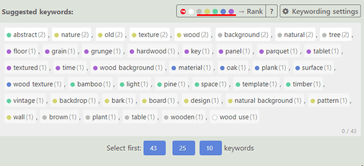 

The **Rank** of a keyword depends on how many times it was downloaded, viewed, by its level of market competition and global trends and the end result is measured using a colored circle next to the keyword:

**0 - White color** means that there is not enough information in the ImStocker database to conclude whether this word is selling or not

**1 - Gray color** means bad rank. The word is either already used very often, or works that are using it are generally not selling very well

**2 - Yellow** means low rank. It is not recommended to use a lot of these words when keying.

**3 - Green** means normal rank. This word is quite popular and not too competitive.

**4 - Blue** means good rank.

**5 - Purple** means excellent rank. Low competition, high sales

You can also customize the display of search results in the settings for suggested keywords 

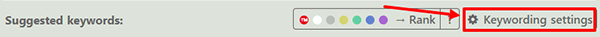 

 

Among all the keywords found, you must choose the ones that you will use and mark them by clicking your mouse. Each marked word goes down into a special box for further use:

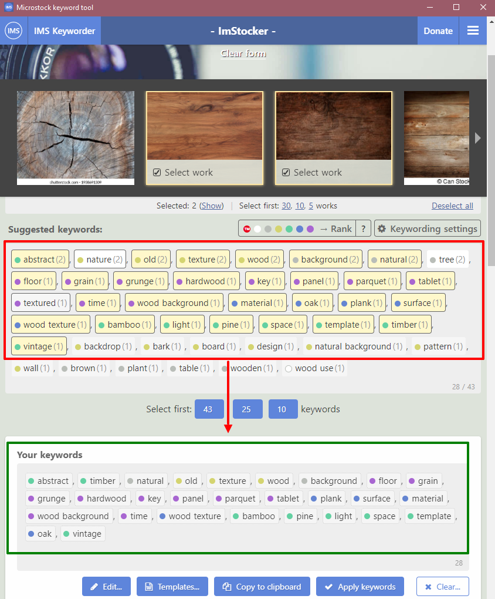 

To save time, all the keywords you have selected can be immediately applied with the “**Apply keywords**” button to the file / files in your workspace:

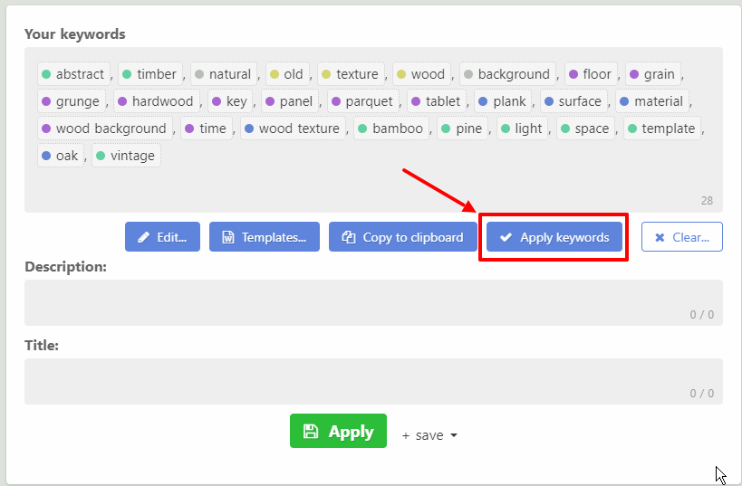 

By using the “**Edit**” button, the chosen words can be:
- **Sorted** by rank, alphabet in forward and reverse order, by number of downloads or randomly.

- **Transformed** into singular / plural, remove: similar words, words that exceed the limit you yourself set and words with some kinds of errors in it.

- Edited with small visual display **settings**

 

“**Templates**” button allows you to create a new one or edit the templates you have already created. Clicking on the template you created will open the keywords it contains:

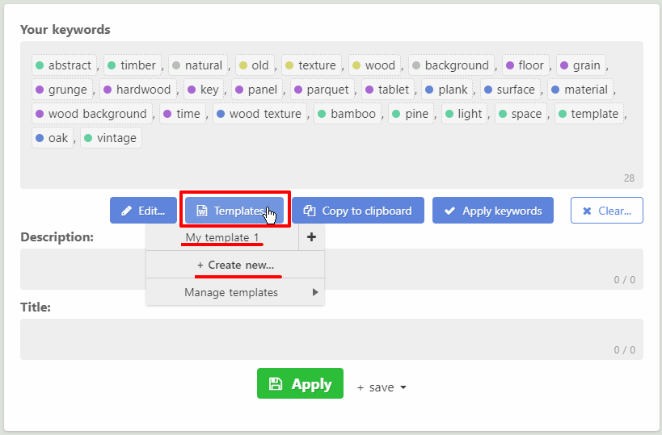 

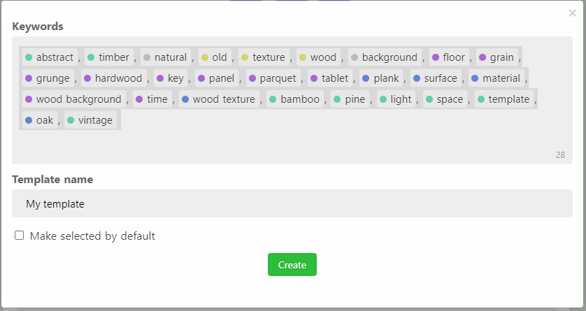 

Clicking on keywords from this template will add them to the “**Your keywords**” box. Inside the template, you can quickly add all keywords at once with the “Select all” button, add one/several random words with the “**Select random**” button, or make changes to the contents or the name of the template itself with the “Edit” button. Or you can completely delete this template.

 

The same button contains the “Template Management” tools, that allow you to export created templates to an external **.csv** file or import templates from the same kind of file.

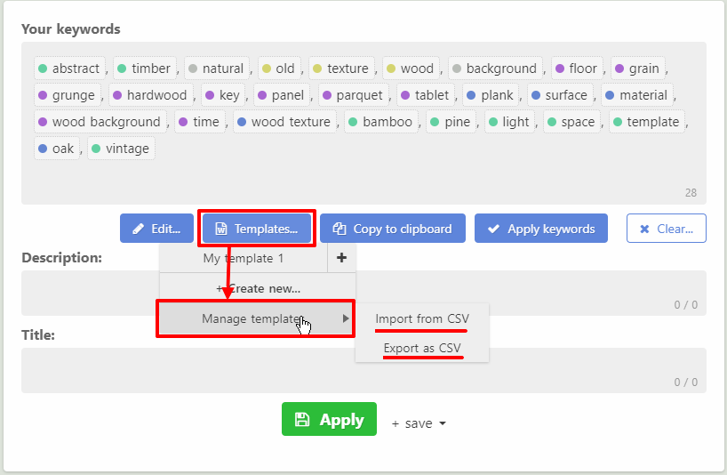 

After the list of keywords is formed, and your work with **ImStocker Keyworder** is complete, the result can be **Applied** to the selected images in the workspace of I**mStocker Studio** and choose what to do with the **ImStocker Keyworder** window:

 

Keywords from the **Your keywords** box, as well as the contents of the **Description** and **Name** boxes, will **Apply** to the selected file / files in the workspace, the action from the context menu applies only to the **ImStocker Keyworder** service window.

Also, small changes for the behavior of the **ImStocker Keyworder** window can be made in **Main menu / Settings /Keyword suggesting**:

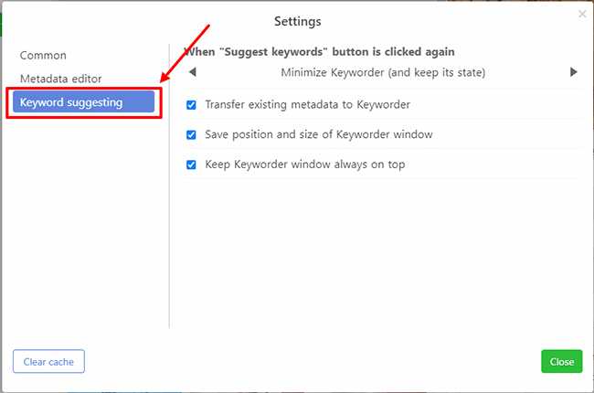 

### Metadata copying / pasting

**IMStocker Studio** implements a mechanism for copying all of the file’s metadata in order to be applied to one or several files in the workspace, which saves a significant amount of time when you are dealing with a large library of pictures / photos.
There are several ways to copy metadata of a file:

**Through the context menu**: when you right-click on the selected image, a context menu will appear. Go to the **Metadata** section and click **Copy metadata to Memo**

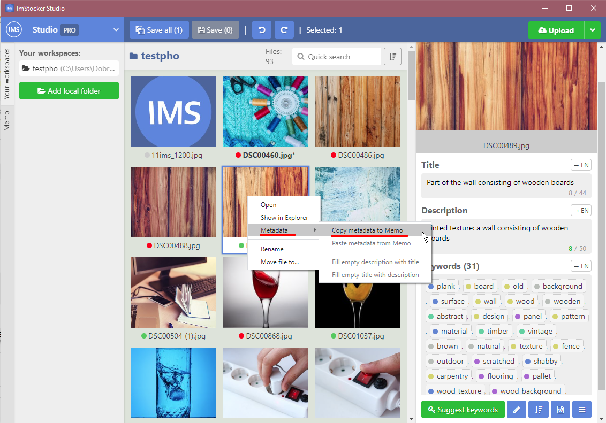 

To apply the copied metadata to one or several files, select the necessary images and right-click - **Metadata - Paste metadata from Memo**:

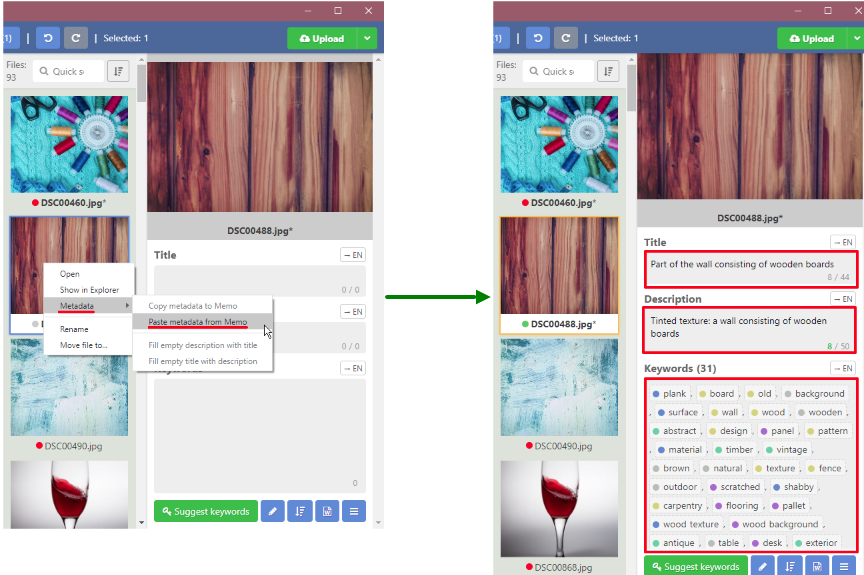 

The metadata will be copied and will become identical to the metadata of the original image.

The second way to copy metadata is through the editing panel in the lower right corner of the program. Press the **Menu** button and choose **Copy metadata to Memo**, then select one or more files where you want to copy the metadata and click **Paste metadata from the Memo**:

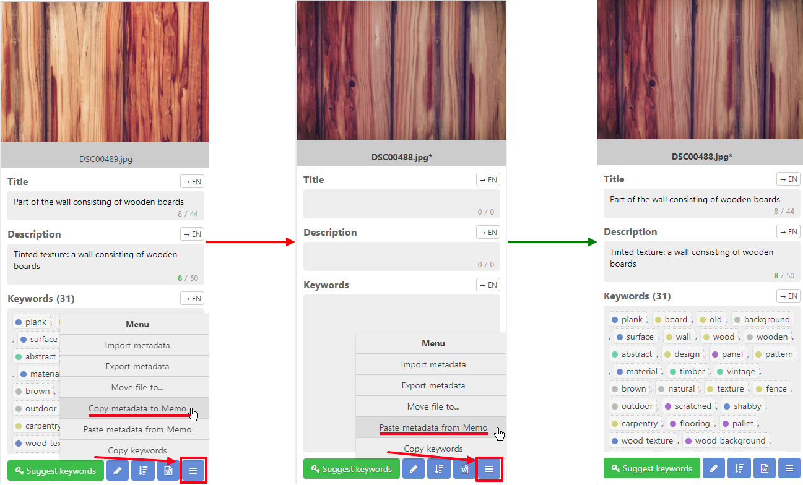 

At any moment when you are copying metadata, you can see what is currently stored in the memo, and, if necessary, make adjustments to it, before pasting metadata into another file. To do this, go to the **Memo** section on the left border of **IMStocker Studio**:

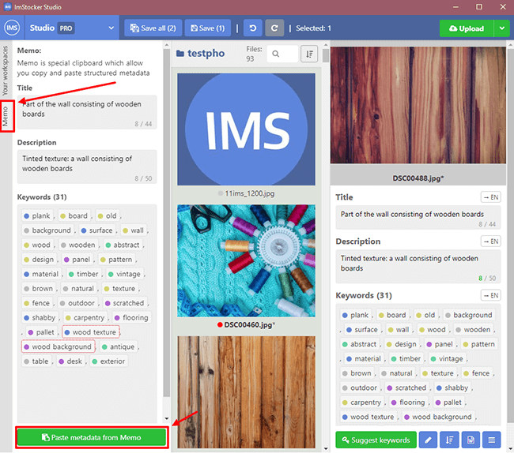 

This section has its own **Paste metadata from Memo** button, that will apply everything from the memo to the selected file  in the central area of a screen.

### Multiple choice

The ability to edit multiple files at once will save you time when you are dealing with a large number of similar images. To edit several files, click them with the left mouse button, holding down the Ctrl key. All selected pictures will be combined into a group, its composition and the number of selected files will be displayed in the upper right corner of the program:

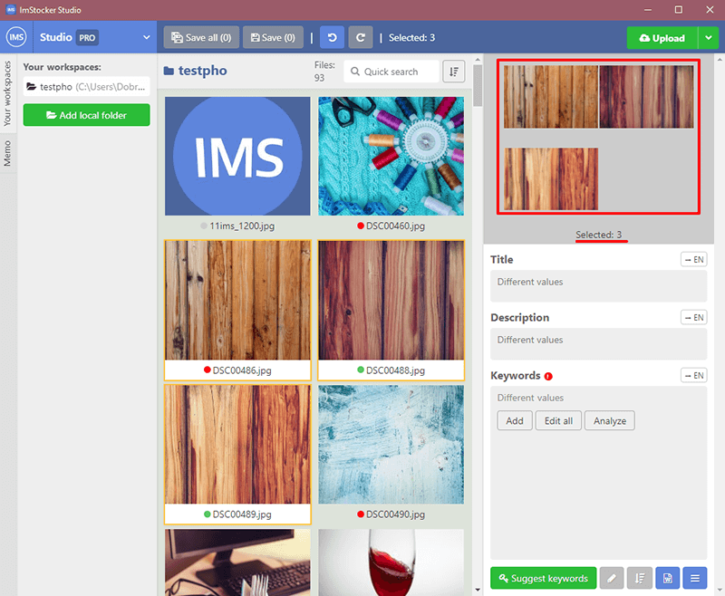 

Everything that you type in the **Name** and **Description** boxes in this mode will replace the contents of such boxes for each image respectively. With the **Keywords** box  you can choose the **Edit all** option, completely replacing the keywords of the chosen files with the new ones that you enter or you can choose the **Add** option that will add new words to the **Keywords** box of the images, saving the ones that are already there.

### Templates

Working with templates in **IMStocker Studio** will significantly speed up the process of adding keywords to files. The template management menu is located in the lower right corner of the program and appears once you click on any picture from the workspace:

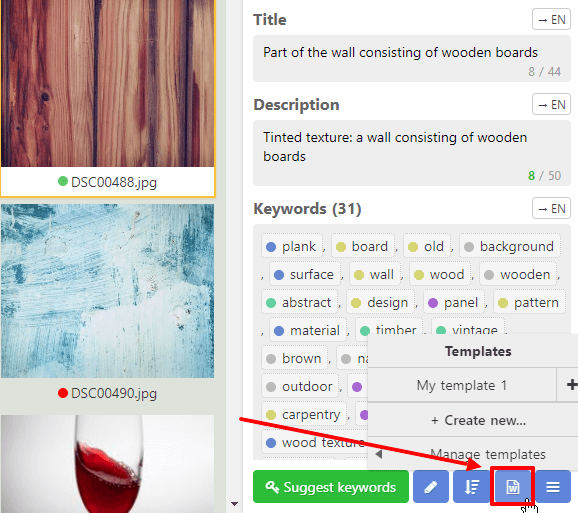 

This menu displays a list of already created templates, the button for creating a new template, as well as the tools to import templates from a **.csv** file or export your templates into such a file.

If you click on one of your templates, it will open the list of keywords it contains. Keywords of content matching with the  selected file will be marked, and all keywords that you mark by clicking will be added to the **Keywords** box of the selected file. Also in this window, you can **Edit** or **Delete** a template, add all keywords to the file at once with the **Select all** button or several random words with the **Select randomly** button.

**Manage templates** feature contains **The Import / Export Templates** tools that allow you to transfer templates between devices or users.

## File management

### Export metadata (PRO)

Metadata exporting  is one of the key features of the **PRO** version of **IMStocker Studio**, which allows you to export the metadata of selected images into a separate **.csv** file in a few clicks.

In order to use the export function, press the **Menu** button in the lower right corner and select **Export metadata**:

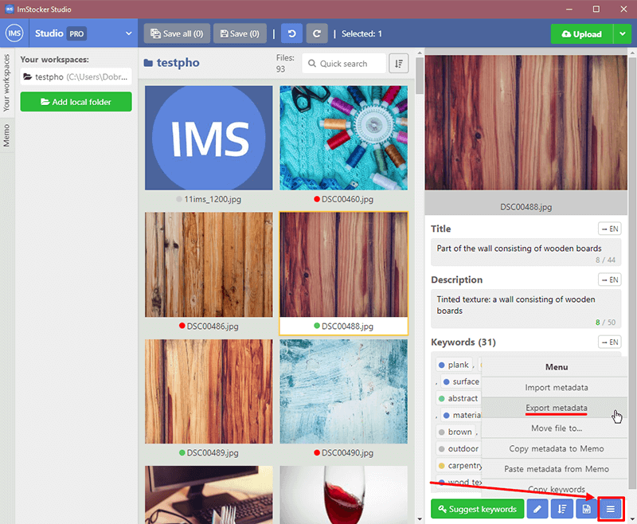 

The export window provides an opportunity to select one or several templates used by microstocks, or create one yourself, according to your needs:

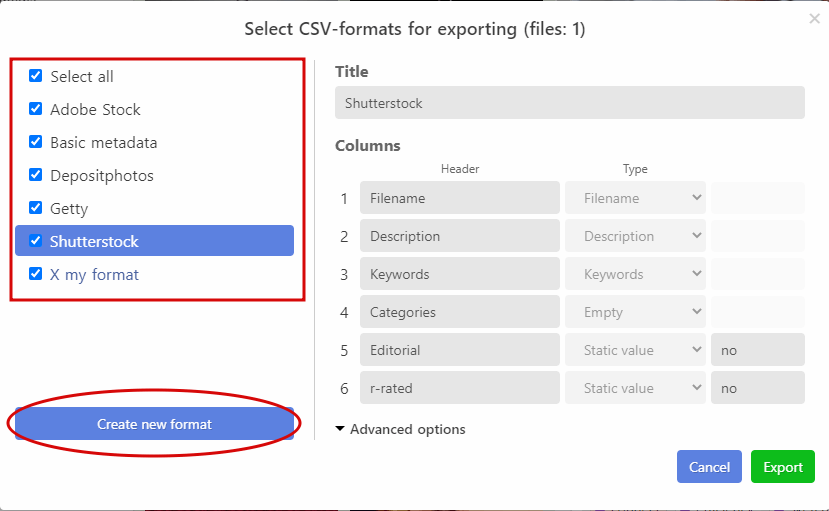 

A **.csv** file containing the metadata file  will be created for each selected template:

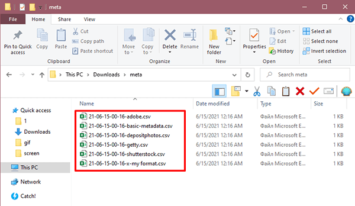 

### Metadata Importing  (PRO)

Metadata importing is another feature of the **PRO** version of **IMStocker Studio**, which allows you to quickly load metadata from a **.csv** file to the selected pictures in the work area.

In order to use it, select the pictures, that are referenced in a **.csv** file, click the **Menu** in the lower right corner and then **Import metadata**: (program is checking whether the metadata belongs to the picture by the name of a file)

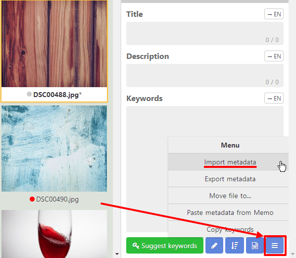 

Select the **.csv** file of the required template and click **Open**:

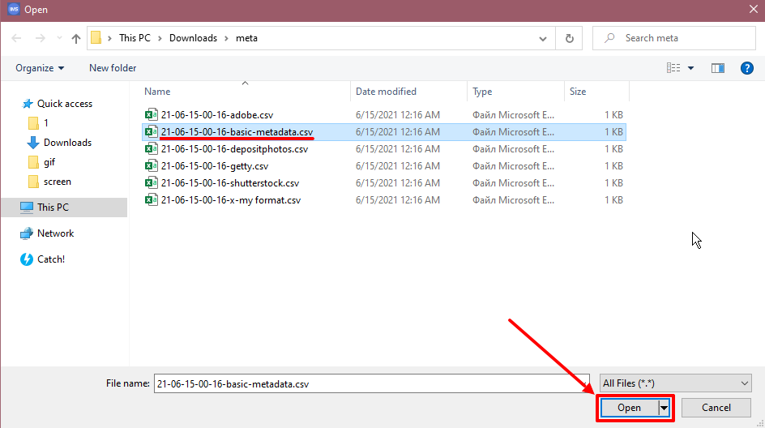 

Based on the metadata in the file, the program will try to determine which template is used and offer it. Click **Import**: 

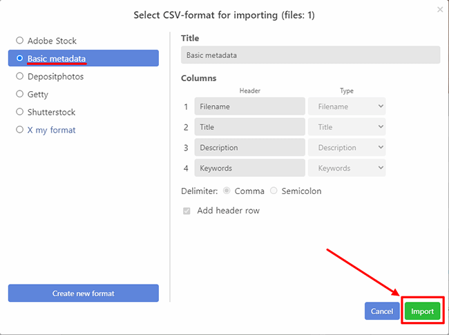 

Finally, check that all the boxes are filled for each of the images mentioned in the file.

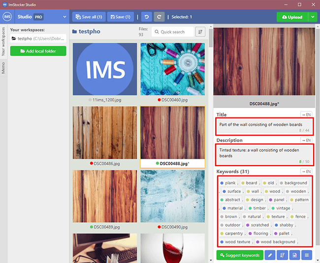 

### Renaming files

**IMStocker Studio** allows you to rename a picture without closing the program. To do this, right-click on the picture in the workspace and click **Rename** in the context menu:

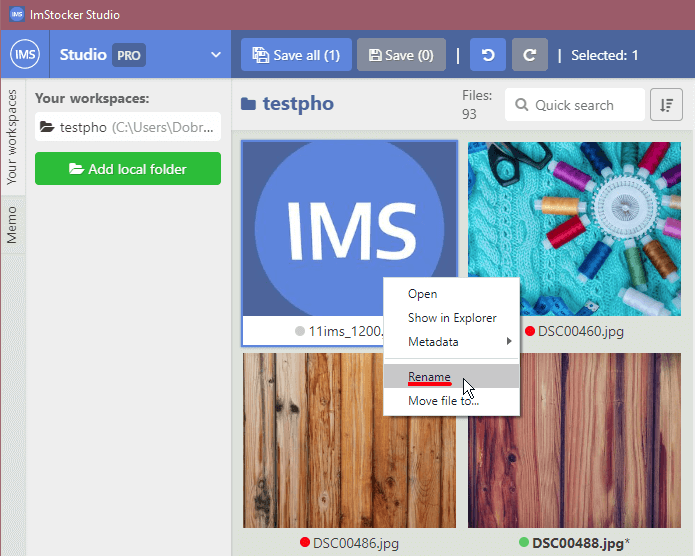 

Or simply double-click on the name of the file with the left mouse button:

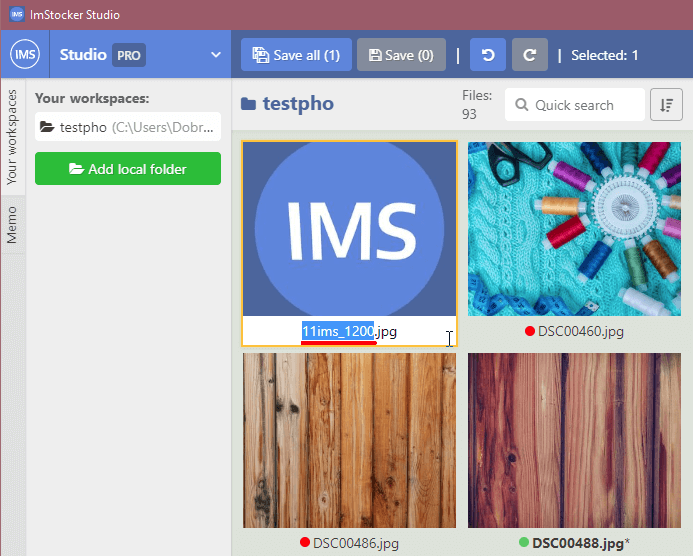 

### Moving files

The IMStocker Studio program also allows you to move the picture without closing the program. To do this right-click on the picture in the workspace and click **Move file to** in a context menu:

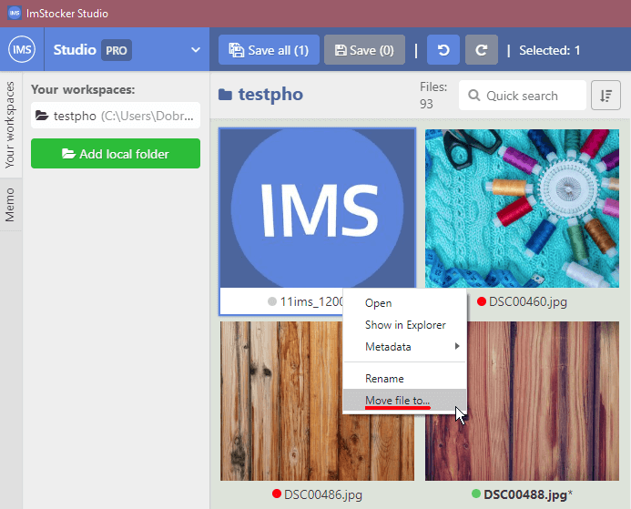 

Or select the pictures that need to be moved and use the **Menu** button in the lower right corner of the program, then click ** Move file to**:

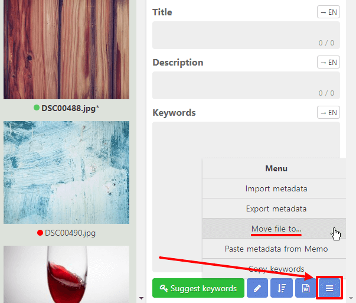 

In both cases, window will open, allowing you to **Move** the selected images to one of the added workplaces or into the folder created inside them:

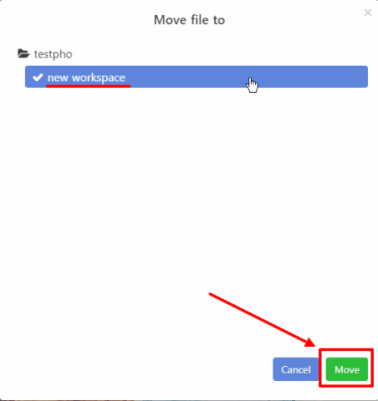 

