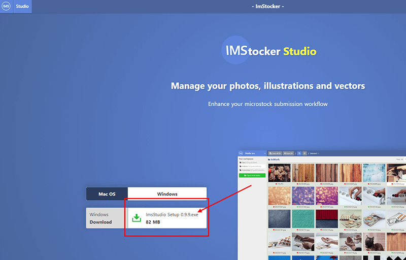
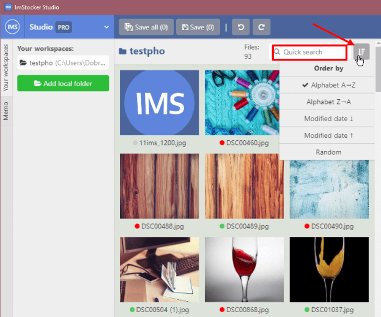

# ImStocker Studio Guide

## Beginning of work

### First launch 

The IMS Studio software is available for download on the main site [https://imstocker.com/](https://imstocker.com/)

When you click on the IMS Studio button, a window for selecting the user's operating system will open. Select and click on the download button.

After installation and launch, you will be greeted with a welcome window, from which you can log in and register in the program:

Registration in the service is quick and easy, without filling out questionnaires.

And for cases when the deadline is upon you and every second counts, there is a way to enter instantly and anonymously, skipping the registration stage:

When you first enter the program, you will see the **main window**, which will politely tell you how to start your work with **IMStocker Studio**:

### Main window

The functionality is divided into the following areas:

**1** - Basic program control, context menu, workspaces, metadata buffer tool

**2** - Contents of the workspace, navigation within the folder, saving, canceling actions

**3** - File preview, boxes for filling metadata: title, description, keywords

### Main menu

The main menu contains **Settings**, the ability to update the program to the **PRO** version, brief information about the program, a feedback button with the developer, as well as the ability to **change the user** and **exit**.

In the **Program Settings**, you can change the language of use, configure the default rules for checking metadata, and change the display mode for thumbnails:

### Working areas

The main interactions with files in **IMStocker Studio** take place through “**workspaces**”. Workplace is a folder that contains the files for editing. To get started, you need to add a new folder using the "**Add local folder**" button:

The folder can contain files of 2 regular types: **JPG** and **EPS**, as well as the combined **JPG + EPS** format supported by **IMStocker studio**.
The contents of the selected folder appear in the thumbnail display area.

Right there you can sort them in a way convenient for you or quickly find the file you need by a name:

### Context menu

When you right-click on any of the files in the workspace, the context menu appears:

It allows you to quickly open a file in File Explorer, copy or paste copied metadata, as well as rename or move a file to another Workspace / Folder.

### File status

When loading the contents of a folder in the thumbnail display area, each file will receive an indicator of how much of its metadata is filled (a circle in the file name):

**Green** - everything is filled

**Red** - partially filled

**Gray** - nothing is filled

You can configure the default metadata validation rules in the **common settings**:

## Editing files

### Editing metadata

Editing the metadata of the selected file occurs in the right side of the program. The editor consists of three boxes: **Title**, **Description**, **Keywords**.
