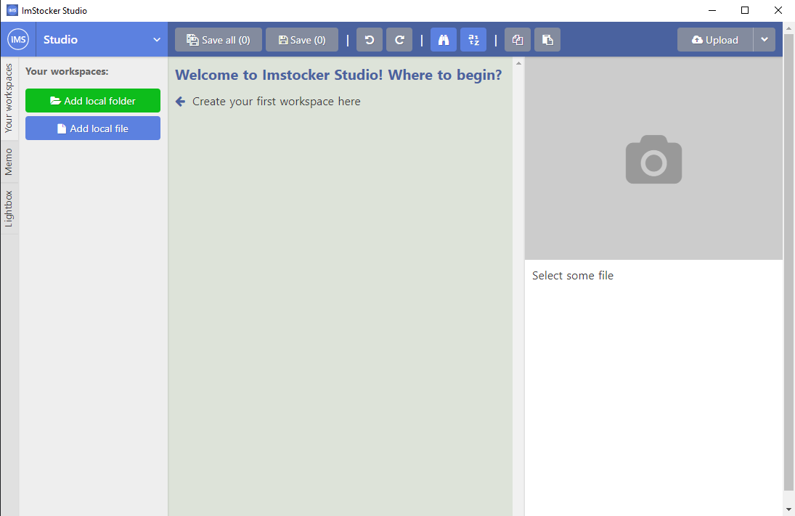
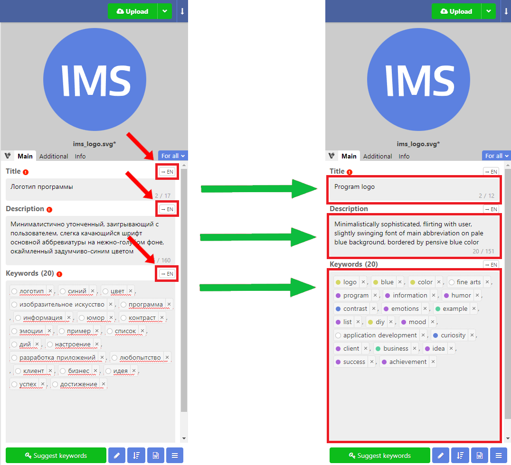
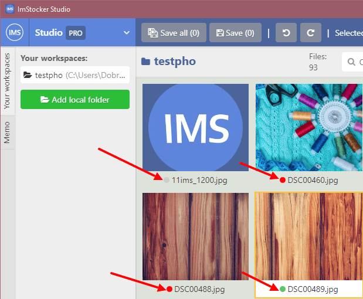
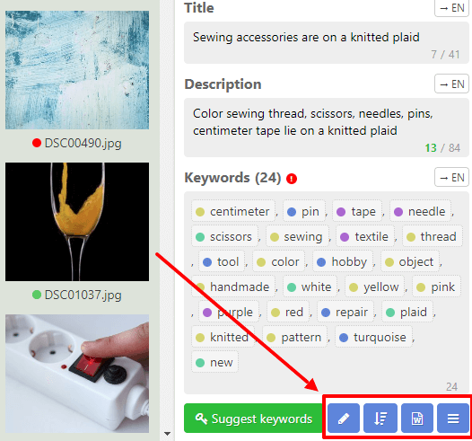
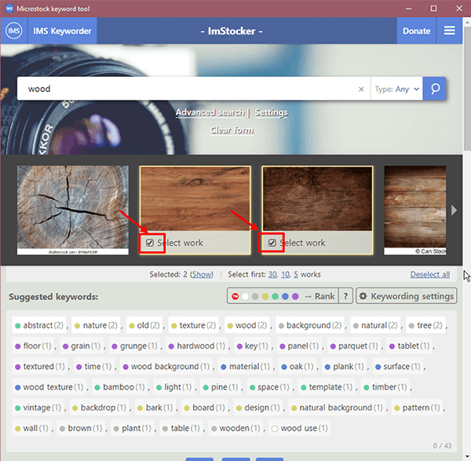
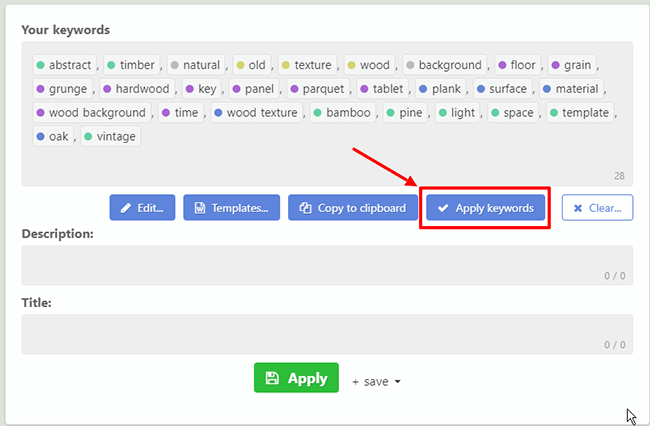

# ImStocker Studio Guide

## Beginning of work

### First launch 

The IMS Studio software is available for download on the main site [https://imstocker.com/](https://imstocker.com/)

When you click on the IMS Studio button, a window for selecting the user's operating system will open. Select and click on the download button.

After installation and launch, you will be greeted with a welcome window, from which you can log in and register in the program:

Registration in the service is quick and easy, without filling out questionnaires.

And for cases when the deadline is upon you and every second counts, there is a way to enter instantly and anonymously, skipping the registration stage:

When you first enter the program, you will see the **main window**, which will politely tell you how to start your work with **IMStocker Studio**:

### Main window

The functionality is divided into the following areas:

**1** - Basic program control, context menu, workspaces, metadata buffer tool

**2** - Contents of the workspace, navigation within the folder, saving, canceling actions

**3** - File preview, boxes for filling metadata: title, description, keywords

### Main menu

The main menu contains **Settings**, the ability to update the program to the **PRO** version, brief information about the program, a feedback button with the developer, as well as the ability to **change the user** and **exit**.

In the **Program Settings**, you can change the language of use, configure the default rules for checking metadata, and change the display mode for thumbnails:

### Working areas

The main interactions with files in **IMStocker Studio** take place through “**workspaces**”. Workplace is a folder that contains the files for editing. To get started, you need to add a new folder using the "**Add local folder**" button:

The folder can contain files of 2 regular types: **JPG** and **EPS**, as well as the combined **JPG + EPS** format supported by **IMStocker studio**.
The contents of the selected folder appear in the thumbnail display area.

Right there you can sort them in a way convenient for you or quickly find the file you need by a name:

### Context menu

When you right-click on any of the files in the workspace, the context menu appears:

It allows you to quickly open a file in File Explorer, copy or paste copied metadata, as well as rename or move a file to another Workspace / Folder.

### File status

When loading the contents of a folder in the thumbnail display area, each file will receive an indicator of how much of its metadata is filled (a circle in the file name):

**Green** - everything is filled

**Red** - partially filled

**Gray** - nothing is filled

You can configure the default metadata validation rules in the **common settings**:

## Editing files

### Editing metadata

Editing the metadata of the selected file occurs on the right side of the program. The editor consists of three boxes: **Title**, **Description**, **Keywords**.

After editing the metadata of one or several files, you can either save currently selected file, or all the changes at once, as well as undo or redo any changes you made:

For user's convenience , there is a mechanism for changing the visual display of keywords. It is located in **Settings** - **Metadata Editor**:

In the lower right corner of the program there are several tools that greatly simplify the work with keywords:

   - The "Transform keywords" button allows you to make quick changes to all keywords at the same time: translate words into singular / plural, as well as the ability to remove the same root / similar words, words exceeding the set limit and words with errors.
   - The “Sort keywords” button allows for the convenience of displaying to sort keywords by popularity, number of downloads, alphabet in forward and reverse order, as well as randomly.
   - The "Templates"  button allows you to create your own set of keywords, and quickly apply it if necessary, greatly simplifying the work with keywords if you are working with a large number of similar pictures / photos.
   - The “Menu” button allows you to work with the functions of import / export of metadata, as well as with the buffer of metadata.

### Browsing for keywords

In the lower right corner of the program, you can also find the integrated browsing service **ImStocker Keyworder**, which allows you to quickly browse keywords on stocks using a number of convenient filters.

In order to use the **ImStocker Keyworder** service, you need to select one or several files to which you will search for words, and click the "**Suggest keywords**" button:

To get first results, it is enough to:

  **1** Enter one keyword and press **Enter** or the search button
  

  **2** Choose one picture or more that associated with the chosen word from suggested images:
  
 

The keywords in the search result box can be quickly sorted by its **Rank**: 

 

The **Rank** of a keyword depends on how many times it was downloaded, viewed, by its level of market competition and global trends and the end result is measured using a colored circle next to the keyword:

**0 - White color** means that there is not enough information in the ImStocker database to conclude whether this word is selling or not

**1 - Gray color** means bad rank. The word is either already used very often, or works that are using it are generally not selling very well

**2 - Yellow** means low rank. It is not recommended to use a lot of these words when keying.

**3 - Green** means normal rank. This word is quite popular and not too competitive.

**4 - Blue** means good rank.

**5 - Purple** means excellent rank. Low competition, high sales

You can also customize the display of search results in the settings for suggested keyword

 

 

Among all the keywords found, you must choose the ones that you will use and mark them by clicking your mouse. Each marked word goes down into a special box for further use:

 

To save time, all the keywords you have chosen can be immediately applied with the “**Apply keywords**” button to the file / files in your workspace:

 

By using the “**Edit**” button, the chosen words can be:
- **Sorted** by rank, alphabet in forward and reverse order, by number of downloads or randomly.
- **Transformed** into singular / plural, remove: similar words, words that exceed the limit you yourself set and words with some kinds of errors in it.
- Edited using small visual display **settings**

 

“**Templates**” button allows you to create a new one or edit the templates you have already created. Mouse click on the template you have created will open the keywords that it contains:

 

 

