# ImStocker Studio Guide

## Beginning of work

### First launch 

**ImStocker Studio** is available for download on the our main website [https://imstocker.com/](https://imstocker.com/)

  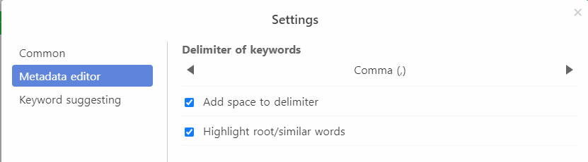

Click "IMS Studio" button, choose your OS (Windows or Mac) and click on the download button.

  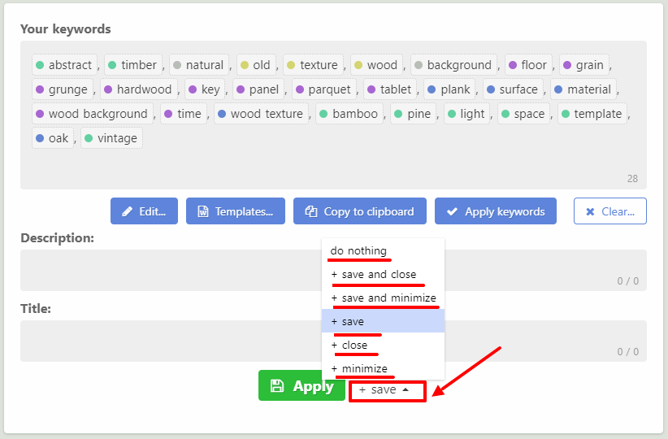

After installation and launch, you will be greeted with a welcome window. Here you can login using **ImStocker** account or click *"Create a new one"* to create new account

  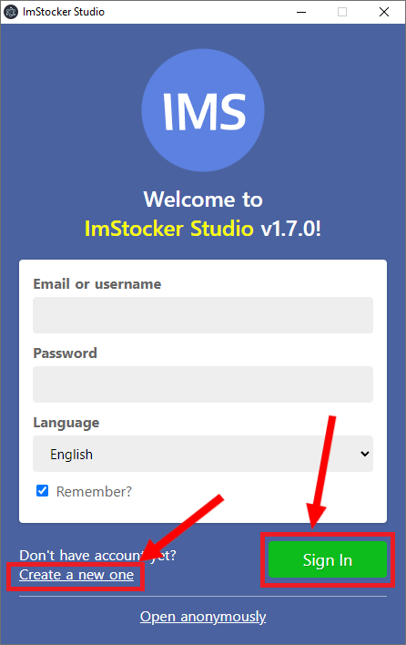

Registration in the service is quick and easy, without filling out long questionnaires.

  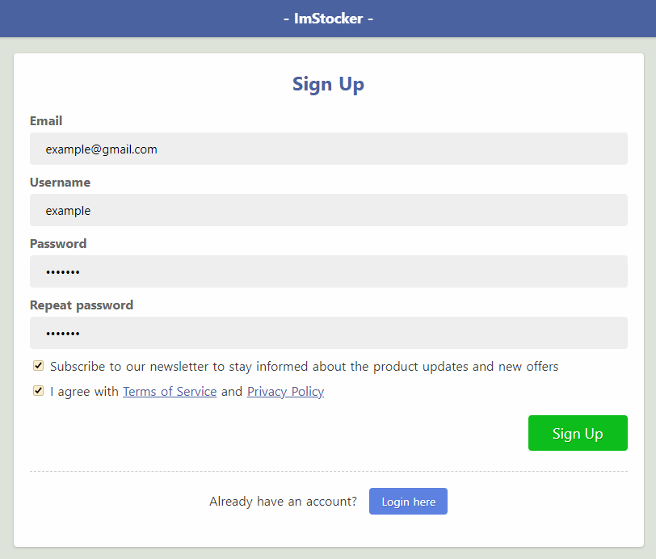

After registering, you will receive an email to confirm your email address. After confirmation, enter credentials specified during registration in the login form inside the program.

If you just want to look around first, you can skip the registration step by clicking "Open anonymously"

  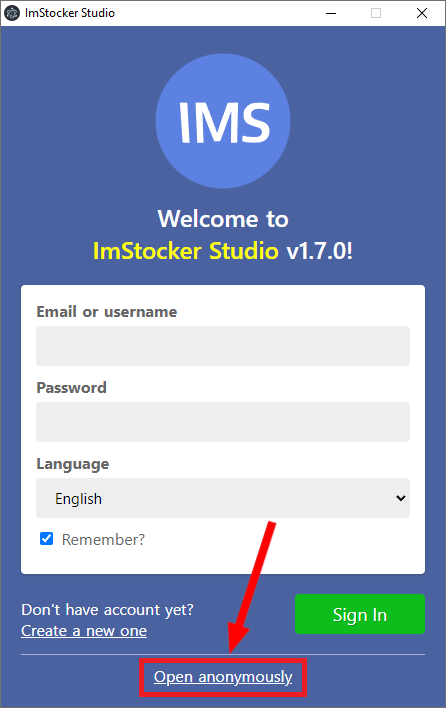

When you first enter the program, you will see a **main window** that will advice you where to start your work with **ImStocker Studio**:

  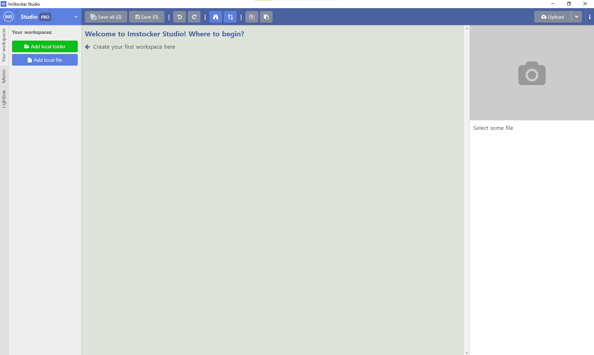

### Main window

The functionality of the main window is divided into the following areas:

  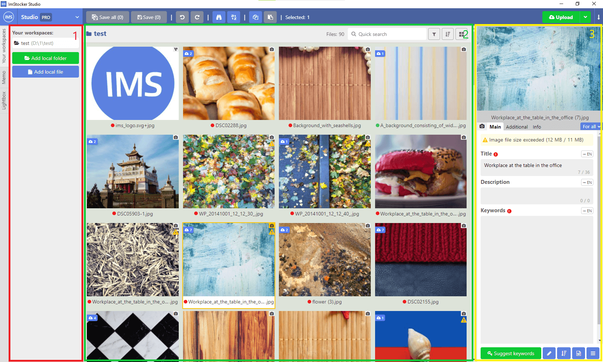

**1 - Left side panels**. Here is a list of [**workspaces**](#workspaces) (opened folders), [**Memo**](#edit-copy-paste-metadata) feature to quickly copy & paste metadata of files and [**Lightbox**](#lightbox) - a place where you can add favorite files, or just files from different folders that you want to work with

**2 - Contents of the current workspace** is a place, where you can interact with your files. You can choose the display mode (tiles, list, table), specify sorting and filtering rules

**3 - Right side panels**. There are a preview block of the selected file (or files), fields for filling metadata (titles, descriptions and keywords), as well as tabs for additional file functions. More details about this block are described in the section ["Editing files"](#edit)

You can customize the size (by dragging the edges) and position of the sidebars (by dragging their titles or through the **Settings** menu in the "Workspace" section)

### Main menu

  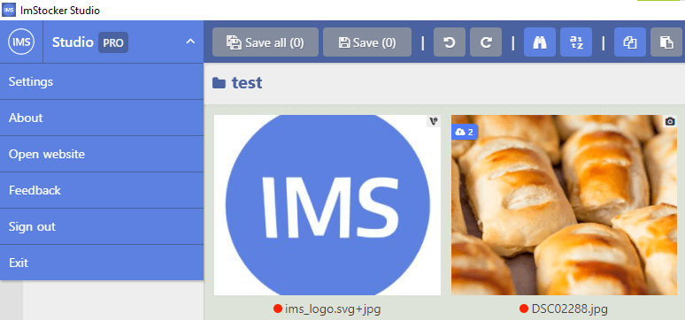

**Main menu** The program menu is located in the upper left corner of the window and contains a **Settings** button, a button to upgrade your account to the **PRO** version, a button to show brief information about the program, a link to **imstocker.com** website, a feedback button to connect with us, as well as the function to change the account and close the program.

The **Settings** of the program contains an impressive number of options. For example, you can change the interface and translation languages; customize the size and display mode of thumbnails; customize sidebars; customize a keywords field and the behavior of the Keyword Suggestion window; add metadata sets that allow you to set different keywords, titles and descriptions for different microstocks; add statuses that allow you to make your own flags on files; clear the preview cache; open the folder with logs, etc. You can read more about this section in the ["Program settings"](#settings) section.

  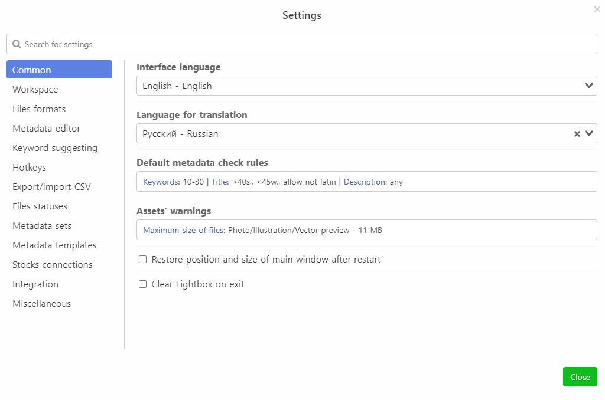

The "About" dialog box displays the current version of the program, a link to the site, and, if you are the proud owner of a **PRO** version of **ImStocker Studio**, then the validity period of your license. If the license is about to expire, the program will also warn you about it using a special icon in the main menu header.

  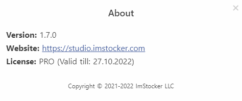

### Workspaces

The main interaction with files in the program **ImStocker Studio** occurs through **Workspaces**. A workspace is a folder containing files for editing.

To add a new workspace, click “**Add local Folder**”:

  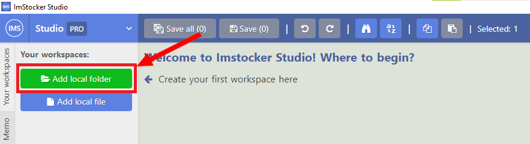

After adding and selecting a workspace, the photos, illustrations, vectors and videos ([more about file formats](#files-types)) contained in it will be displayed in the central part of the window. If a folder contains two (or more) files with the same name but different extensions, such as *image.jpg* and *image.eps*, they will be displayed as one *image.eps+jpg* asset.

To select a file for further interaction with it, click on it with the left mouse button. You can select multiple files at the same time. To do this, use the mouse to select them with a frame, or use the *Ctrl/Cmd* or *Shift* keys while clicking on the file.

If you click on the file with the right mouse button, the context menu will open:

  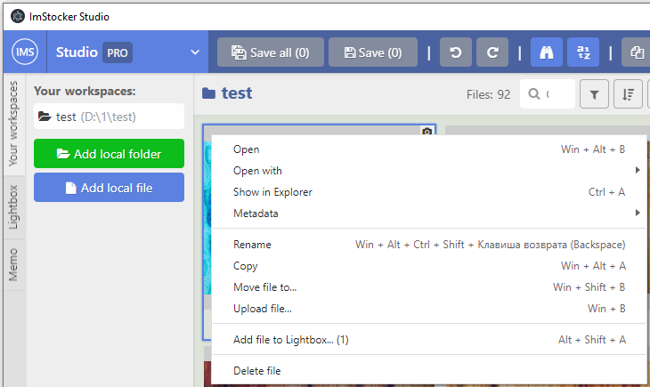

It allows you to quickly reveal file in Explorer, copy or paste metadata, as well as rename or move the file to another Workspace/Folder and upload the selected file to the microstock agency. It is important to note that all these actions and many others can be assigned hotkeys in **Settings** in the "Hotkeys" section

By default, files in the workspace are displayed as **tiles**, the size of which you can adjust using *Ctrl/Cmd + Mouse Wheel* or through the **Settings** menu. In addition to this mode, in the upper right corner of the workspace you can select the **"List"** and **"Table"** modes.

  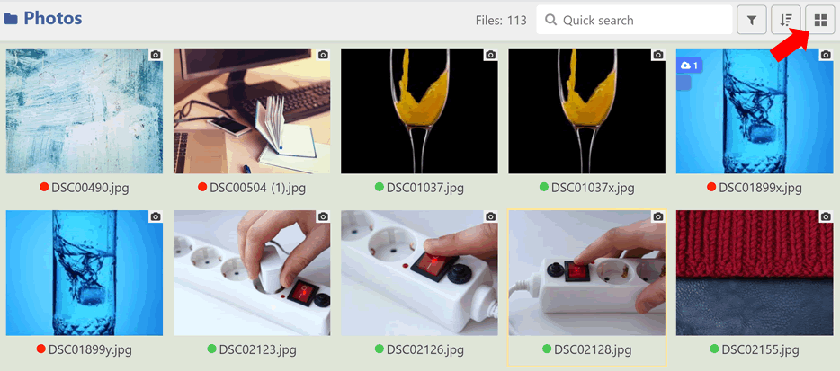

In list mode, files are displayed one after the other, while the metadata stored in the files is immediately visible.

  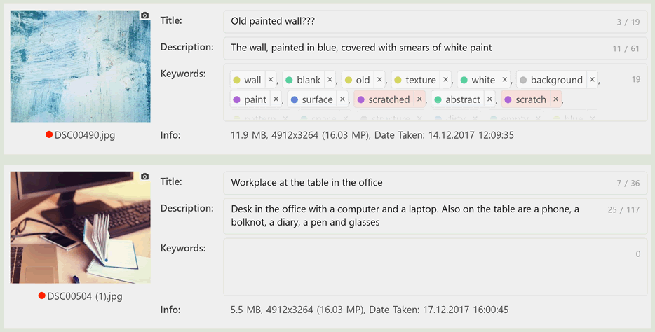

In table mode[[PRO]], each file occupies only one line. You can quickly view and edit the metadata of one or more files by selecting the corresponding table cells. In addition, by dragging the edge of a cell, you can quickly fill adjacent cells with the contents of the selected cells.

  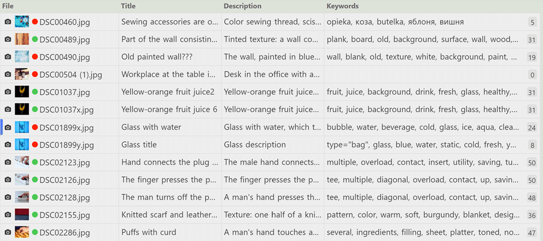

Also next to the button for changing the display mode is the sorting button:

  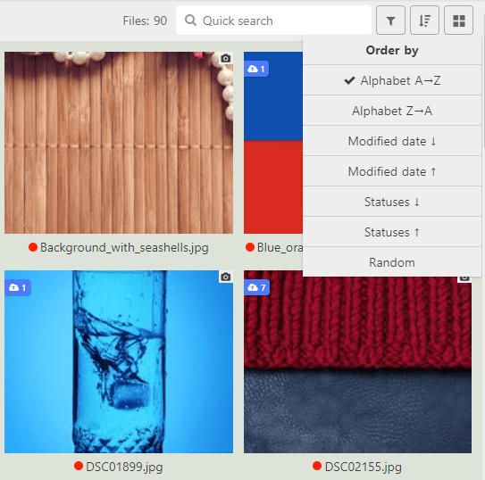

With this button you can set the order in which files should be displayed in the workspace. The following options are available:

* **Alphabetically** - files are sorted by name

* **By date modified** - files are sorted by the date they were last modified. By default, so that files do not jump during editing, this sorting is applied only when the folder is opened. You can change this behavior by enabling the *"Change the position of the file after saving if sorting by modification date is selected"* checkbox in the "Metadata editor" section.

* **By status** - files are sorted by the presence of one or another status. More about statuses in the section ["File statuses"](#file-statuses)

* **Random** - files are displayed in random order

To the left of the sort button is the filter button and the quick search block. Filters allow you to temporarily hide unnecessary files for some reason. More details about the functionality of filters are described in the ["File filter"](#file-filters) section. Quick search allows you to find files by name or by the metadata they contain (see section ["Finding and replacing metadata"](#file-search-and-replace))

### File ready icon

When loading the contents of the workspace, each file receives a metadata readiness indicator (a circle to the left of the file name):

  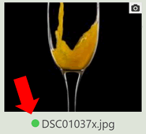

Possible options:

* **Grey** - the metadata is not yet filled

* **Red** - the metadata is partially filled

* **Green** - metadata is full and file is ready to upload

By default, a file becomes "green" under the following conditions: the file has from 30 to 50 keywords, the description contains at least one word, and all metadata is filled in English (Latin). You can easily change the rules for yourself through the "Common" section in **Settings** (see ["Checking readiness of files"](#checking-readiness-of-files))

### Warning icon

In addition to the readiness status for metadata, you can also configure the display of a warning icon if the file does not meet the specified technical restrictions.

  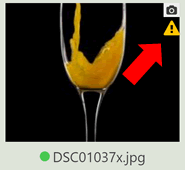

You can configure technical restrictions through the "Common" section in **Settings** (see ["Warnings on files"](#checking-warnings-of-files))

### File statuses

Another distinguishing feature of files are statuses. Using statuses you can mark if file is belonging to a certain group.

  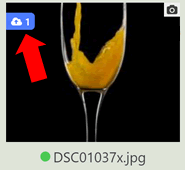

 So, for example, every time you upload a file to the microstock, **ImStocker Studio** adds a special label to the file to help you figure out which files are uploaded and which are not. In addition, you can come up with and add your own statuses to the work. For example, mark those files that were accepted or rejected by microstocks, or select a group of files on some basis.

You can manage the list of such statuses in the "Settings - File statuses" section. Read more ["here"](#settings-file-statuses)

To manually add a status to a file(s), you need to select the files, then in the “Metadata Editor” section, go to the “Info” tab and click the “Add status” button.

  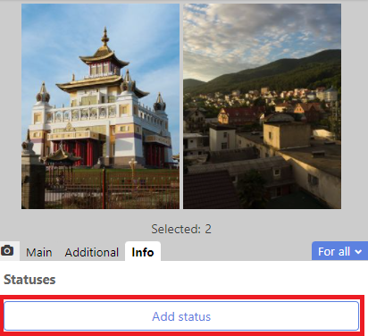

A dialog box will appear where you must select the desired status, date (by default - today) and, if required, one or more stocks to which it applies.

  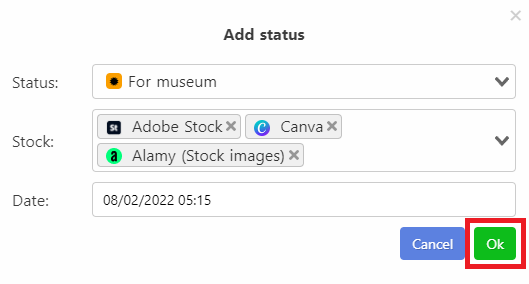

In addition to the labels in the upper left corner of the image, statuses are also displayed in the “Info” tab in the “Metadata Editor”.

  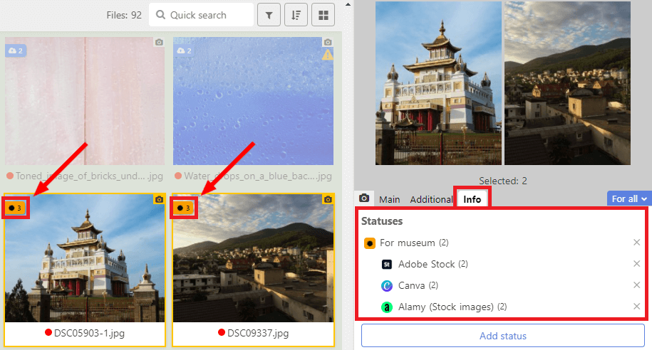

If you have changed your mind, you can freely delete the file status by clicking on the cross to the right of the status name in the “Metadata Editor / Info” section

If you do not want status icons to be displayed, go to the “Workspace” settings section and uncheck the box next to “Display file statuses icons in file list”
  

  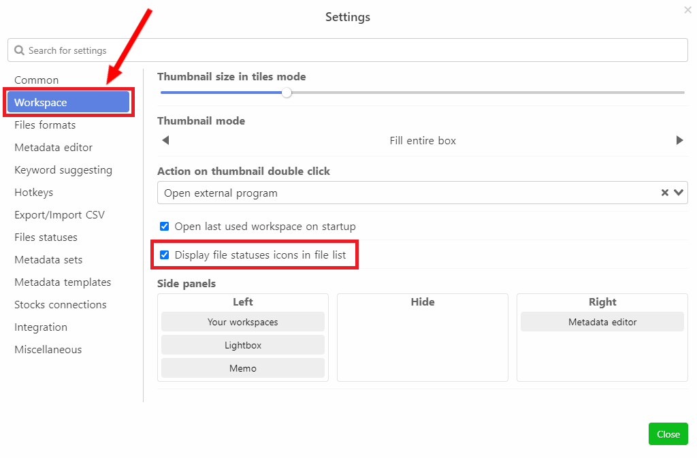

### File types

The program is configured for the following types of files:

**Photo** - **JPG**, **JPEG**, **TIFF**, **RAW** formats are supported. It is also possible to resave photos in JPEG format.

**Illustrations** - **PNG** format supported

**Vector files** - **EPS**, **SVG** files are supported (+ **JPEG**/**PNG** preview)

**Video files** - **MOV**, **MP4**, **AVI**, **MPG** files are supported (+ **JPEG** preview)

### Feedback

If you have any questions, complaints or suggestions, please let us know via the [feedback](https://imstocker.com/en/page/feedback?product=ims-studio) form or in a special chat in [Telegram](https://t.me/imstocker_chat_en)

And in order to stay in touch and be the first to know about all new changes in the program, subscribe to us on social networks:

* [Instagram](https://www.instagram.com/imstockercom/)
* [Twitter](https://twitter.com/imstocker)
* [Telegram](https://t.me/imstocker_en)

## Editing files

### Editing metadata

To edit metadata, select one or several files in the workspace. They will be displayed in the right sidebar for editing metadata.

This panel is divided into two parts: **preview block** and **edit block.**

The preview block displays a thumbnail of the currently selected file or files. If there is only one file, then when you click on it, file preview will be opened in full screen. If there are several files, you can switch between them by clicking on the corresponding thumbnail or the left and right toggle buttons (displayed on hover). By dragging the bottom edge of the preview block, you can set its height.

  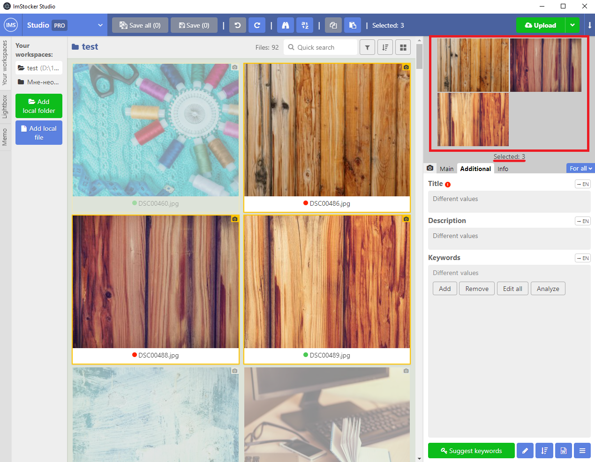

The editing block, in turn, consists of three tabs:

* **Main** - contains 3 fields: **Title**, **Description** and **Keywords**

* **Additional** - in this tab you can view or remove meta tags

* **Info** - contains information on the statuses and files of the selected asset

  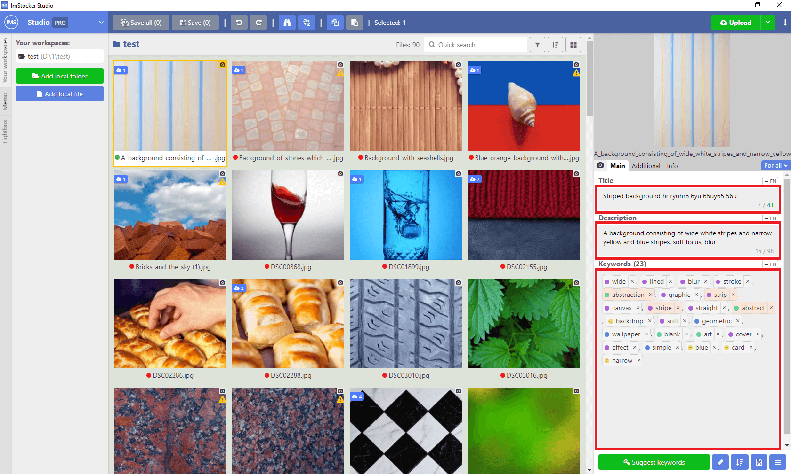

In order to make a change to the file, select the required edit field and enter the new value. After changing (and switching to another element), the file will be marked as changed, its name will be written in bold. You can undo the change you made (and then redo it again) using the buttons at the top of the app.

  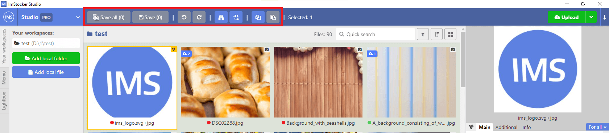

After finishing editing, click on the "Save" button (*Ctrl/Cmd + S*) to save the currently selected files, or "Save All" (*Ctrl/Cmd + Shift + S*) to save all modified files, including those that are not currently selected.

### Combining title and description

If you are used to writing the same name and description, then you can enable a special mode in which these two fields will be combined. To do this, open the "Metadata Editor" section in **Settings** and check the box *Combine title and description into one field”*

  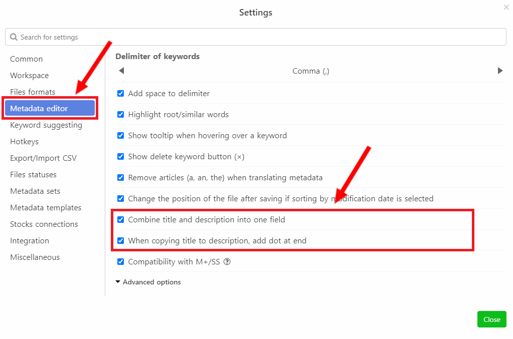

After activation, the fields will be merged. When editing a merged field, the value will be written to both the title and description.

  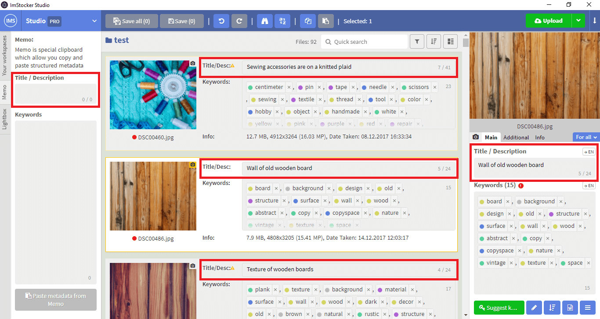

If the name and description do not match when merging, a warning will appear.

You can also configure the program so that when you enter a name in the combined field, it is copied into the description with a dot at the end. This can be useful if you don't want the title and description to be exactly equal. To activate this feature, select the item *“When copying title to description, add dot at end”*.

### Additional editing features

In the lower right corner of the program there are several functions that greatly simplify the work with keywords:

  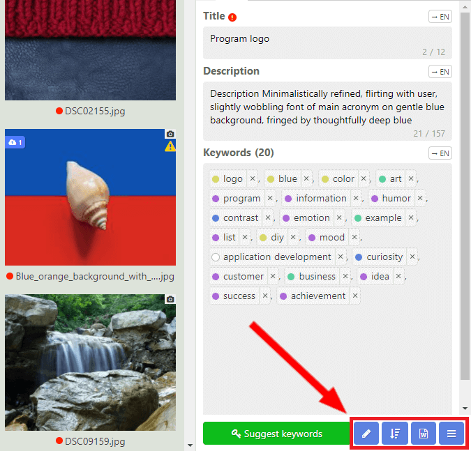

The “**Transform keywords**” button allows you to make quick changes to all keywords at the same time: translating words into singular/plural, as well as the ability to remove words with the same root/similar words, words that exceed the set limit, and words with errors. And many other useful features.

  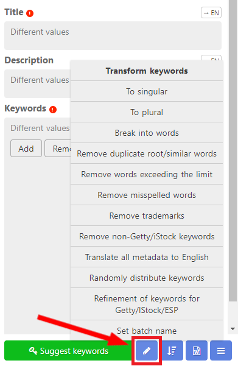

One such feature is *"Randomly distribute keywords"*. This feature is very useful when dealing with similars whose keywords need to be slightly different. To use it, you write a set of keywords to one of the files: the first part of which will have to be the same for all files, and the second part will be randomly redistributed. After preparing the set, select the desired files and click this button. After that, the program will ask you how many of the first keywords should remain in place and how many keywords to distribute the rest.

Next to the button in the form of a pencil is the button “**Sort by..**”. It allows you to sort keywords by popularity, number of downloads, alphabetically in forward and reverse order, as well as randomly.

  

In addition, the program has a special kind of random sorting of keywords, in which you can also choose the number of first words that will remain in place. Unlike the *"Randomly distribute keywords"* function, here the keywords are not distributed, but simply sorted within a single file. To activate the function, you need to select the item “Randomly after N words” and specify the number of first words that should remain in place.

  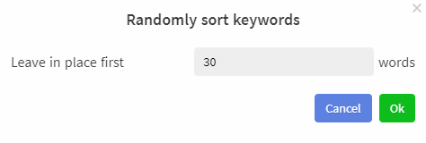

The “**Templates**” button allows you to create your own set of keywords and quickly apply it if necessary. It is greatly simplifies the work with keywords if you work with a large number of the same type of pictures/photos. Moreover, you can activate templates directly while entering keywords, if you assign a hotkey digit to it (activated by holding down the *Alt* key). More information about templates is written in the section ["Templates"](#edit-templates)

  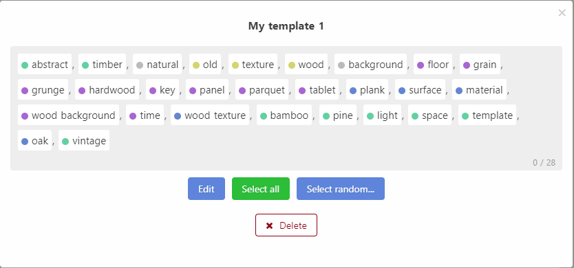

The “**Menu**” button allows you to work with the metadata import/export functions, as well as with the metadata buffer. Here you can also select the functions of moving files and copying keywords.

  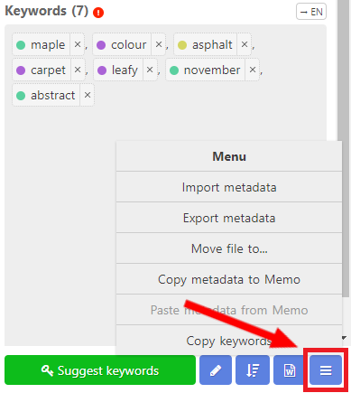

### Keyword selection

In the lower right corner of the program, you can also find an integrated keywording service **ImStocker Keyworder**, which allows you to quickly get keywords using a number of convenient filters.

In order to use the **ImStocker Keyworder** service, you need to select one or several files to which you will select keywords, and click the “**Suggest keywords**” button:

  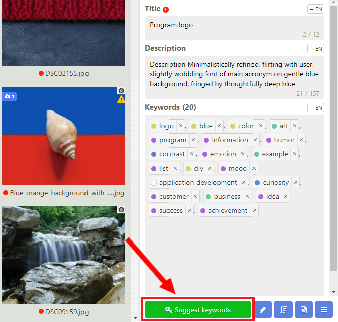

To get the results, it is enough:

   **1.** Enter some keywords and press the Enter key or the search button

  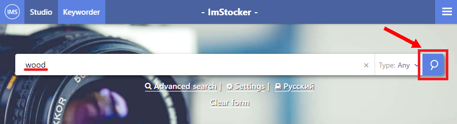

For the convenience of the user, there is a mechanism for auto-filling the search string with a title or description of file. It is located in **Settings - Keyword suggesting**:

  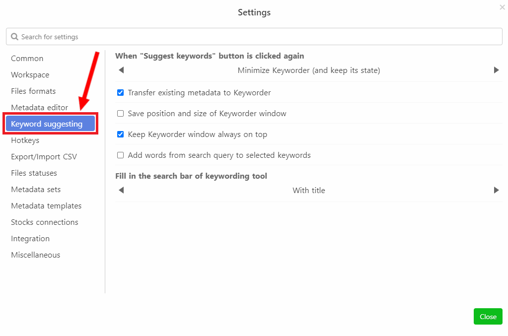

**2.** Select one or more pictures that are similar to your files:

  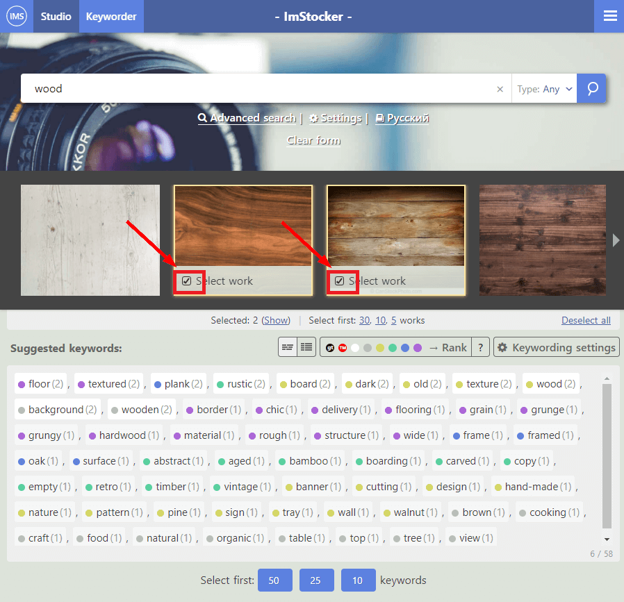

**3.** Choose relevant keywords

After the list of keywords is formed and completely suits you, and work with **ImStocker Keyworder** is completed, the result can be **Applied** to selected images in the workspace of **ImStocker Studio** and choose what to do with the window **ImStocker Keyworder**:

  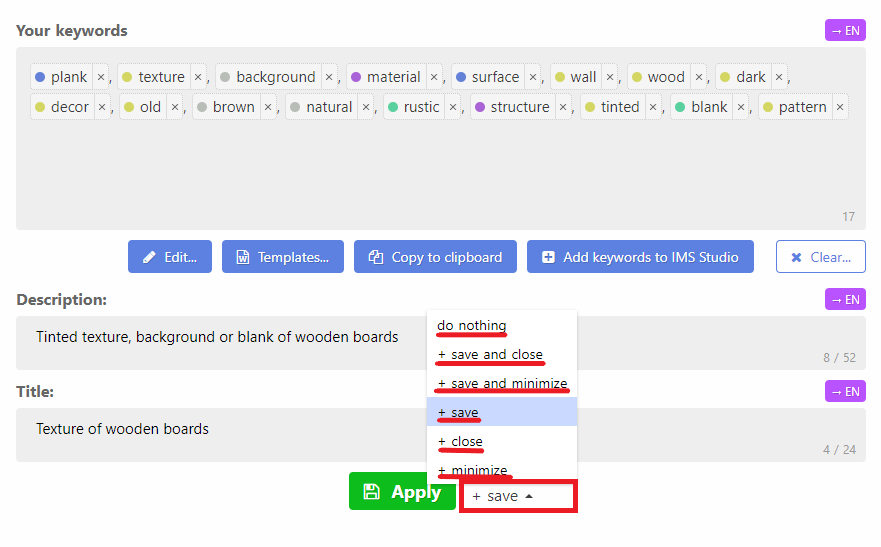

**Your keywords**, as well as the contents of the boxes **Description** and **Title** will be applied to the selected file/files

Small settings for the behavior of the **ImStocker Keyworder** window can be changed in **Main menu/Settings/Keyword suggesting**:

  

### Keyword Refinement for Getty/IStock/ESP [[PRO]]

As you know, GettyImages (IStock/ESP) has its own idea of what keywords can be used when describing files. Now the user can refine keywords without leaving the program, choosing the closest words to them from the Getty/IStock dictionary.

To take advantage of this feature, you must do the following:

Select the required file(s), click on the blue square button with a pencil inside and select "Refinement of keywords for Getty/IStock/ESP" from the drop-down list.

  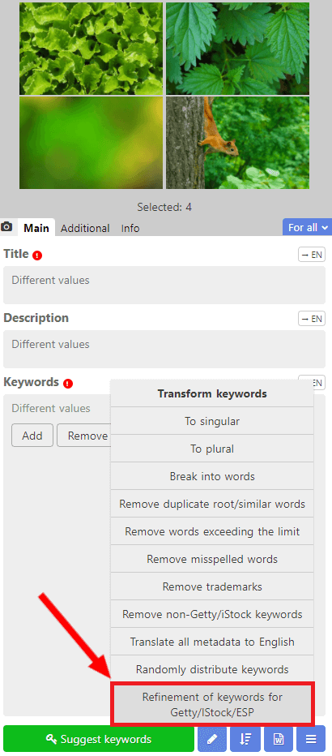

A window will open with keywords, their definitions and translation. Select the required refinements by clicking on them with the left mouse button. For 1 keyword, you can select only 1 refined pair.

  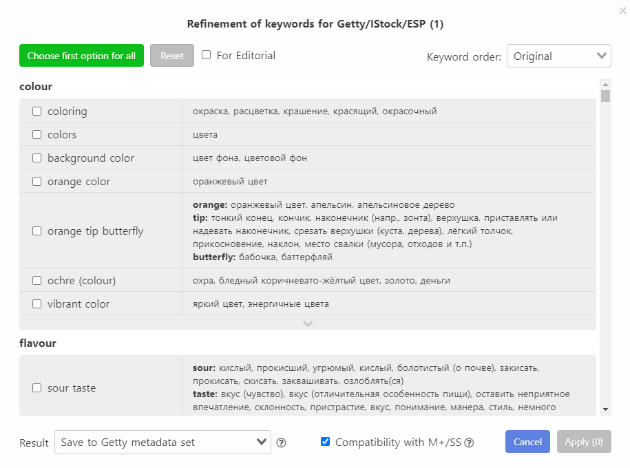

If required, you can select the first option for all or reset the selection by clicking on the appropriate buttons.

  

You can also use the "For Editorial" checkbox to turn on and off keyword suggestions that are used for editorial images.

After selecting all the desired refinements, you can choose what to do with the result:

* *Save to Getty metadata set* - the result will be saved to a separate metadata set that will be used when you export metadata to CSV for Getty

* *Save to a separate JPG-file* - in the folder next to the file for which refinement is performed, a new file will appear with the ending *_getty.jpg*, in which the refined keywords will be written

* *Replace current keywords* - refined keywords will be written instead of the current keywords.

In addition, if you use the Microstock+ service or the StockSubmitter program to submit files to microstocks, you can check the *"Compatible with M+/SS"* checkbox. In this case, the clarifications will also be written to a JPG file in a special format that these programs can read.

In M+/SS compatibility mode, you can also specify a batch name for ESP:

  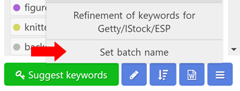

### Translation of metadata [[PRO]]

**Metadata translation** is one of the benefits available in the **PRO** version of **ImStocker Studio**. Allows you to instantly translate file metadata from your language into English. You can translate each field with a separate button or use the "Translate all metadata to English" command in the menu with the pencil icon:

  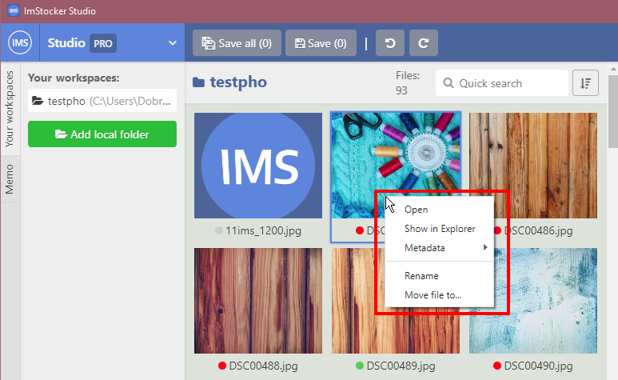

In addition, you can translate not only into English, but also back into your native language. This is useful if you need to make some changes to an already attributed file.

To translate back to your language, hold down the *Alt* key while clicking on the translate button. The same can be done using hotkeys: *Ctrl/Cmd + Alt + T*. To translate all metadata, hold down the *Shift* key while clicking on the translate button.

### Viewing and deleting other metadata [[PRO]]

If you want to know what kind of metadata you are sending to microstock agencies, there is a "Show all meta tags" function in the "Advanced" tab.

  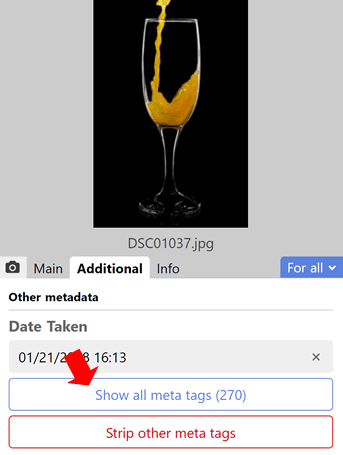

Clicking on it will open the following dialog

  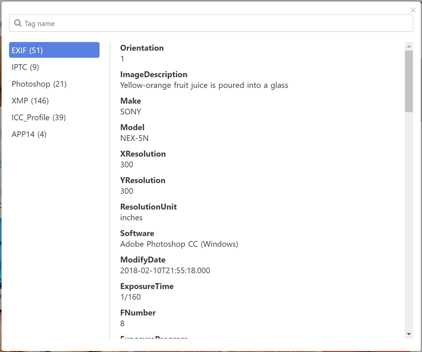

Here you can see all the tags that are written inside the file, grouped by source. There is also search bar to filter tags

In addition, next to the button for viewing all metadata there is a button "Remove other meta tags", which allows you to clear the file of extraneous tags (attention, the operation cannot be undone).

### Metadata sets [[PRO]]

Metadata sets allow you to store different metadata values for different microstocks. They are applied automatically when exporting metadata and uploading files.

You can switch between sets of metadata through a special menu to the right below the preview block:
  

  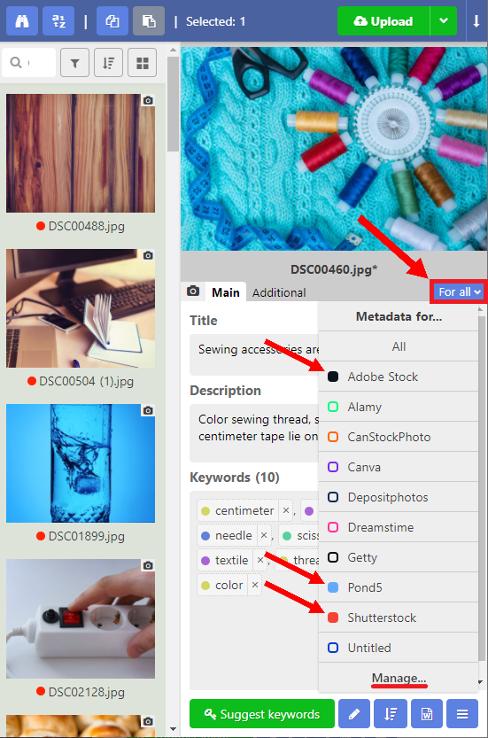

  
  
Solid squares indicate which metadata sets are involved (that is, you have overridden the metadata for them).

Using the “**Manage**” button, you can create a new or edit metadata sets that you have already created.

You can do the same in **Main menu/Settings/Metadata sets**:
  

  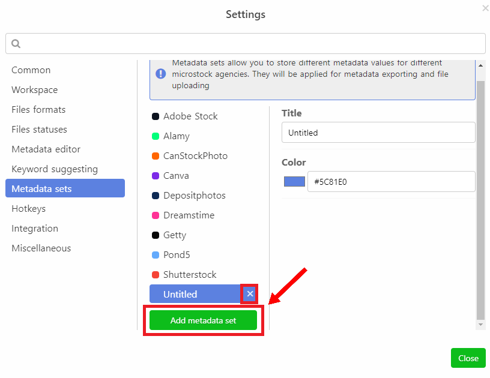

### Copy/paste metadata

The **ImStocker Studio** program implements a mechanism for copying all file metadata for applying to one/several files of the workspace, which saves a significant amount of time when working with a large library of files.

There are several ways to copy file metadata:

Through the context menu: when you right-click on the selected image, a context menu will appear, go to the **Metadata** section and click **Copy metadata to Memo**:

  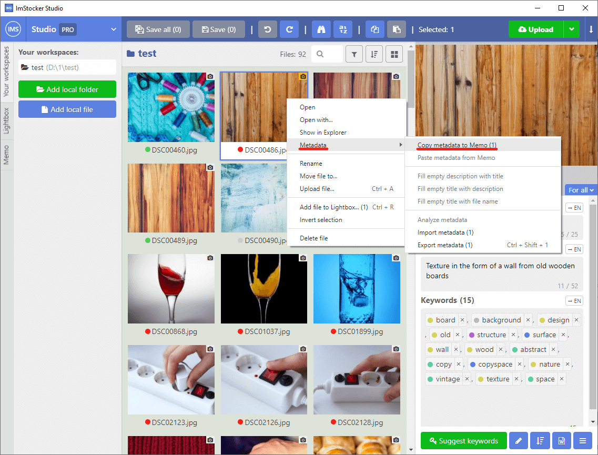

To apply the copied metadata to one or more files, select the desired pictures and right-click - **Metadata** - **Paste metadata from Memo**:

  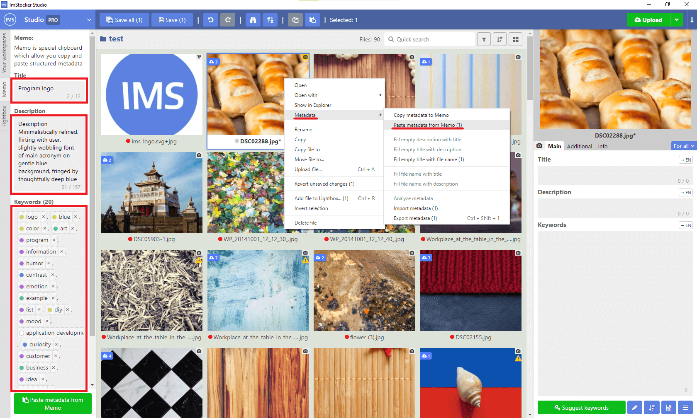

The metadata will be copied and will be identical to the original image's metadata.
  

  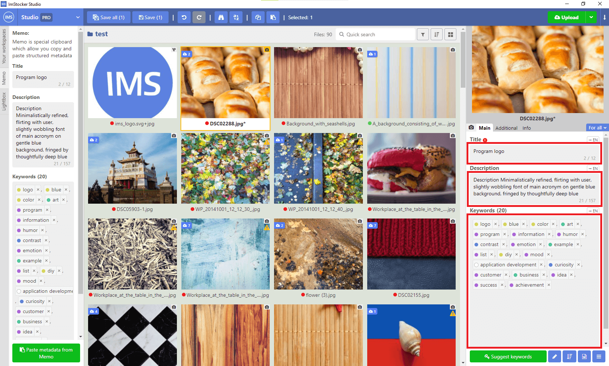

The second way to copy metadata is through the editing panel in the lower right corner of the program. Press the **Menu** button and select **Copy metadata to Memo**, then select one or more files where you want to copy the metadata and click **Paste metadata from Memo**:

  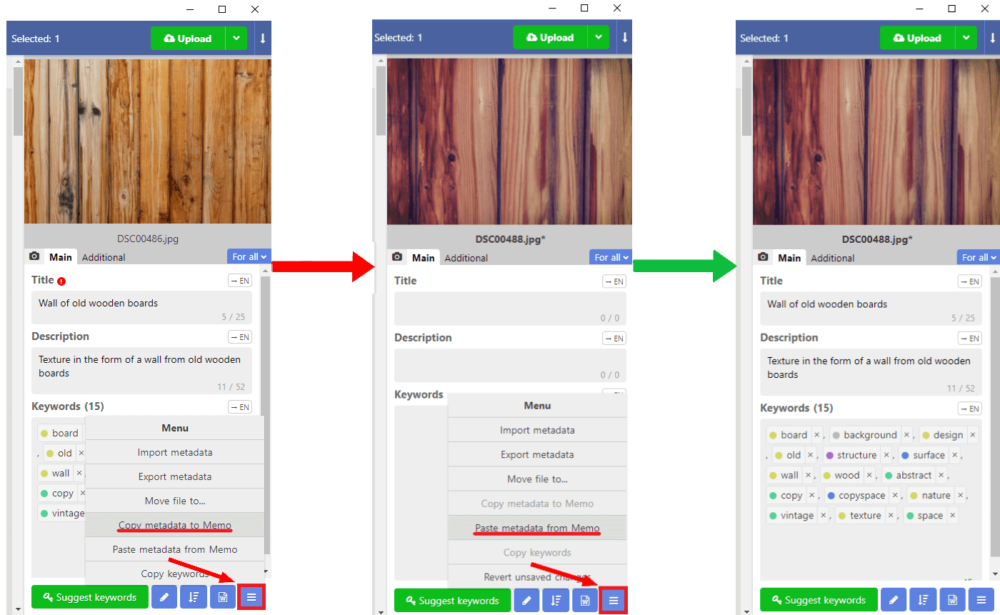

At any time when working with copying metadata, you can see what is currently copied to the special clipboard, and also, if necessary, make adjustments before pasting metadata into another file. To do this, go to the **Memo** section:

  

This section also has a button **Insert metadata from Memo** that will apply everything in the special clipboard to the selected file in the middle of the screen.

### Templates

Working with templates in **ImStocker Studio** will allow you to significantly speed up the process of adding keywords to files. The template management menu is located in the lower right corner of the program and appears when you select any image from the workspace:

  

This menu displays a list of already created templates, a button for creating a new template, and a button for managing the list of templates

When you click on the button with the plus sign next to the template name, it is activated and its content is inserted into the metadata of the current file. If you click on the name, a dialog will first appear in which you can either select only specific keywords, or all, or N random

  

When you click on the template management button, the following dialog will be displayed:

  

Here there is a list of all templates that were added earlier and a form for adding/editing a template.

When creating a template, you must specify a name and a set of keywords that it contains. You can also additionally specify the title and description inserted when the template is activated.

You can group templates into folders. To do this, click on the button with the corresponding icon and set the name of the folder. If the slash character "/" is present in the folder name, then you will create a nested structure. For example, folder "a/b" means that the template will be placed in folder "b", which in turn is in folder "a"

In addition, you can add a comment to the template, which will be displayed when you hover over the name of the template in the list. As well as a hotkey digit. If you press *Alt + the specified digit* when the input cursor is placed in the keyword field, then the contents of the template will be inserted without further action. If you press *Alt + Shift + the specified digit*, then a dialog for viewing the corresponding template will open

The menu next to the "Create Template" button contains the **Import/Export** functions of templates. It will allow you to transfer templates between your devices or other users.

### Generation of previews for vector and illustrations [[PRO]]
   
**ImStocker Studio** can generate thumbnails for vectors (SVG and EPS) in JPG or PNG format (with transparency). To do this, right-click on the vector and click the corresponding button

  

A preview file will be created:
  

  

  
You can adjust the width and height when generating a vector preview in the advanced settings of the "File formats" section:
  

  

Similarly, you can generate JPG previews for illustrations (PNG files)

It's important to note a couple of things:

* *For Windows users*: in order for the program to be able to generate a preview of the EPS file, you must install Ghostscript on your computer and enable integration in the settings (see section ["Integration with Ghostscript (Windows)"](#settings-ghostscript-integration))

* Due to the peculiarities of the ESP format, not all such files can be saved as PNG with transparency

Like other commands, this command can be called on multiple files at once.

### Creating ZIP archives for vectors [[PRO]]
  
The **ImStocker Studio** program also allows you to create ZIP archives of vectors with previews right away without leaving the program. To do this, right-click on the file in the workspace and select **Create ZIP-archive for vector**:

  

  
A ZIP archive will be created for the selected file:

  

Like other commands, this command can be called on multiple files at once.

### Generation of preview for video [[PRO]]
  
To generate a video preview, you need to right-click on the video in the workspace and select **Generate video thumbnail**:
  

  

A window for selecting a thumbnail will open. You can enlarge the preview by clicking on the image. To select a specific video frame, you need to set a point in time using the slider or a number:
  

  

  
A **.jpg** format file with the same name as the video will be created:
  

  

  
You can save the preview as a separate file without closing the dialog box. Just right-click on the desired frame, select "Save as a separate file" from the context menu and the desired frame is in your pocket (on disk). In this case, a **.jpg** format file will be created with a title that includes the name of the video and the moment in time that you have chosen.
  

  

  
Like other commands, this command can be called on multiple files at once.

## File Management

### File filter

When there are many files, it is difficult to find what you need. For convenience, you have the ability to search for the files you need using filters.

  

You can filter files by:

**1.** - Metadata:

 * empty (meta:empty) - the file has no title, no description, no keywords
  
 * in work (meta:error) - at least one of the metadata fields is filled, but the file does not meet all the rules for checking metadata (you can set them yourself in the program settings in the “Common” section)
  
 * done (meta:ok) - all necessary metadata is filled in, the file is ready to be uploaded.

**2.** - Presence of warnings (warn). You can also set the list of warnings through the program settings, section “Common”

**3.** - Statuses (marker:status_name). You can select files that contain or do not contain a particular status. For example, uploaded to at least one stock, or to certain microstocks.

The first time you click on the filter button, files that meet its conditions are selected, the second - files that, on the contrary, contradict, and the third - it is deactivated and ceases to affect files. Clicking while holding ctrl corresponds to double clicking on the filter.

In addition to selecting one search criterion, you can select several at once, while specifying how they will be combined:

* Any of - the file must match at least one of the active filters. For example, you can select files with empty and partially filled metadata (meta:empty meta:error)

* All - the file must match all active filters at the same time. Let's say you can select files that are ready but contain warnings (and(meta:ok warn))

* Not all - the opposite of "All".

  

For convenience, the filter can be set not only using the buttons, but also by manually entering it into a special search bar. Smart search remembers the last used filters and offers only what you need.

To reset all filters, you can simply clear the search field or click on the appropriate button.

### Find and replace metadata [[PRO]]

In addition to the quick search, **ImStocker Studio** has an advanced search function. It is activated by pressing the button with the binoculars icon (1)

  

A search string is entered in field (2)

Button (3) allows you to turn on and off the search for whole words

Block (4) allows you to configure where the search will be performed: by file name, by title, by description, by keywords

Next to the button for the advanced search function, there is a button for activating the replace function (1):

  

In field (2) the search text is entered, in field (3) - the text with which you want to replace the search

Button (4) allows you to enable or disable the search for entire words

Block (5) allows you to configure where the search and replacement will be carried out: in the title, in the description, in keywords

Button (6) replaces only selected files, button (7) - in all found files

### Metadata export [[PRO]]

Metadata export is one of the key features of the **PRO** version of **ImStocker Studio**, which allows you to upload the metadata of selected works into a separate **.csv** file in a few clicks.

In order to use the export function, press the **Menu** button in the lower right corner and select the **Export metadata** item:

  

The export window provides the ability to select one or more templates used by microstocks, or create your own according to your needs:

  

For each selected template, a **.csv** format file will be created containing the metadata of the selected files:

  

If the checkbox *"Export metadata from all files of selected workspace"* was enabled, then the output files will include the metadata of all files that are in the same folder as the selected files.

If you need to create a new template, then in addition to manually setting all fields, you can use the automatic creation of an export format from a template. This feature is available in the menu next to the "Create new format" button

### Import metadata [[PRO]]

Metadata import is another feature of the **PRO** version of **ImStocker Studio** that allows you to quickly load metadata from a **.csv** format file to selected pictures in the workspace.

To use: select empty pictures for which we have prepared a **.csv** file and press **Menu** in the lower right corner and select **Import metadata**: (the metadata belonging to the picture is checked by the name of the picture )

  

Select the **.csv** file of the required template and click **Open**:

  

Based on the metadata contained in the file, the program will try to determine the template for the data to be filled in and offer it. Click **Import**:

  

And check that all fields are filled for each of the images mentioned in the file:

  

If the checkbox "Import metadata to all files of selected workspace" was enabled, then the import will be performed for all files located in the same folder as the selected

### Metadata analysis [[PRO]]

Metadata analysis is one of the most useful and visual features of the **PRO** version of **ImStocker Studio**. In order to analyze the metadata, select 2 or more files in the workspace and click the **Analyze** button that will appear in the **Keywords** field.

  

The **Metadata Analysis** window will open, containing two tabs:

**By keywords** - the program will provide a brief statistical summary of 4 points: the minimum number of words, the maximum number of words, the average number of words and their average uniqueness. It will visually display the number of keywords for each of the selected files, their uniqueness as a percentage of the total number of words, and divide the words into ranking groups, as well as calculate their number, numerical and percentage. Common keywords, words used only once, repeated words, as well as a general list of all words will be visually displayed in special boxes.

  
  

**By titles and descriptions** - the program will display the number of unique and completed, minimum, average and maximum length, the total number of unique and matching titles and descriptions of each of the selected files. Provides lists of the most common titles and descriptions.

  

  

### Renaming files and folders

The **ImStocker Studio** program allows you to rename a file without leaving the program. To do this, right-click on the file in the workspace and select **Rename**:

  

Or double-click on the image name with the left mouse button:

  

  
To rename a folder, right-click on the folder and select **Rename Folder**:  

  

  
A rename window will open, allowing you to give the folder a new name:

  

  
### Rename files by name and description

The user can rename the file with either a title or a description. To do this, select the file(s) and find the item “Insert title in file name” or “Insert description in file name” in the context menu.

  

  

  
### Copy files
  
The user can copy files without leaving the program. To do this, select the file and find the “Copy” item in the context menu.

  

A dialog box will open with a suggested name for the copied file.

  

Copying completed.

  

### Moving files and folders

The **ImStocker Studio** program also allows you to move a file without leaving the program. To do this, right-click on the file in the workspace and select **Move file to**:
  

  

Or select the necessary pictures to move and use the **Menu** button in the lower right corner of the program, then click **Move file to**:

  

To rename a folder, right-click on the folder and select **Move Folder**:

  

In any case, a move window will open, allowing you to **Move** the selected pictures or folder to one of the added workspaces, or to a folder created inside them:

  

### Create subfolders

To create a subfolder, right-click on the folder and select **Create Subfolder**:  

  

A window will open to select the name of the new folder:

  

The subfolder may not appear immediately. To refresh the list of folders, in **Workspaces** you need to right-click on the folder and select **Reload**:
  

  

  
### Open file with...
  
If you need to correct or view the file in any external program, you can now click the “Open with...” item in the context menu

  

If the clicked tile includes several files at once (for example, EPS + JPEG), then the program will specify which particular file you want to open.

Next, the program selection window will open. Find the desired program on your computer and confirm your choice. After that, **ImStocker Studio** will ask if it should remember this program for the selected file extension. If you answer in the affirmative, then the next time the corresponding item will appear in the context menu:

  

  
You can also edit the list of external programs in the section **Settings - Integration - Open with**:

  

  
You can configure the opening of an external program when you double-click on a tile. To do this, select the appropriate option in the item “Action on thumbnail double click”:

  

Now, when you double-click on a tile, the first program that matches the extension from the “Options for “Open with...”” list will open. If you have several programs selected for one extension, you can swap them by dragging the item number in this list.

### Upload files [[PRO]]

Direct upload of files to stocks is a feature of the **PRO** version of **ImStocker Studio** that will allow you to prepare files with metadata for publication on stocks without leaving the program. To use this feature, select one or more files in the workspace and click the **Upload** button in the upper right corner of the program.

  

In the upload window that opens, select the desired or several stocks you need from those already offered or add a new one that you prefer.

  

Enter your login and password in the upload window or immediately click upload and enter in the window that opens, confirm the start of the upload.

  

The upload process will begin. If the upload required the addition of preview files or the formation of ZIP archives, they will be created automatically

Upon completion of the upload, go to the stock and check that the files you have selected with their metadata are already waiting for submission.

  

  

It is important to note that most microstocks do not read metadata from video files. In such cases, in order to attach metadata to the uploaded files, you need to export them to a CSV file of the format required for the microstock and upload it through the microstock web interface.

If, however, microstock reads metadata from videos, you can enable the checkbox *"Save video metadata into embedded XMP if possible"* in the "File formats" section in the **Settings** of the program, then resave the file and send it to microstock. This checkbox does not take into account special metadata sets for microstocks.
  
### Lightbox
  
**Lightbox** allows you to conveniently work with files located in different workspaces, as well as open files directly without creating a workspace. You can add files to Lightbox in one of the following ways:
  
**1** - Via context menu "Add to Lightbox"
  
**2** - By dragging the file into the program window"
  
**3** - Clicking the "Add local file" button
  

  

 
  
You can add files to **Lightbox** from your computer by clicking on **+** in the lower left corner of **Lightbox**, and from workspaces, to do this, right-click on the file and select **Add to Lightbox **:
  

  

The file will appear in the **Lightbox**. You can delete the file using the cross on the right, or clear the **Lightbox** using the **Clear Lightbox** button in the lower right corner of the **Lightbox**:
  

  

  
You can quickly find the desired file using the search bar:
  

  

  
## Program settings

### Settings overview

The **Settings** window consists of the following sections:

* Common

* Workspace

* File formats

* Metadata editor

* Keyword suggesting

* Hotkeys

* Export/Import CSV

* File statuses

* Metadata sets

* Stocks connections

* Integration

* Miscellaneous

You can quickly find the desired setting using the search bar:
  

  

  
You can manage connection settings, CSV templates, and metadata sets. For example, if you want to hide unused elements, then you need to click on the crossed-out eye located to the right of the selected element.

  

If you decide to restore an item, go to the settings, select the section you need (CSV templates, connection settings or metadata sets) and click on the arrow located to the right of the selected item.

  

  
If you want to delete a status, connection, template or set, click on the cross located to the right of the element name.
  

  

### Common

In this section, you can configure the language, metadata checking rules, and file warnings.
  

  

### File readiness check

You can configure the default metadata validation rules in "Settings - Common - Default metadata check rules":

  

### File Warnings

You can configure the display of technical warnings in the "Settings - Common - Assets' warnings" section:

  

### Workspace

In this section, you can control the size, display mode of thumbnails (thumbnails) and side panels. Sidebars can be moved from left to right, between themselves, and even hide unnecessary panels. 
  

  

### File formats

Allows you to set whether to save the selected playback speed when switching video and metadata to embedded sections, as well as display the file type icon. You can adjust the width and height when generating a vector preview in the advanced settings.

  

  
### Metadata editor

In the section, you can configure the display of a word delete button and a tooltip when hovering over a keyword, set a key line separator (either a new line, or a comma, or a semicolon).

  

  
You can add the author's email, country, and author's copyright to the metadata when saving, and set the metadata to be saved to a separate XMP file in the advanced settings.

  

  
### Keyword suggesting

Here you can choose what to do when you click on the "Suggest keywords" button, fill in the search string when selecting words with a title or description, select the location of the keyword suggesting window and the transmitted metadata.

  

  
### Hotkeys

It is impossible to imagine a working tool without hotkeys that speed up your work many times over. In ImStocker Studio, they are not only present, but, moreover, you can easily customize them as you like. This is done in a special tab “**Hotkeys - Assign hotkeys**” in the program settings:

  

  
In total, more than 50 commands are currently available in the program, divided into five groups: working with files, with metadata, with a vector, with workspaces and with video. You can assign your own hotkey to each of these commands. To do this, click on the command you are interested in and specify the keyboard shortcut in the pop-up window:

  

  
In addition, if you try to assign a hotkey that is already in use, a corresponding warning is displayed, and you are also prompted to specify the order in which commands are executed. Thus, it is possible to form original macros. Then, with one keystroke, it will be possible to automatically perform several actions, for example, 1) transform to singular keywords 2) sort the keywords alphabetically A → Z, and then 3) remove the keywords that exceed the limit.
  

  

  
If you want to assign a hotkey to a specific command, you can enter its name in the search bar:

  

  
To view the set hotkeys, you need to open the **Hotkeys list** tab.

  

  
### Export/Import CSV

The section contains csv formats for metadata import/export. To add a new csv format, click the **New Format** button. You can also create a template by simply uploading a CSV file. The program will do everything for you. To do this, click on the blue drop-down button with 3 white horizontal lines and select “Create from Template” from the menu. 

  

Then select the file and click the "Open" button.

  

  

### File statuses

To manage file statuses in the settings, there is a special section “File statuses”, where you can create a status and select the icon, color, name you like for it, whether it is binded to microstock agencies.
  

  

To create, click on the blue button at the bottom of the “Add Status” dialog box.
  

  

  

  
### Metadata sets

Contains the main sets of metadata. To add a new metadata set, click the **Add set** button.

  

  
### Metadata Templates

Contains basic metadata templates. To add a new template, click the **Add template** button.
  

  

  
### Stocks connections

Contains the main connections to microstock agencies. To add a new connection, click on the **Add new stock** button.

  

  
### Integration 

Allows you to save the applications you frequently use to open files, and also gives you the ability to set the path to Ghostscript. Learn more about Ghostscript [here](#settings-ghostscript-integration).

  

  
### Miscellaneous

In the section, you can clear the preview cache and open the folder with logs.

  

   
### Integration with Ghostscript (Windows)
  

  
The Mac version of **ImStocker Studio** supports generating previews for EPS files out of the box, and to teach the Windows version, you can integrate IMS Studio with [Ghostscript](https://www.ghostscript.com/releases/gsdnld.html)

To do this, install Ghostscript on your computer, then open the "Integration" section and click the auto search button

  

If it was unable to determine where Ghostscript is to be installed, then you can set it manually by clicking the "Select" button. You must find and select the **gswin64c.exe** executable (but not gswin64.exe)

