# Руководство по ImStocker Studio

## Начало работы

### Первый запуск

Программа **IMS Studio** доступна для скачивания на основном сайте [https://imstocker.com/](https://imstocker.com/)

  

При нажатии на кнопку IMS Studio откроется окно выбора операционной системы пользователя. Выбираем и нажимаем на кнопку скачивания.

  

После установки и запуска, вас встретит окно приветствия, с которого можно осуществить вход и регистрацию в программе:

  

Регистрация в сервисе быстрая и легкая, без заполнения анкет.

  

А для случаев, когда дедлайн уже дышит в спину и «нет времени объяснять» есть возможность зайти мгновенно и анонимно, пропуская этап регистрации:

  

При первом входе в программу вы увидите **главное окно**, которое вежливо подскажет откуда начать вашу работу с **IMStocker Studio**:

  

### Главное окно

Функционал разделен на следующие области:

  

**1** - Основное управление программой, контекстное меню, рабочие области, инструмент буфера метаданных

**2** - Содержимое рабочей области, навигация внутри папки, сохранение, отмена действий

**3** - Предпросмотр файла, боксы заполнения метаданных: название, описание, ключевые слова

### Главное меню

  

Главное меню управления программой содержит **Настройки**, возможность обновить программу до **PRO** версии, краткую информацию о программе, кнопку быстрого перехода на сайт **imstocker.com**, кнопку обратной связи с разработчиком, а также возможность сменить пользователя и выйти.

В диалоговом окне “О программе” указывается срок действия лицензии и программа за несколько дней предупреждает пользователя об истечении срока действия лицензии.

  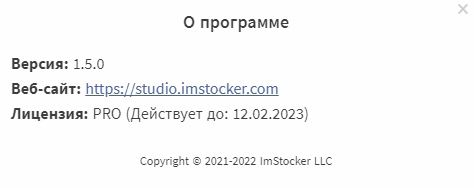

В **Настройках** программы содержится внушительное количество возможностей. Например, можно поменять язык интерфейса и перевода, настроить размер и режим отображения миниатюр, настроить боковые панели, настроить отображение ключевых слов и поведение окна "Подбор слов", добавить наборы метаданных, позволяющие задавать разные ключевые слова, названия и описания для разных стоков, добавить статусы, позволяющие делать собственные заметки к файлам, очистить кеш превью, открыть папку с логами и т.д.:

  

Более подробную информацию об управлении статусами и метаданными файлов можно найти в разделе ["Обзор настроек"](#settings)

### Рабочие области

Основное взаимодействие с файлами в программе **IMStocker Studio** происходит через “рабочие области”. Рабочая область - это папка, содержащая файлы для редактирования. Для начала работы необходимо добавить новую папку можно с помощью кнопки “**Добавить папку**”:

  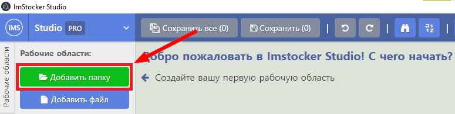

Папка может содержать файлы [разных типов](#files-types).

Тут же их можно отсортировать удобным для вас образом или быстро найти нужный файл:

  

### Фильтр

Когда много файлов, трудно найти то, что нужно. Для удобства у Вас есть возможность искать нужные файлы с помощью фильтров.

  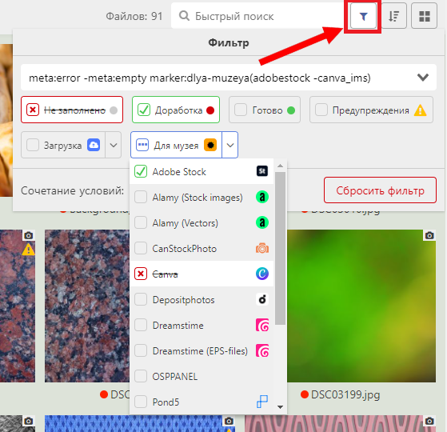

Вы можете фильтровать файлы по:

**1** - Метаданным:

  **a** - не заполнено (meta:empty) - в файле нет ни названия, ни описания, ни ключевых слов
  
  **b** - доработка (meta:error) - хотя бы одно из полей метаданных заполнено, но файл не удовлетворяет всем правилам проверки метаданных (Вы можете задать их самостоятельно в настройках программы в разделе “Общие”)
  
  **c** - готово (meta:ok) - все необходимые метаданные заполнены, файл готов к загрузке.

**2** - Наличию предупреждений (warn). Перечень предупреждений Вы также можете задать через настройки программы, раздел “Общие”

**3** - Статусам (marker:имя_статуса). Вы можете выбрать файлы, которые содержат или не содержат тот или иной статус. Например, загруженные хотя бы на один сток, или на определенные микростоки.

При первом клике на кнопку фильтра выбираются файлы, которые удовлетворяют его условиям, при втором - файлы, которые, наоборот, противоречат, а при третьем - он деактивируется и перестает влиять на файлы. Клик с зажатым ctrl соответствует двойному нажатию на фильтр.

Помимо выбора одного критерия поиска, вы можете выбрать сразу несколько, при этом указав, как они будут сочетаться:

**1** - Любое из - файл должен соответствовать хотя бы одному из активных фильтров. Например, можно выбрать файлы, с незаполненными и частично заполненными метаданными (meta:empty meta:error)

**2** - Все - файл должен соответствовать всем активным фильтрам одновременно. Скажем, можно выбрать файлы, которые готовы, но содержат предупреждения (and(meta:ok warn))  

**3** - Не все - противоположный вариант сочетанию “Все”.

  

Для удобства фильтр можно задавать не только с помощью кнопок, но и ручным вводом в специальную строку поиска. Умный поиск запоминает последние использованные фильтры и предлагает только то, что Вам нужно.

Чтобы сбросить все фильтры вы можете просто очистить поле поиска или нажать на соответствующую кнопку.

### Контекстное меню

При нажатии правой кнопки мыши на любой из файлов рабочей области появляется контекстное меню:

  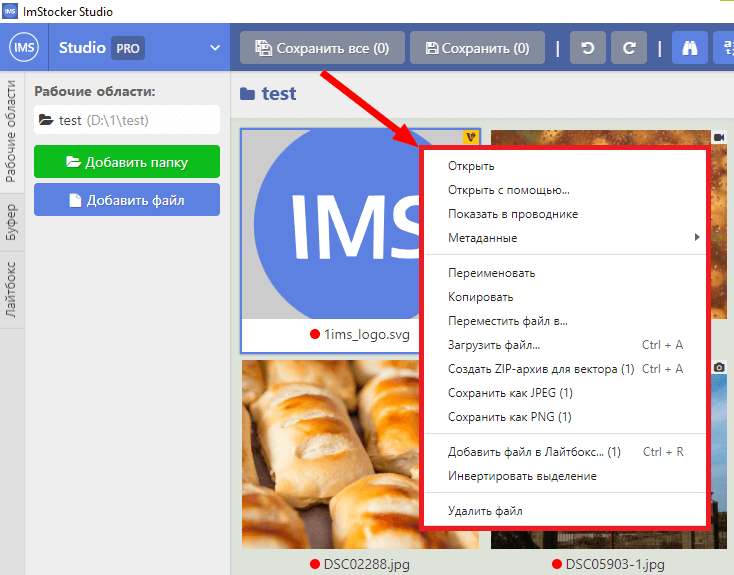

Оно позволяет быстро открыть файл для просмотра в проводнике, скопировать или вставить скопированные метаданные, а так же переназвать или переместить файл в другую Рабочую область/Папку и загрузить выбранный файл на сток.

### Типы файлов

Папка может содержать файлы следующих типов:

**Фото** - подерживаются **JPG**, **JPEG**, **TIFF**, **RAW** -форматы. Так же есть есть возможность пересохранения фото в формат JPEG

**Иллюстрации** - подерживается **PNG**-формат

**Векторные файлы** - подерживаются **EPS**, **SVG** -форматы (+ **JPEG**/**PNG**-превью)

**Видео-файлы** - подерживаются **MOV**, **MP4**, **AVI**, **MPG** -форматы (+ **JPEG**-превью)

### Статусы файлов

При загрузке содержимого папки в области отображении миниатюр, каждый файл получит индикатор заполненности метаданных(кругляшок у названия файлов):

  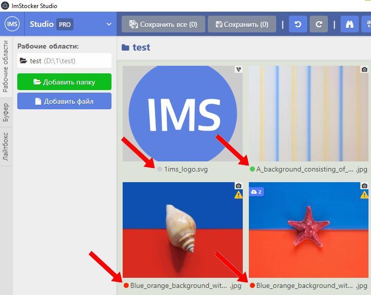

**Зеленый** - все заполнено

**Красный** - заполнено частично

**Серый** - ничего не заполнено

Более подробную информацию об управлении статусами и метаданными файлов можно найти в разделе ["Проверка готовности файлов"](#checking-readiness-of-files)

Кроме статусов, отражающих уровень соответствия метаданных условиям, в программе есть и другие статусы. Каждый раз, когда вы загружаете файл на микросток ImStocker добавляет в файл специальную метку, которая поможет вам сориентироваться, какие файлы загружены, а какие нет. Кроме того, вы  можете  придумать и добавить собственные статусы к работам. Например, пометить те файлы, которые были приняты или отклонены стоками, либо выделить группу файлов по какому-то признаку.

Управлять такими статусами можно в разделе "Настройки - Статусы файлов". Подробнее ["здесь"](#settings-file-statuses)

Для добавления статуса к файлу(-ам) нужно выбрать файлы, затем в разделе “Редактор метаданных” перейти на вкладку “Инфо” и нажать кнопку “Добавить статус”.

  

Появится диалоговое окно, где вы должны выбрать желаемый статус, дату (по умолчанию -  текущая) и, если требуется, один или несколько стоков, к которым он относится.

  

Добавленные статусы отображаются в левом верхнем углу изображений в списке файлов и во вкладке “Инфо” в “Редакторе метаданных”.

  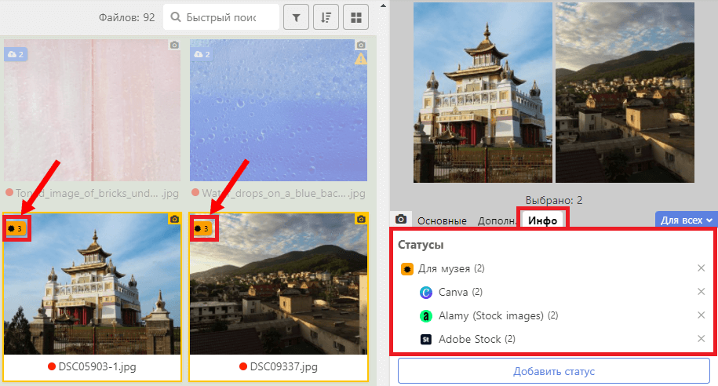

Готово! Но если Вы передумаете, то можете беспрепятственно удалить статус файла, нажав на крестик справа от названия статуса  в разделе “Редактор метаданных/Инфо”

Если Вы не хотите, чтобы значки статусов отображались, перейдите в раздел настроек “Рабочая область” и уберите галочку напротив пункта “Отображать значки статусов файлов в списке файлов”
  

  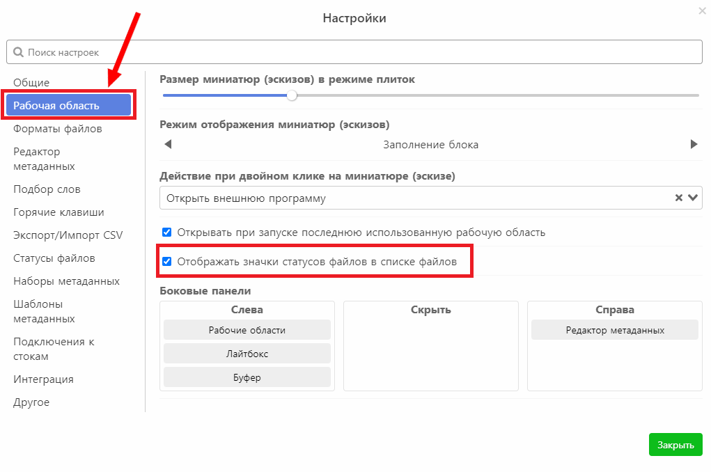

### Обратная связь

Если у Вас есть вопросы, жалобы или предложения, то сообщите нам в социальных сетях просто перейдя по одной из ссылок:

[Facebook](https://www.facebook.com/groups/imstocker)
[ВКонтакте](https://vk.com/imstockercom)
[Instagram](https://www.instagram.com/imstocker.ru/)
[Twitter](https://twitter.com/intent/follow?original_referer=https%3A%2F%2Fstudio.imstocker.com%2F&ref_src=twsrc%5Etfw%7Ctwcamp%5Ebuttonembed%7Ctwterm%5Efollow%7Ctwgr%5Eimstocker&region=follow_link&screen_name=imstocker)
[Telegram](https://t.me/imstocker_ru)

## Редактирование файлов

### Редактирование метаданных

  

Редактирование метаданных выбранного файла происходит в правой части программы. Редактор состоит из трех вкладок: 

**Основные** - состоит из 3 боксов: **Название**, **Описание**, **Ключевые слова**

**Дополнительные** - в данной вкладке вы можете посмотреть или удалить метатеги

**Инфо** - содержит статусы файлов

После редактирования метаданных одного или нескольких файлов можно либо сохранить результат текущего активного файла, или все внесенные изменения сразу, а так же в любой момент отменить или повторить внесенные изменения:

  

Для удобства пользователя существует механизм изменения визуального отображения ключевых слов. Находится он в **Настройки - Редактор метаданных**:

  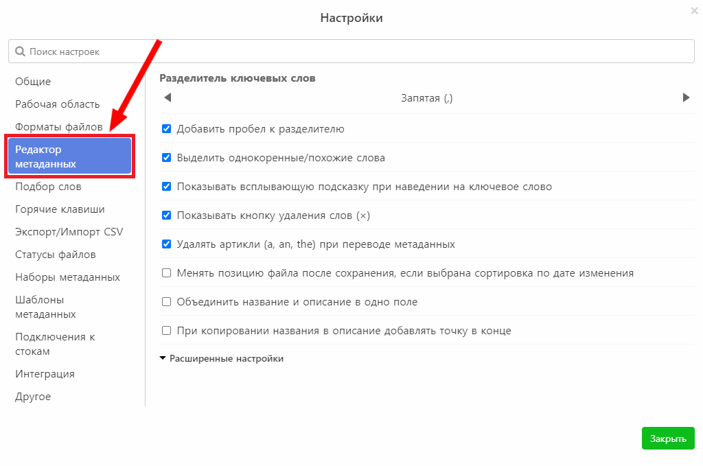

В правом нижнем углу программы находится несколько функций значительно упрощающих работу с ключевыми словами:

  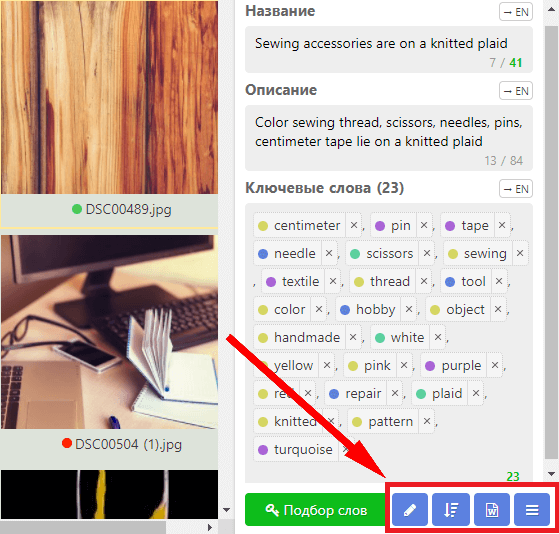

Кнопка “**Преобразовать ключевые слова**” позволяет вносить быстрые изменения во все ключевые слова одновременно: перевод слов в единичное/множественное число, а также возможность удалить однокоренные/похожие слова, слова превышающие установленный лимит и слова с ошибками. И много других полезных функций.

  

Кнопка “**Отсортировать по..**”  позволяет в целях удобства отображения отсортировать ключевые слова по популярности, количеству скачиваний, алфавиту в прямом и обратном порядке, а также случайным образом. 

  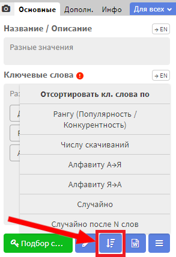

Кроме этого, в программе присутствует особый вид случайной сортировки ключевых слов, в которой можно также выбрать количество первых слов, которые останутся на месте. В отличие от предыдущей функции ключевые слова не распределяются, а просто сортируются в рамках одного файла. Для активации функции нужно выбрать пункт “Случайно после N слов” и указать количество слов, которые должны остаться на месте. 

  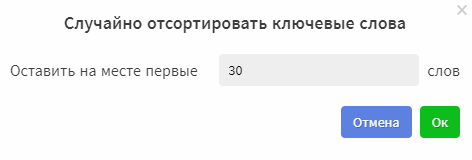

Кнопка “**Шаблоны**” позволяет создать ваш собственный набор ключевых слов, и быстро применить его в случае надобности, значительно упрощает работу с ключевыми словами в случае, если вы работаете с большим количеством однотипных картинок/фотографий.

  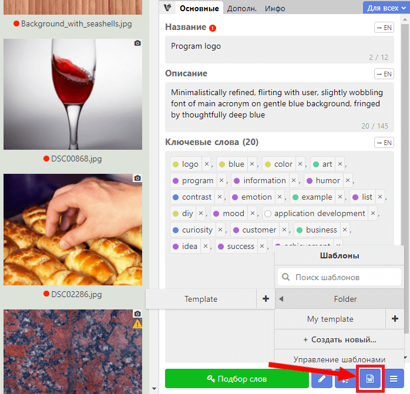

Кнопка “**Меню**” позволяет работать с функциями импорта/экспорта метаданных, а также с буфером метаданных. Здесь также можно выбрать функции перемещения файлов и копирования ключевых слов.

  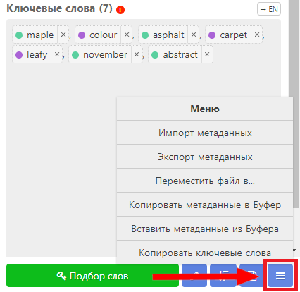

### Подбор ключевых слов

В правом нижнем углу программы можно также найти интегрированный сервис подбора **ImStocker Keyworder**, позволяющий быстро подобрать ключевые слова, использующиеся на стоках, с помощью ряда удобных фильтров.

Для того чтобы воспользоваться сервисом **ImStocker Keyworder**, необходимо выделить один или несколько файлов, к которым вы будете подбирать слова, и нажать кнопку “**Подбор слов**”:

  

Для получения первых результатов, в окне поиска достаточно:

  **1** Ввести одно ключевое слово и нажать клавишу  Enter или кнопку поиска

  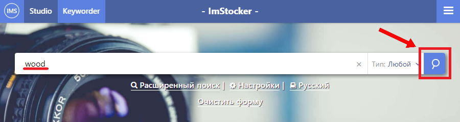

Для удобства пользователя существует механизм заполнения поисковой строки при подборе слов. Находится он в **Настройки - Подбор слов**:

  

**2** Выбрать одну или несколько из ассоциирующихся с этим словом всплывших картинок:

  

Найденные по результатам поиска ключевые слова можно быстро отсортировать по **Рангу**:

  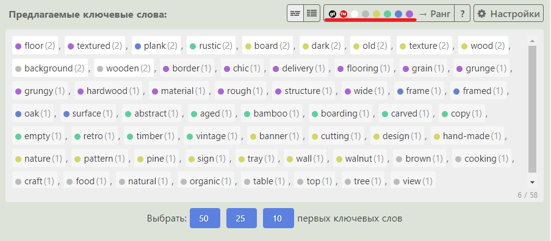

**Ранг** ключевого слова зависит от скачивания, просмотров, уровня конкурентности и трендов и отображается с помощью цветного круга рядом с ключевым словом:

**0 - Белый цвет** означает, что в базе ImStocker еще недостаточно информации, чтобы сделать вывод продающее это слово или нет

**1 - Серый цвет** означает плохой ранг. Слово, либо очень часто используется, либо работы с ним не покупают

**2 - Желтый цвет** означает низкий ранг. Не рекомендуется использовать слишком много таких слов при ключевании

**3 - Зеленый цвет** означает нормальный ранг. Это слово достаточно востребовано и не слишком конкурентно

**4 - Синий цвет** означает хороший ранг.

**5 - Фиолетовый цвет** означает отличный ранг. Низкая конкуренция, высокие продажи

Кроме сортировки по рангам в этом же окне можно посмотреть перевод ключевых слов:

  

А также более тщательно настроить отображение результатов поиска в настройках предлагаемых ключевых слов:

  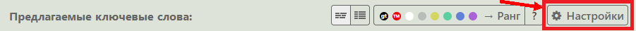

  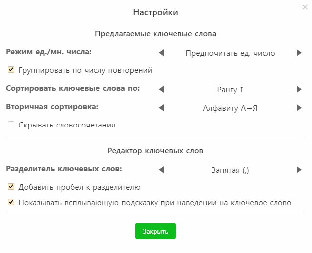

Среди всех найденных ключевых слов необходимо выбрать те, которые вы будете использовать и отметить их нажатием левой кнопки. Каждое отмеченное слово переходит вниз в специальный бокс, для дальнейшего использования:

  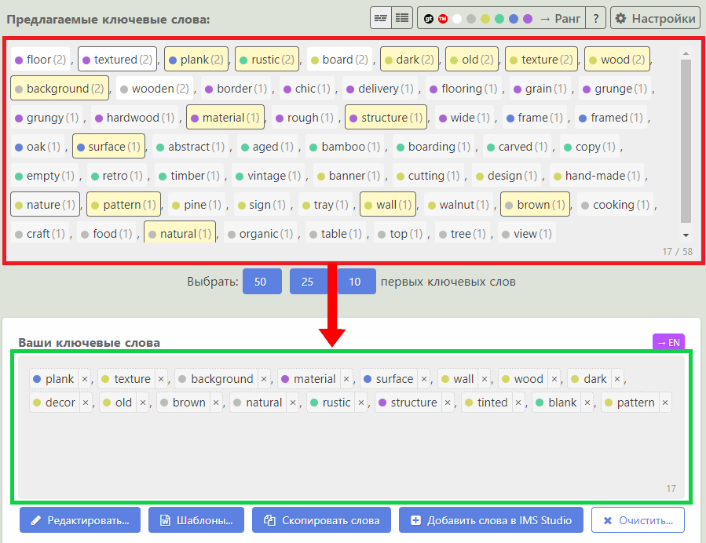

Все выбранные вами ключевые слова можно сразу применить кнопкой “Добавить слова в IMS Studio” к файлу/файлам в вашей рабочей области:

  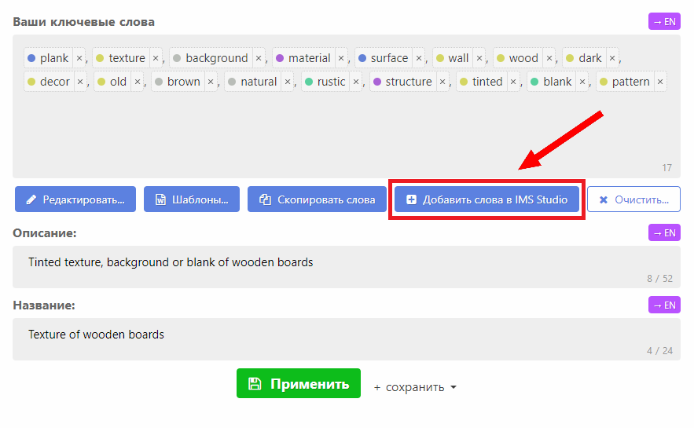

С помощью кнопки “**Редактировать**” можно:

- Отсортировать выбранные слова по рангу, алфавиту в прямом и обратном порядке, по количеству скачиваний или в случайном порядке.
- Преобразовать выбранные слова в единственное/множественное число, а также разбить на слова
- Удалить выбранные слова, которых нет на Getty/iStock, торговые марки, дублирующие однокореные/похожие слова, слова с ошибками и превышающие лимит
- Настроить небольшие визуальные параметры отображения

  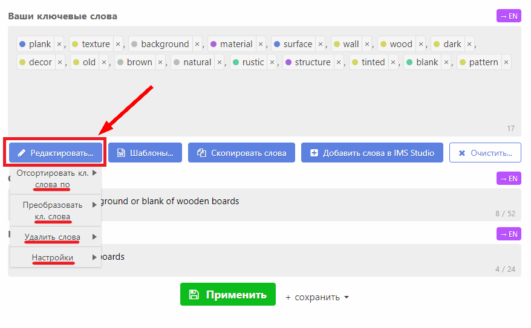

С помощью кнопки “**Шаблоны**” можно создать новый или отредактировать уже созданные вами шаблоны. С помощью кнопки “**+**” можно применить шаблон. При нажатии на созданный вами шаблон, откроются содержащиеся в нем ключевые слова:

  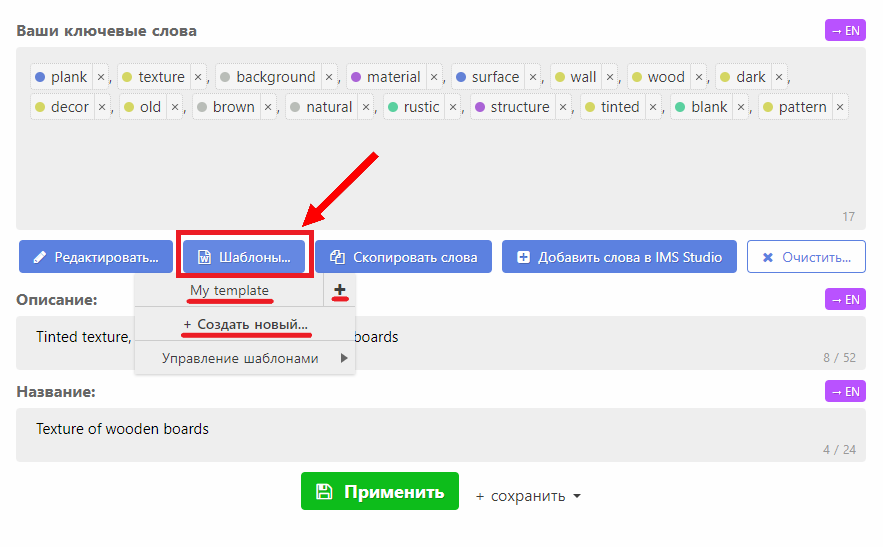

  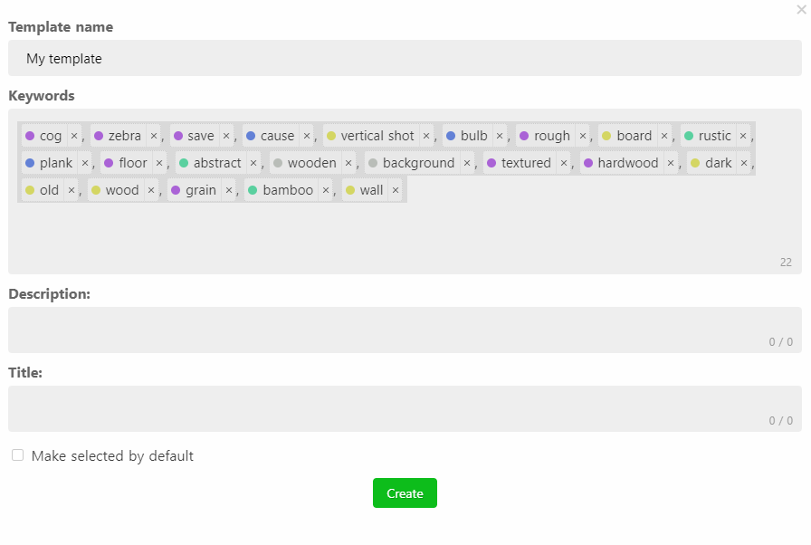

Выбранные левой кнопкой слова из этого шаблона добавятся в бокс “**Ваши ключевые слова**”. Внутри шаблона можно добавить все слова сразу кнопкой “**Использовать шаблон**”, добавить одно/несколько случайных слов кнопкой “**Выбрать случайно**”, внести изменения в состав или название самого шаблона кнопкой “**Редактировать**”, либо удалить данный шаблон полностью.

  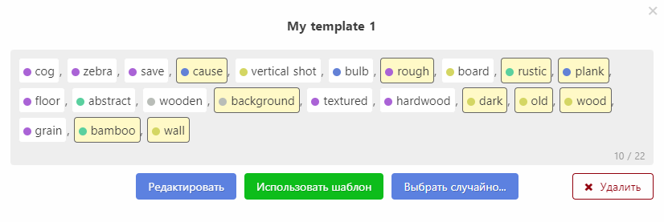

Кнопка “**Шаблоны**” также содержит функционал “**Управления шаблонами**”, который позволит вам экспортировать созданные шаблоны во внешний файл формата **.csv** либо импортировать шаблоны из такого же файла.

  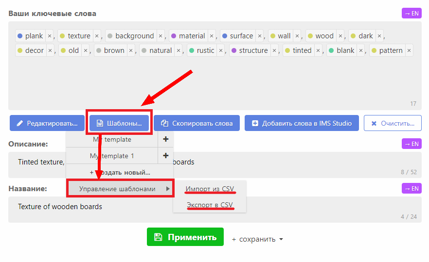

После того как список ключевых слов сформирован и полностью вас устраивает,  а работа с **ImStocker Keyworder** завершена, результат можно **Применить** к выбранным картинкам в рабочей области **ImStocker Studio** и выбрать что сделать с окном **ImStocker Keyworder**:

  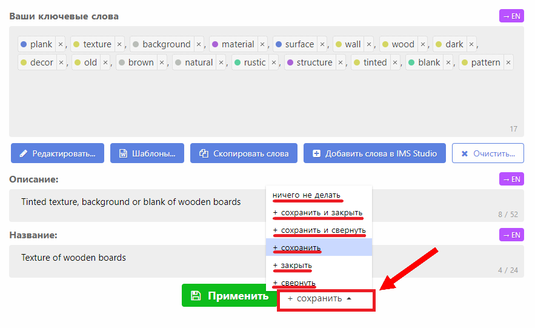

При любом из выбранных вариантов **Ваши ключевые слова**, а также содержание боксов **Описание** и **Название** применится к выбранному файлу/файлам рабочей области, действие из контекстного меню относится только к окну сервиса **ImStocker Keyworder**.

Небольшие настройки поведения окна **ImStocker Keyworder** можно поменять в **Главное меню/Настройки/Подбор слов**:

  

### Объединение названия и описания

Если название и описание одинаковы, тогда нет необходимости показывать оба поля, верно? ImStocker тоже так считает, поэтому теперь вы можете скрывать описание файла. 

  

Для этого перейдите в раздел настроек “Редактор метаданных” и выберите пункт  “Объединить название и описание в одно поле”. 

  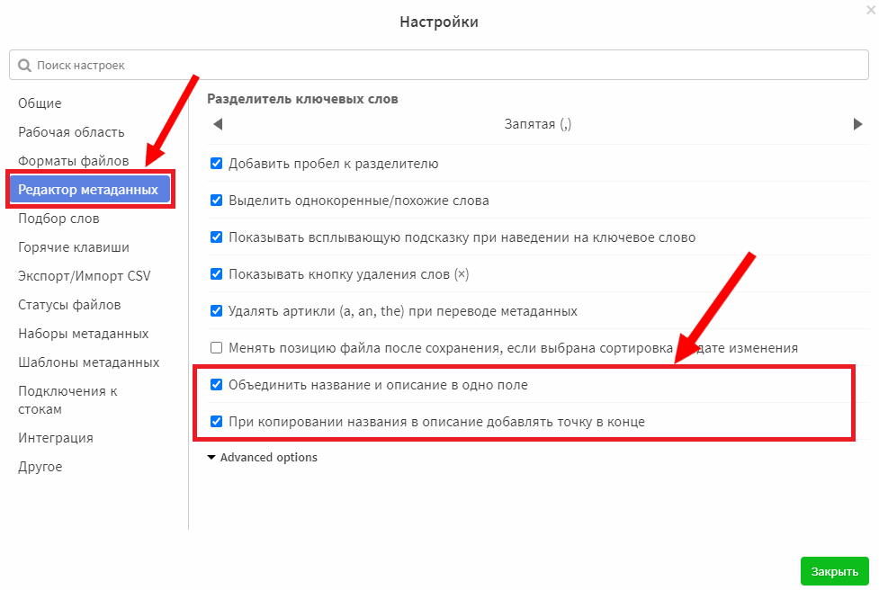

Если при объединении название и описание не будут совпадать,то появится предупреждение. Вы можете настроить программу также так, чтобы при вводе названия в объединенное поле, в описание оно копировалось с точкой на конце. Это может быть полезно, если Вы хотите, чтобы название и описание в точности не были равны. Для активации этой возможности выберите пункт “При копировании названия в описание ставить точку в конце”.

### Уточнение ключевых слов для Getty/IStock/ESP

Как известно, у GettyImages (IStock/ESP) свое собственное представление о том, какие ключевые слова можно использовать при описании файлов. Сейчас пользователь может уточнять ключевые слова, не выходя из программы, подбирая к ним наиболее близкие слова из словаря Getty/IStock. 
Чтобы воспользоваться этой возможностью, необходимо выполнить следующее:

Выбрать нужные файл(-ы), нажать на синюю квадратную кнопку с карандашом внутри и в выпадающем списке выбрать “Уточнение ключевых слов для Getty/IStock/ESP”.

  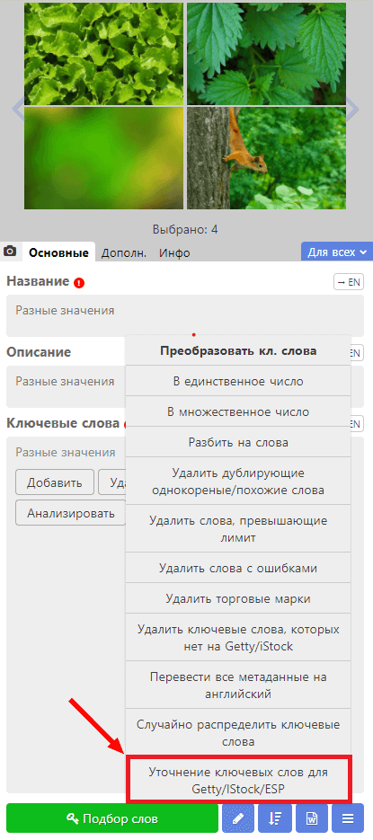

Откроется окно с ключевыми словами, их уточнениями и переводом. Выберите нужные уточнения, щелкнув левой кнопкой мыши по ним. Для 1 ключевого слова можно выбрать только 1 уточнение.

  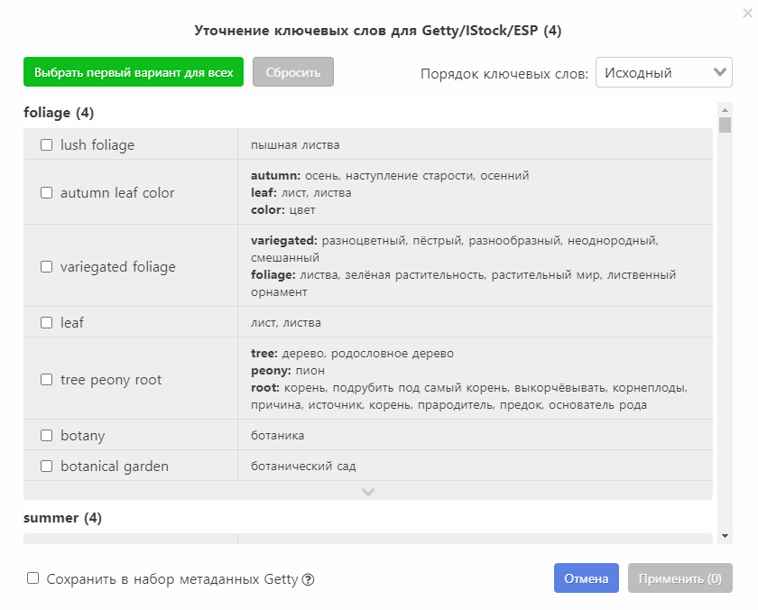

Также Вы можете выбрать первый вариант для всех или сбросить выбор, нажав на соответствующие кнопки

  

Нажмите на кнопку “Применить”. Теперь, в зависимости от того, включена ли галочка “Сохранить в набор метаданных Getty”, уточненные ключевые слова запишутся, либо вместо текущих, либо в специальный набор метаданных “Getty”. Значения наборов метаданных автоматически применяются к файлам при экспорте метаданных и при загрузке файлов.

  

### Перевод метаданных [[PRO]]

**Перевод метаданных** - одно из преимуществ, доступное в **PRO** версии **IMStocker Studio**. Позволяет мгновенно перевести с русского на английский язык метаданные файла. Каждый бокс переводится отдельной кнопкой:

  

Пользователи **PRO**-версии ImStocker теперь могут выполнять перевод метаданных не только на английский язык, но и обратно на их родной язык. Это полезно, если нужно внести какие-то изменения в уже атрибутированный файл. 

Чтобы перевести обратно на ваш язык, зажмите клавишу **<Alt>** при нажатии на кнопку перевода. Это же можно сделать с помощью горячих клавиш: **ctrl+alt+T**. Чтобы перевести все метаданные, зажмите клавишу **<Shift>** при нажатии на кнопку перевода.

Посмотреть возможности функции перевода в деле можно на видео:

[[YOUTUBE=Z1kohCT3aDQ]]
  
### Вкладка дополнительных полей

### Наборы метаданных [[PRO]]

Наборы метаданных позволяют хранить разные значения метаданных для разных метаданных. Они применяются при экспорте метаданных и загрузке файлов. Закрашенные квадраты обозначают задействованные наборы метаданных (т.е. для них вы переопределили метаданные). С помощью кнопки “**Управлять**” можно создать новый или отредактировать уже созданные вами наборы метаданных. 
  

  

  
  
То же самое вы можете сделать в **Главное меню/Настройки/Наборы метаданных**:
  

  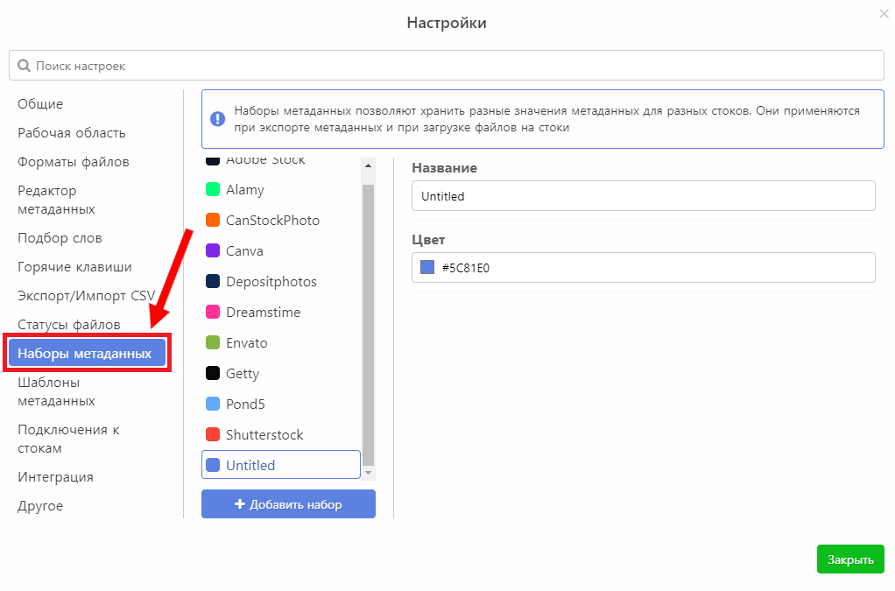

### Копирование/вставка метаданных

В программе **IMStocker Studio** реализован механизм копирования всех метаданных файла для применения к одному/нескольким файлам рабочей области, что позволяет сэкономить значительное количество времени при работе с большой библиотекой картинок/фотографий.
Скопировать метаданные файла можно несколькими способами:

Через контекстное меню: при нажатии правой кнопки мыши по выделенной картинке появится контекстное меню, переходим в раздел **Метаданные** и нажимаем **Скопировать метаданные в Буфер**:

  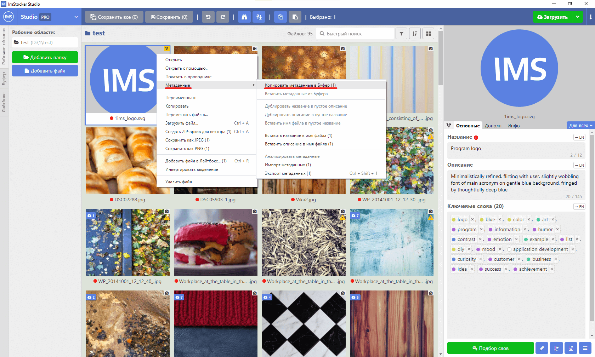

Для применения скопированных метаданных к одному или нескольким файлам, выделяем нужные картинки и нажимаем правой кнопкой мыши - **Метаданные** - **Вставить метаданные из буфера**:

  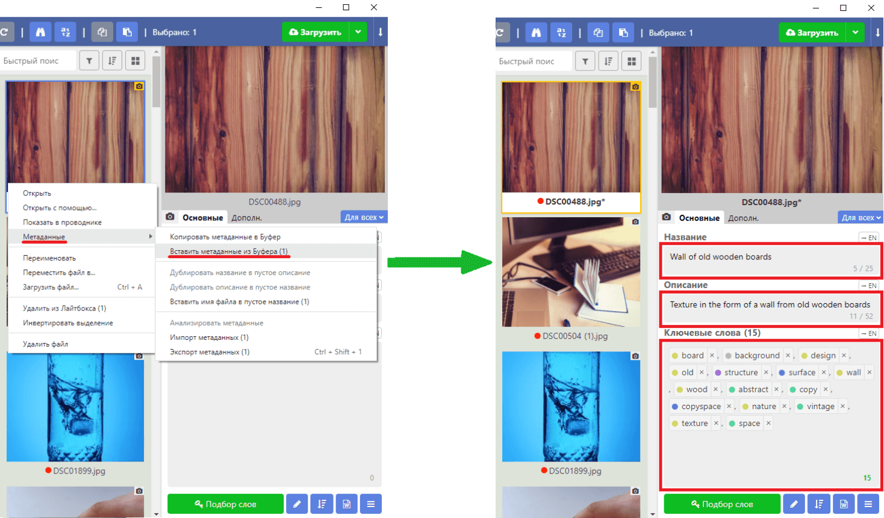

Метаданные скопируются и будут идентичны метаданным исходной картинки.

Второй способ скопировать метаданные - через панель редактирования в правом нижнем углу программы. Нажимаем кнопку **Меню** и выбираем пункт **Скопировать метаданные в Буфер**, далее выделяем один или несколько файлов куда необходимо скопировать метаданные и нажимаем **Вставить метаданные из Буфера**:

  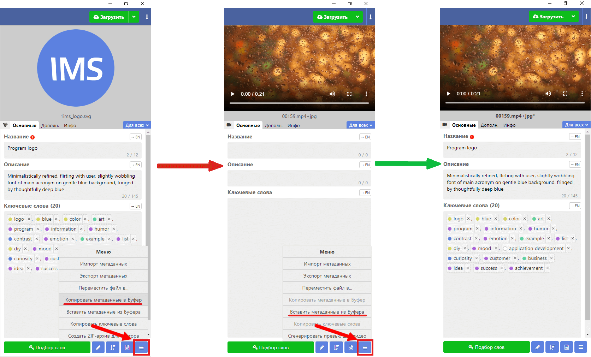

В любой момент работы с копированием метаданных вы можете посмотреть что на данный момент скопировано в буфер, а также в случае необходимости внести корректировки перед вставкой метаданных в другой файл. Для этого переходим в раздел **Буфер**:

  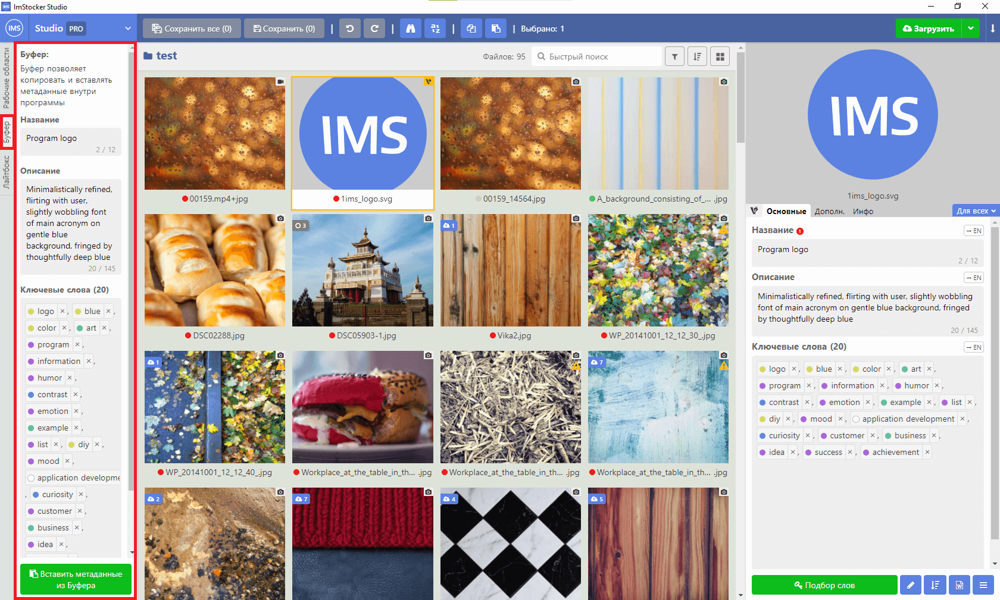

В данном разделе также присутствует кнопка **Вставить метаданные из Буфера** которая применит всё что есть в буфере к выбранному в середине экрана файла.

### Множественный выбор

Возможность редактирования сразу нескольких файлов позволит вам сэкономить время при работе с множеством похожих картинок. Для редактирования нескольких файлов их необходимо выделить левой кнопкой мыши, предварительно зажав клавишу **Ctrl**. Все выделенные картинки объединятся в группу, её состав и количество выбранных файлов отобразится в правом верхнем углу программы:

  

Всё что вы введете в этом режиме в боксы **Название** и **Описание** заменит содержание этих боксов каждой из выделенных картинок. Ключевые слова можно либо **Редактировать все**, то есть полностью заменить ключевые слова исходных картинок введенными, либо **Добавить** что дополнит введенными словами исходные ключевые слова картинок.

### Шаблоны

Работа с шаблонами в **IMStocker Studio** позволит вам значительно ускорить процесс добавления ключевых слов к файлам. Меню управления шаблонами находится в правом нижнем углу программы и появляется при выделении любой картинки из рабочей области:

  

В данном меню отображается список уже созданных шаблонов, кнопка для создания нового шаблона, а также возможность импорта шаблонов из файла **.csv** или экспорта ваших шаблонов в подобный файл.
При нажатии на один из ваших шаблонов, откроется окно, содержащее в себе ключевые слова объединенные в шаблон. Совпадающие по содержанию с выделенным файлом ключевые слова будут отмечены, а все слова которые вы отметите внутри шаблона мгновенно добавятся в список ключевых слов выделеннонр файла. В этом же окне шаблон можно **Редактировать** или **Удалить**, добавить все ключевые слова разом кнопкой **Выбрать всё**, или несколько случайных слов кнопкой **Выбрать случайно**.

Функция **Импорта/Экспорта** шаблонов, позволит вам передавать шаблоны между своими устройствами или другими пользователями.

### Генерация превью для вектора
   

  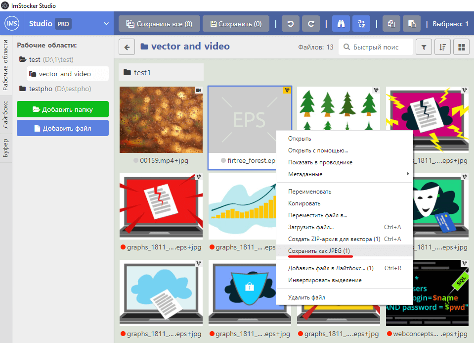

  

  

  
Вы можете регулировать ширину и высоту при генерации превью вектора в расширенных настройках:
  

  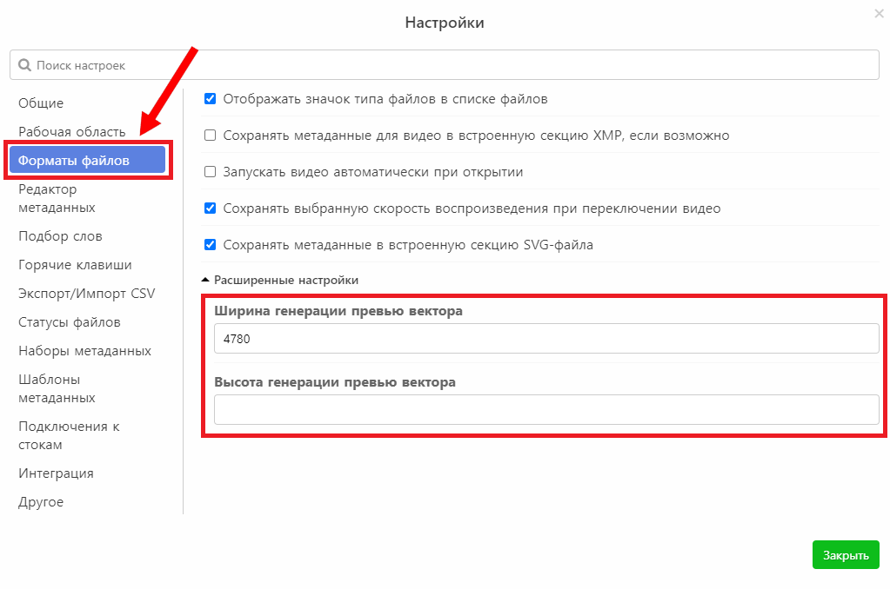

### Создание ZIP-архивов для векторов
  
Программа **IMStocker Studio** также позволяет создать ZIP-архивы для нескольких векторов сразу не выходя из  программы. Для этого нужно нажать на файл в рабочей области правой кнопкой мыши и выбрать **Создать ZIP-архив для вектора**:

  

  
Для выбранного файла будет создан ZIP-архив:

  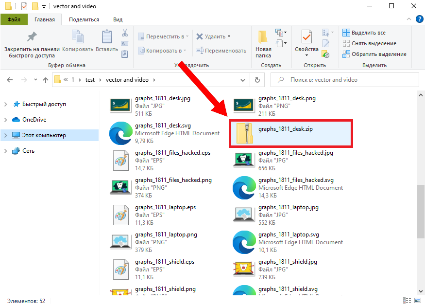

### Генерация превью для видео [[PRO]]
  
Чтобы сгенерировать превью для видео, нужно нажать на видео в рабочей области правой кнопкой мыши и выбрать **Сгенерировать превью для видео**:
  

  

Откроется окно для выбора превью. Вы можете увеличивать превью, щелкнув мышкой по изображению. Чтобы выбрать определённый кадр видео, нужно задать момент времени с помощью ползунка или числа:
  

  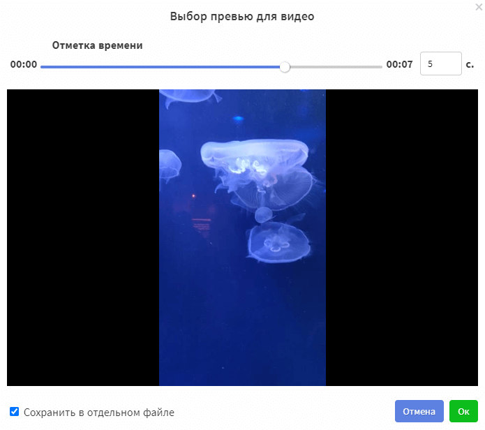

  
Будет создан файл формата **.jpg** с таким же названием, что и у видео:
  

  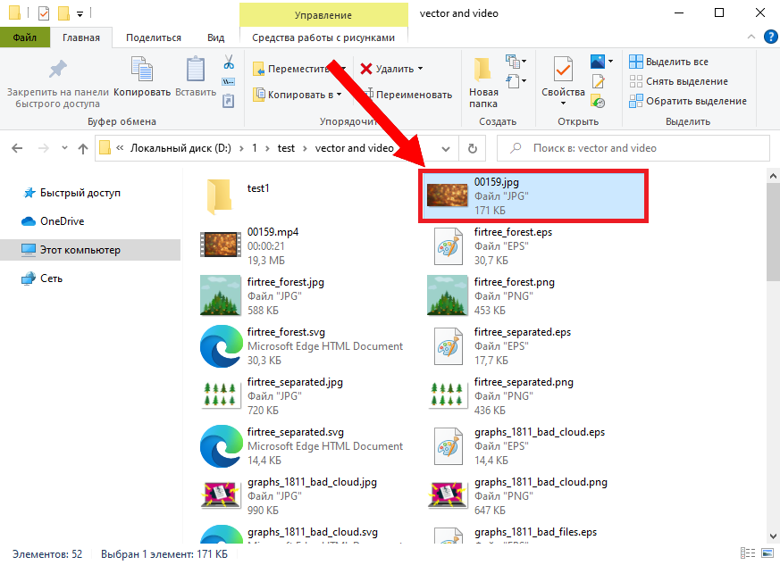

  
Вы можете сохранять превью в отдельном файле, не закрывая диалоговое окно. Просто нажмите правой кнопкой мыши на желаемый кадр, выберите в контекстном меню “Сохранить в отдельном файле” и нужный кадр у вас в кармане (на диске). В данном случае будет создан файл формата **.jpg** с названием, включающим в себя название видео и момент времени, выбранный Вами.
  

  

  
## Управление файлами

### Экспорт метаданных [[PRO]]

Экспорт метаданных одна из ключевых особенностей **PRO** версии **IMStocker Studio**, позволяющая в несколько нажатий выгрузить метаданные выбранных картинок в отдельный файл формата **.csv**.

Для того чтобы воспользоваться функцией экспорта нажимаем кнопку **Меню** в правом нижнем углу и выбираем пункт **Экспорт метаданных**:

  

Окно экспорта предоставляет возможность выбрать один или несколько шаблонов использующийся микростоками, либо создать свой собственный под ваши потребности:

  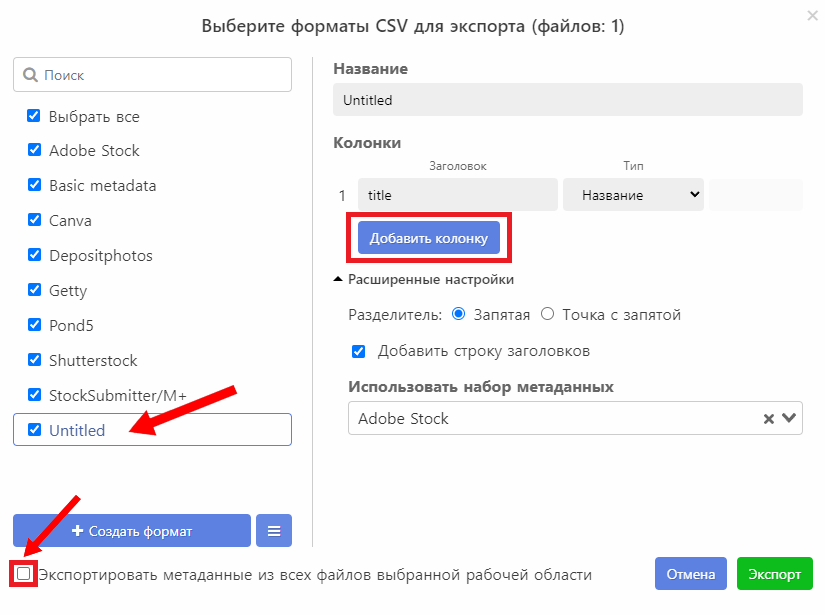

Для каждого выбранного шаблона будет создан файл формата **.csv**, содержащий метаданные файла:

  

Видеоинструкция о данной функции:

[[YOUTUBE=Tm_8wiVCvoc]]

### Импорт метаданных [[PRO]]

Импорт метаданных - ещё одна особенностей **PRO** версии **IMStocker Studio**, позволяющая быстро подгрузить метаданные из файла формата **.csv** к выделенным картинкам в рабочей области.
Чтобы воспользоваться: выделяем незаполненные картинки, для которых у нас приготовлен файл **.csv** и нажимаем **Меню** в правом нижнем углу и выбираем пункт **Импорт метаданных**: (проверка принадлежности метаданных к картинке осуществляется по названию картинки)

  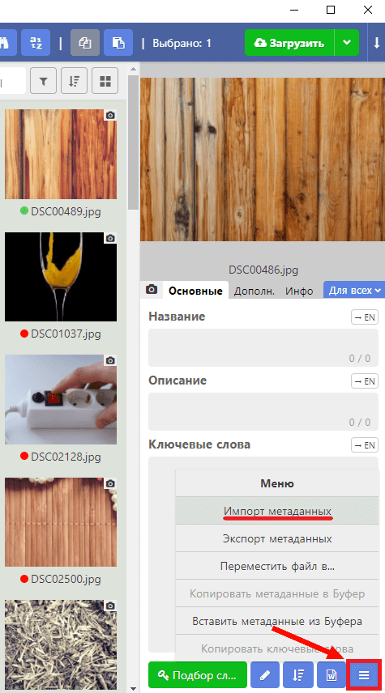

Выбираем файл **.csv** необходимого шаблона и нажимаем **Открыть**:

  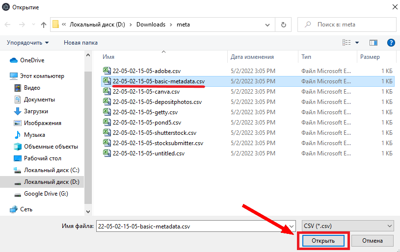

Исходя из содержащийся в файле метаданных программа попробует определить шаблон заполняемых данных и предложит его. Нажимаем **Импорт**:

  

И проверяем что заполнились все боксы для каждой из упомянутых в файле картинок:

  

Видеоинструкция о данной функции:

[[YOUTUBE=VvgFnPx7PV0]]

### Анализ метаданных [[PRO]]

Анализ метаданных - одна из самых полезных и наглядных функций **PRO** версии **IMStocker Studio**. Для того чтобы провести анализ метаданных, выделяем 2 или более файлов в рабочей области и нажимаем кнопку **Анализировать**, которая появится в боксе **Ключевые слова**.

  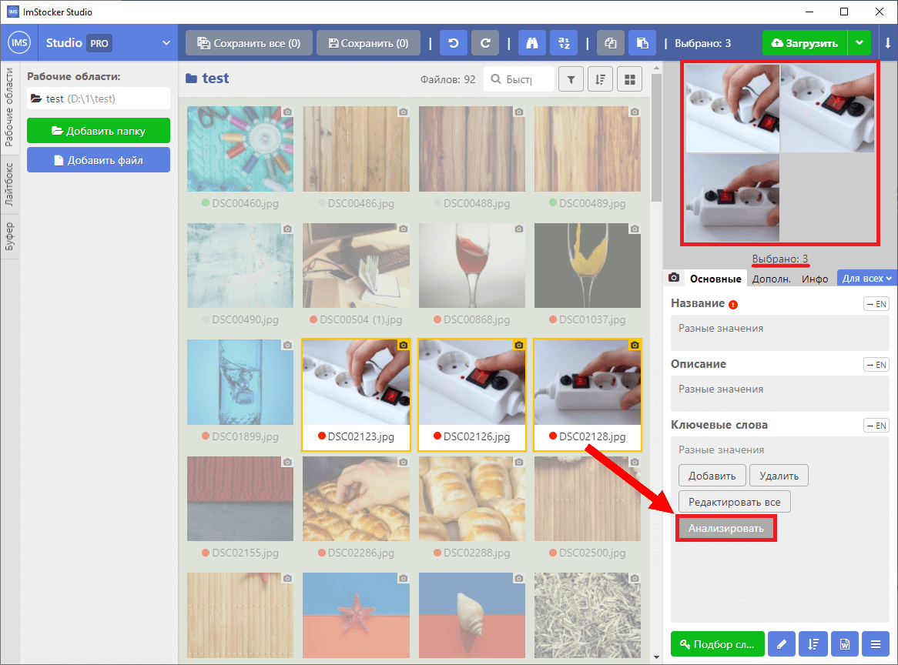

Откроется окно **Анализ метаданных**, содержащее две вкладки:

**По ключевым словам** - программа предоставит краткую статистическую сводку по 4 пунктам: минимальное кол-во слов, максимальное кол-во слов, среднее число слов и их средняя уникальность. Визуально отобразит количество ключевых слов каждого из выделенных файлов, их уникальность в процентах от общего количества слов и разобьет слова на ранговые группы, а так же посчитает их количество, числовое и процентное. Общие ключевые слова, слова, используемые только один раз, повторяющиеся слова, а так же общий список всех слов будет наглядно отображен в специальных боксах.

  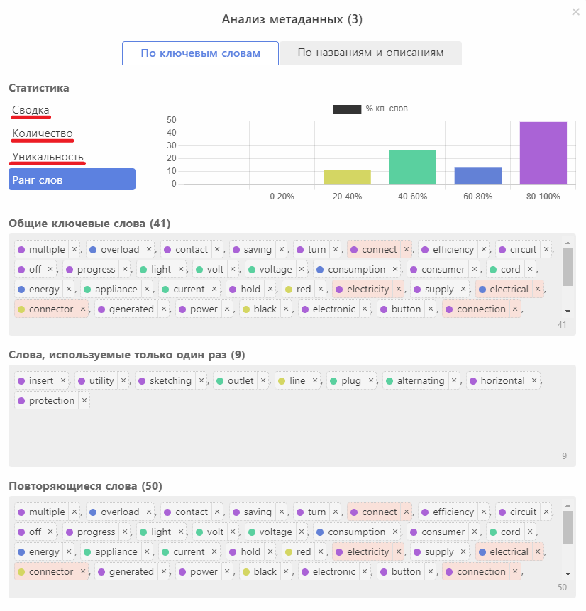
  

**По названиям и описаниям** - программа отобразит количество уникальных и заполненных, минимальную, среднюю и максимальную длину, общее число уникальных и совпадающих названий и описаний каждого из выделенных файлов. Предоставит списки наиболее часто встречаемых названий и описаний.

  

  
Видеоинструкция о данной функции:

[[YOUTUBE=4hv5MDIsGas]]

### Переименование файлов и папок

Программа **IMStocker Studio** позволяет переименовать файл не выходя из  программы. Для этого нужно нажать на файл в рабочей области правой кнопкой мыши и выбрать **Переименовать**:

  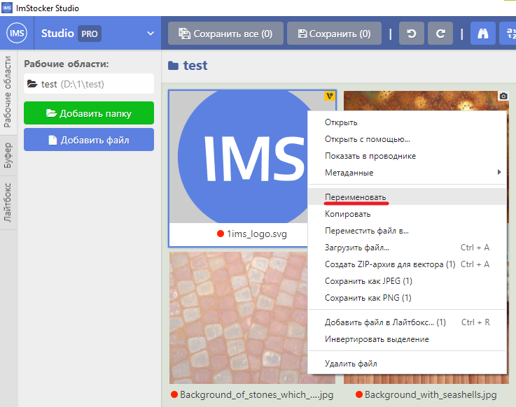

Либо дважды нажать на название картинки левой кнопкой мыши:

  

  
Для переименования папки нужно нажать на папку правой кнопкой мыши и выбрать **Переименовать папку**:  

  

  
Откроется окно переименования, позволяющее задать папке новое название:

  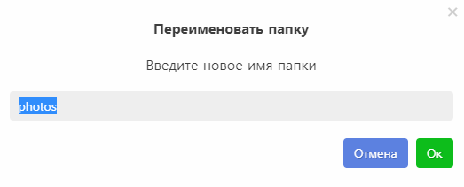

  
### Переименование файлов по названию и по описанию

Пользователь может переименовать файл с помощью названия или описания. Для этого нужно выбрать файл(-ы) и найти в контекстном меню пункт “Вставить название в имя файла” или “Вставить описание в имя файла”.

  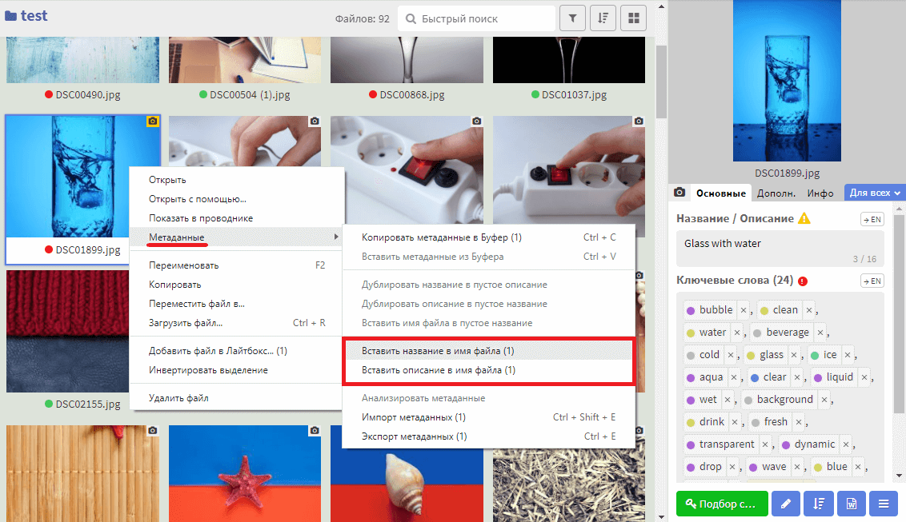

  

  
### Копирование файлов
  
Пользователь может копировать файлы, не выходя из программы. Для этого нужно выбрать файл и найти в контекстном меню пункт “Копировать”. 

  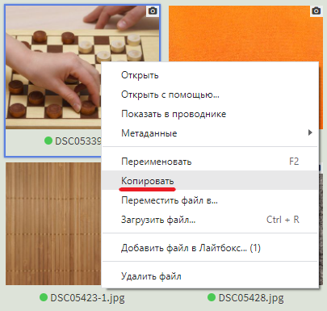

Откроется диалоговое окно с предлагаемым названием для копируемого файла. 

  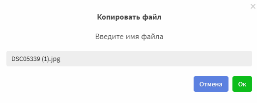

Копирование завершено.

  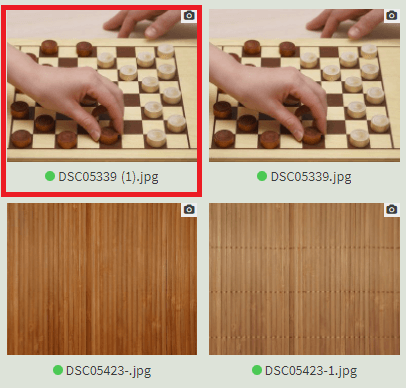

### Перемещение файлов и папок

Программа **IMStocker Studio** также позволяет переместить файл не выходя из  программы. Для этого нужно нажать на файл в рабочей области правой кнопкой мыши и выбрать **Переместить файл в**:
  

  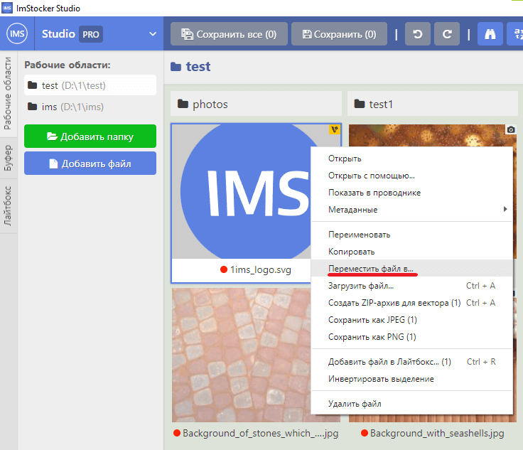

Либо выделить необходимые картинки для перемещения и воспользоваться кнопкой **Меню** в правом нижнем углу программы, затем нажать **Переместить файл в**:

  

Для переименования папки нужно нажать на папку правой кнопкой мыши и выбрать **Переместить папку**:  

  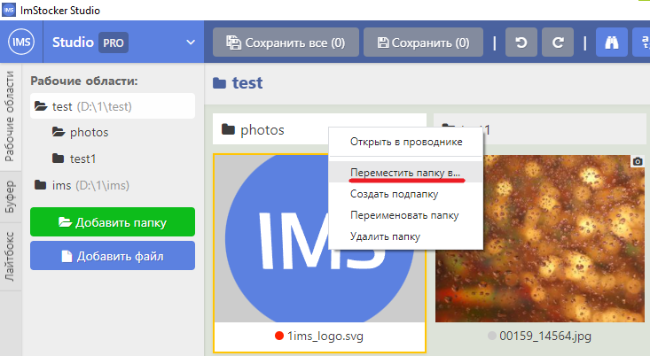

В любом случае откроется окно перемещения, позволяющее **Переместить** выделенные картинки или папку в одно из добавленных рабочий мест, либо в папку, созданную внутри них:

  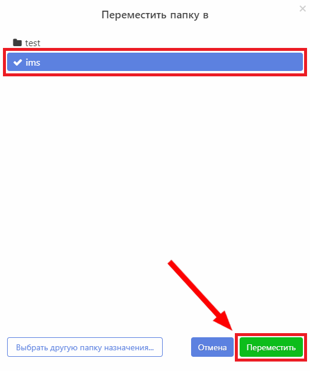

### Создание подпапок

Для создания подпапки нужно нажать на папку правой кнопкой мыши и выбрать **Создать подпапку**:  

  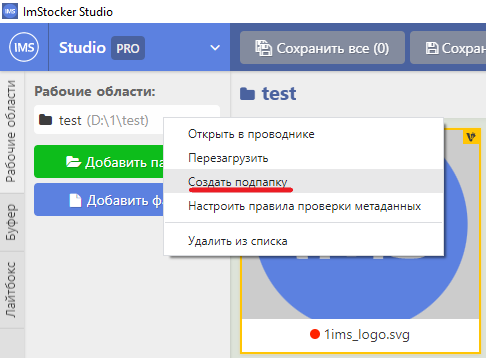

Откроется окно для выбора имени новой папки:

  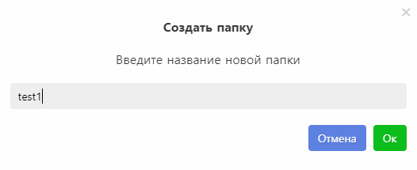

Подпапка может появиться не сразу. Чтобы обновить список папок, в **Рабочие области** нужно нажать на папку правой кнопкой мыши и выбрать **Перезагрузить**:
  

  

  
### Открыть файл с помощью…
  
Если вам нужно скорректировать или посмотреть файл в какой-либо внешней программе, теперь вы можете нажать в контекстном меню пункт “Открыть с помощью...”

  

Если нажатая плитка включает в себя сразу несколько файлов (например EPS + JPEG), то программа уточнит, какой конкретно файл вы хотите открыть. 

Далее откроется окно выбора программы. Найдите нужную программу на своем компьютере и подтвердите выбор. После этого IMS Studio спросит, должна ли она запомнить эту программу для выбранного расширения файла. Если вы ответите утвердительно, то в следующий раз в контекстном меню появится соответствующий пункт:

  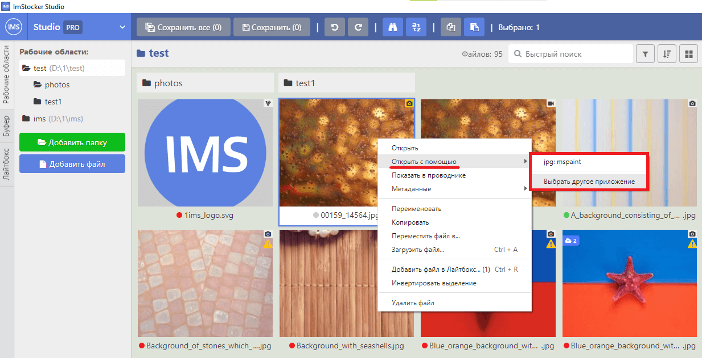

  
Вы также можете отредактировать список внешних программ в разделе **Настройки - Интеграция - Открыть с помощью**:

  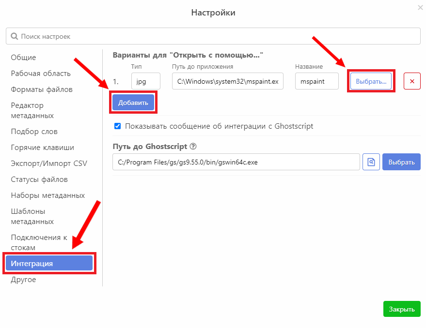

  
Вы можете настроить открытие внешней программы и при двойном клике на плитку. Для этого выберите соответствующую опцию в пункте “Действие при двойном клике на миниатюре (эскизе)”:

  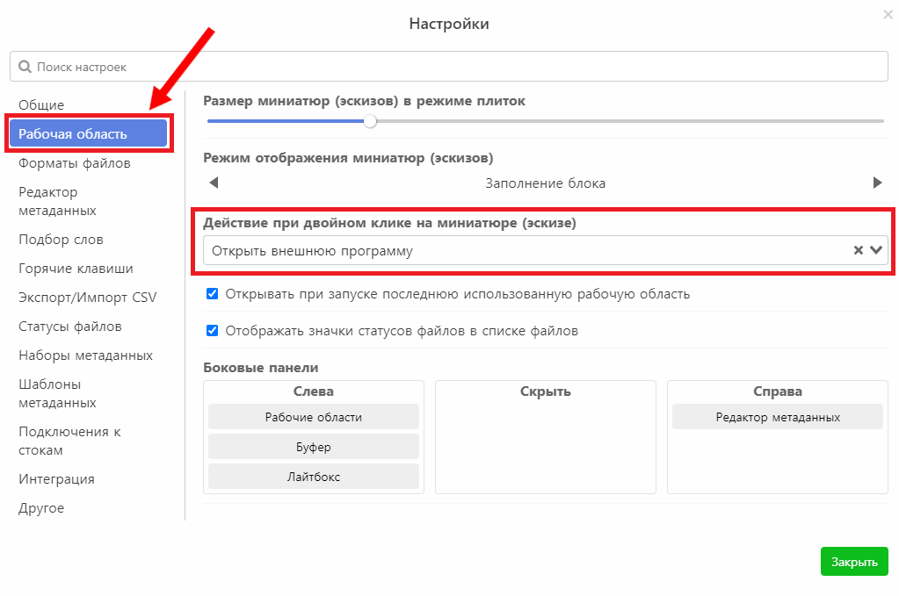

Теперь при двойном клике на плитку будет открываться первая подходящая по расширению программа из списка “Варианты для “Открыть с помощью...””. Если для одного расширения у вас выбрано несколько программ, вы можете их поменять местами, если потяните за номер пункта в этом списке.

### Загрузка файлов [[PRO]]

Прямая загрузка файлов на стоки это функция **PRO** версии **IMStocker Studio**, которая позволит вам не выходя из программы подготовить файлы с метаданными для публикации на стоках. Для того чтобы воспользоваться этой фукнцией, выбираем один или несколько файлов в рабочей области и нажимаем кнопку **Загрузить** в правом верхнем углу программы.

  

В открывшемся окне загрузки выбираем нужный или несколько нужных вам стоков из уже предложенных или добавляем новый, предпочитаемый вами.

  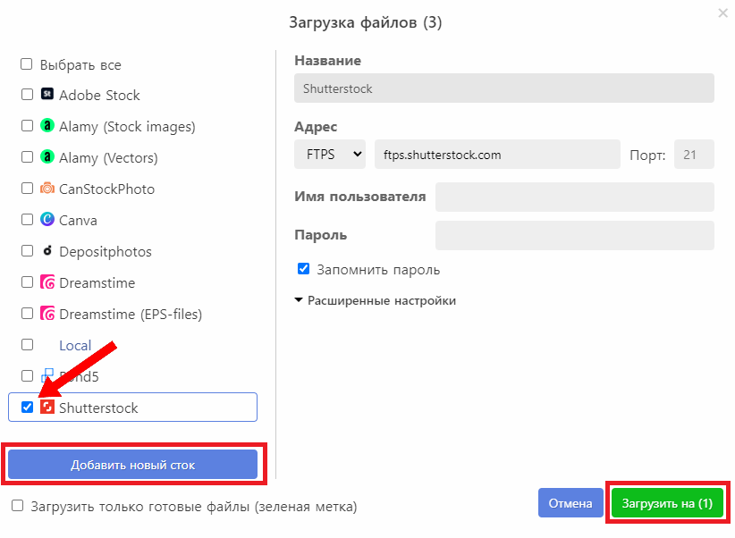

Вводим логин и пароль в окне загрузки или сразу нажимаем загрузить и вводим в открывшемся окне, подтверждаем начало загрузки.

  

Начнется процесс загрузки, по завершению которого, заходим на сток и проверяем что выбранные вами файлы со своими метаданными уже ждут подтверждения отправки.

  

  

Видеоинструкция о данной функции:

[[YOUTUBE=kPM49GGuVVs]]
  
### Поиск и замена метаданных [[PRO]]

### Лайтбокс
  
Лайтбокс позволяет удобно работать с файлами, расположенными в разных рабочих областях, а также открывать файлы напрямую, не создавая рабочую область.  Вы можете добавить файлы в Лайтбокс одним из следующих способов:
  
**1** - Через контекстное меню "Добавить в Лайтбокс"
  
**2** - Перетащив файл в окно программы"
  
**3** - Нажав кнопку "Добавить файл"
  

  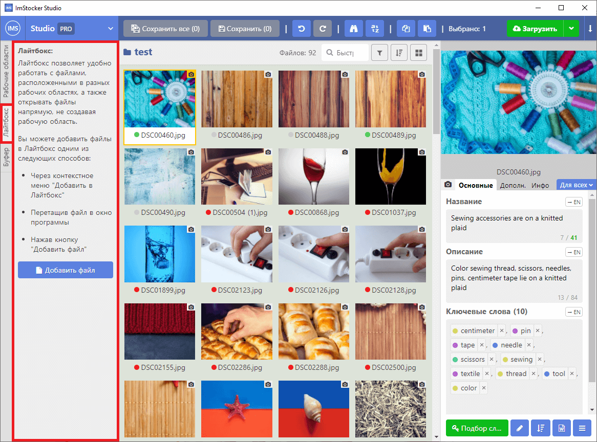

 
  
В **Лайтбокс** можно заносить файлы с компьютера, нажав на **+** в левом нижнем углу **Лайтбокса**, и из рабочих областей, для этого нужно нажать на файл правой кнопкой мыши и выбрать **Добавить в лайтбокс**:
  

  

Файл появится в **Лайтбоксе**. Вы можете удалить файл с помощью крестика, который находится справа, либо очистить **Лайтбокс** с помощью кнопки **Очистить Лайтбокс** в правом нижнем углу **Лайтбокса**:
  

  

  
Вы можете быстро найти нужный файл с помощью строки поиска:
  

  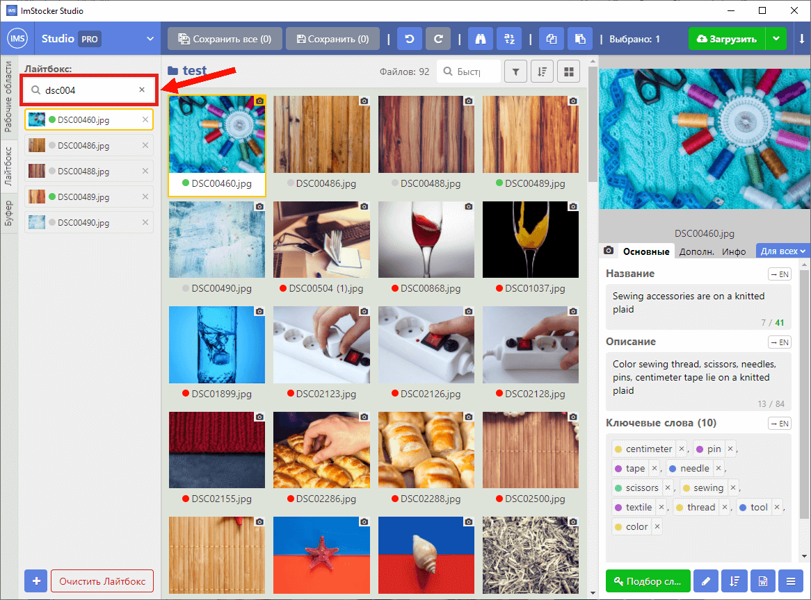

  
## Настройки программы
  
### Обзор настроек

В **Настройках** программы есть несколько разделов:

**Общие** - в разделе можно настроить язык, правила проверки метаданных и предупреждения по файлам.
  

  

**Рабочая область** - в разделе можно управлять размером, режимом отображения миниатюр(эскизов) и боковыми панелями. Боковые панели можно перемещать слева направо, между собой и даже скрывать ненужные панели. 
  

  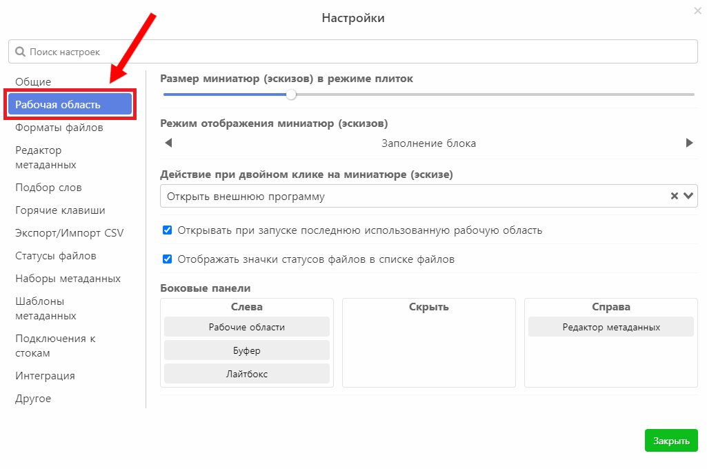

**Форматы файлов** - позволяет настроить сохранение выбранной скорости воспроизведения при переключении видео и метаданных в встроенные секции, а также отображение значка типа файлов. Вы можете регулировать ширину и высоту при генерации превью вектора в расширенных настройках.

  

  
**Редактор метаданных** - в разделе можно настроить показ кнопки удаления слов и всплывающей подсказки при наведении на ключевое слово, установить разделитель ключевых строк (либо новая строка, либо запятая, либо точка с запятой). 

  

  
Вы можете добавить email, страну и копирайт автора в metadata при сохранении и настроить сохранение метаданных в отдельный XMP-файл в расширенных настройках.

  

  
**Подбор слов** - здесь вы можете выбрать действия при нажатии на кнопку "Подбор слов", заполнять поисковую строку при подборе слов названием или описанием, выбрать расположение окна подбора слов и передаваемые метаданные.

  

  
**Горячие клавиши** - состоит из двух частей: **Назначить горячие клавиши** и **Список горячих клавиш**. В **Назначить горячие клавиши** команды разделены по группам в зависимости от того, к какому типу файлов они применяются, и любой команде можно присвоить не только горячую клавишу, но и порядок выполнения, если горячая клавиша уже используется. 

  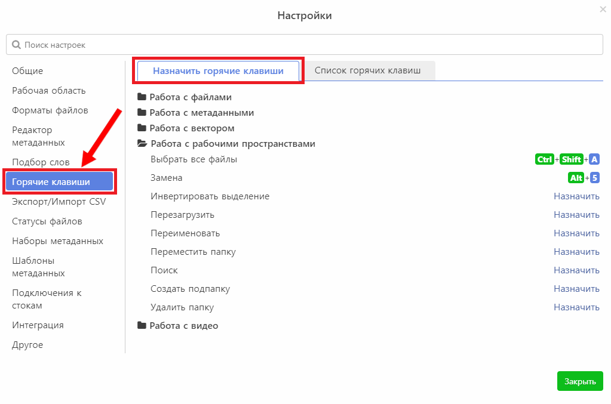

  
Чтобы посмотреть заданные горячие клавиши нужно открыть **Список горячих клавиш**.

  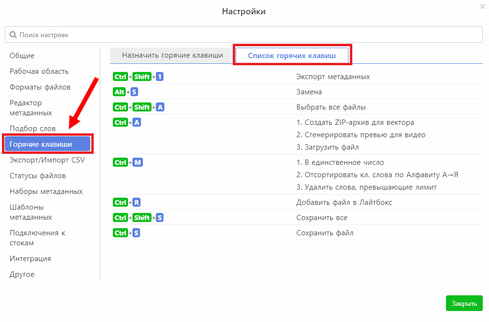

  
**Экспорт/Импорт CSV** - содержит основные csv-форматы. Для добавления нового csv-формата нажмите на кнопку **Создать формат**.
  

  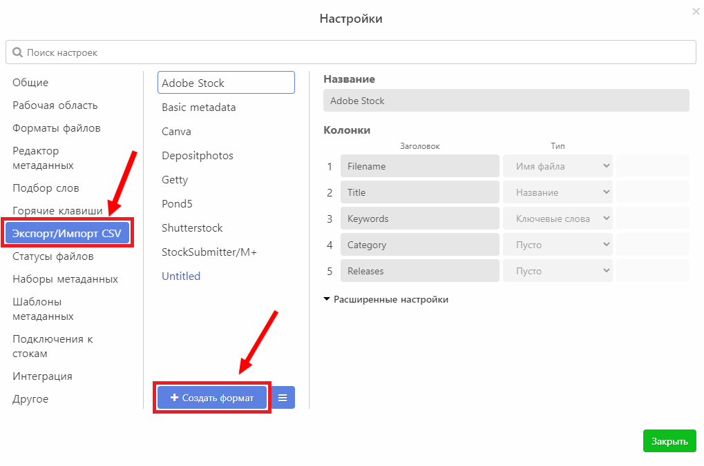

  
Также Вы можете создать шаблон, просто загрузив CSV-файл. Программа всё сделает за Вас. Для этого нажмите на синюю выпадающую кнопку с 3 белыми горизонтальными линиями и выберите в меню “Создать из шаблона”. 

  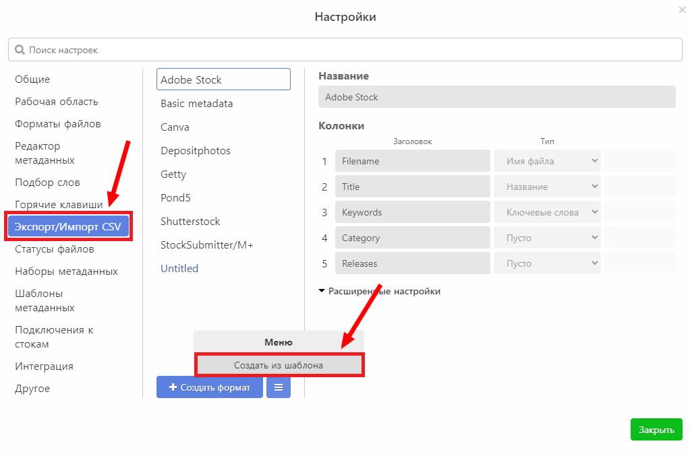

После этого выберите файл и нажмите кнопку “Открыть”. Готово!

  

  
**Статусы файлов** - для управления статусами файлов в настройках есть специальный раздел “Статусы файлов”, где Вы можете создать статус и выбрать ему понравившуюся Вам иконку, цвет, название, привязан ли он к стокам. Для создания нажмите на синюю кнопку внизу диалогового окна “Добавить статус”.
  

  

  

  

  

  
**Наборы метаданных** - содержит основные наборы метаданных. Для добавления нового набора метаданных нажмите на кнопку **Добавить набор**.

  

  
**Шаблоны метаданных** - содержит основные шаблоны метаданных. Для добавления нового шаблона нажмите на кнопку **Добавить шаблон**.
  

  

  
**Подключения к стокам** - содержит основные подключения к стокам. Для добавления нового подключения нажмите на кнопку **Добавить новый сток**.
  

  

  
**Интеграция** - позволяет вам сохранять приложения, которые вы часто используете для открытия файлов, а также даёт возможность задать путь до Ghostscript. Подробнее о Ghostscript можно узнать [здесь](#settings-ghostscript-integration).

  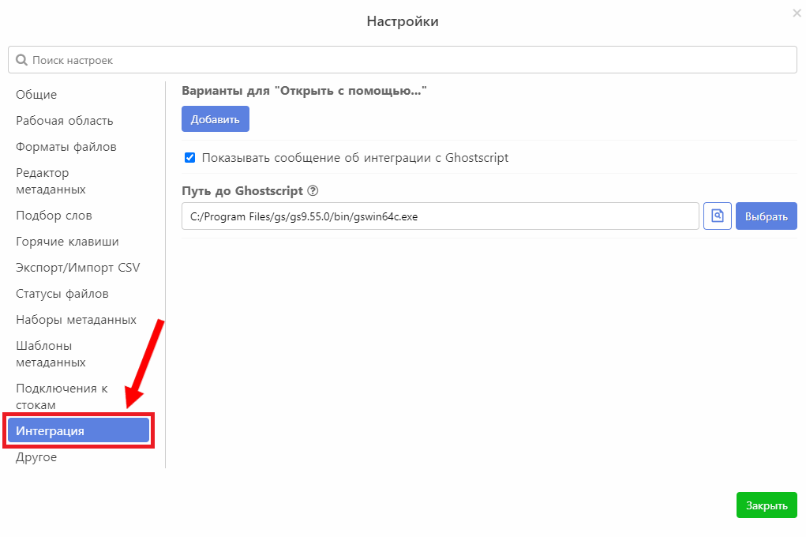

  
**Другое** - в разделе можно очистить кеш превью и открыть папку с логами.

  

  
Вы можете быстро найти нужную настройку с помощью строки поиска:
  

  

  
Вы можете управлять настройками подключений, шаблонами CSV и наборами метаданны. Например, если Вы захотите скрыть неиспользуемые элементы, то нужно нажать на перечеркнутый глаз, расположенный справа от выбранного элемента.

  

Если Вы решите восстановить элемент, перейдите в настройки, выберите нужный Вам раздел (шаблоны CSV, настройки подключений или наборы метаданных) и нажмите на стрелочку, расположенную справа от выбранного элемента.

  

  
Если Вы захотите удалить статус, подключение, шаблон или набор, нажмите на крестик, расположенный справа от названия элемента.
  

  

### Проверка готовности файлов

Настроить правила проверки метаданных по умолчанию можно в общих настройках:

  

### Горячие клавиши
  
Невозможно представить рабочий инструмент без горячих клавиш, которые многократно ускоряют вашу работу. В ImStocker Studio они не только присутствуют, но и, более того, вы можете с легкостью настроить их, как вам угодно. Делается это в специальной вкладке “**Горячие клавиши - Назначить горячие клавиши**” в настройках программы:

  

  
Всего на данный момент в программе доступно свыше 50 команд, разделенных на пять групп: работа с файлами, с метаданным, с вектором, с рабочими областями и с видео. Каждой их этих команд вы можете присвоить свою горячую клавишу. Чтобы сделать это, нажмите на интересующую вас команду и укажите сочетание клавиш во всплывающем окне:

  

  
Кроме этого, при попытке назначить горячую клавишу, которая уже используется, выводится соответствующее предупреждение, а также предлагается указать порядок выполнения команд. Таким образом можно формировать своеобразные макрокоманды. Тогда одним нажатием клавиш можно будет автоматически выполнить несколько действий, например, 1) привести к ед. числу, 2) отсортировать ключевые слова по алфавиту А → Я, а затем 3) удалить слова, превышающие лимит.
  

  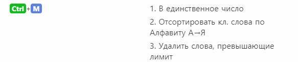

  
Если вы хотите назначить горячую клавишу какой-то конкретной команде, вы можете вписать ее название в строку поиска:

  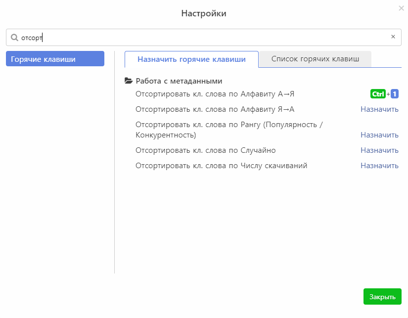

   
### Интеграция с Ghostscript (Windows)
  

  
Mac-версия **ImStocker Studio** поддерживает генерацию превью для EPS-файлов "из коробки", а чтобы этому научить Windows-версию, можно интегрировать IMS Studio с [Ghostscript](https://www.ghostscript.com/releases/gsdnld.html)

## Рецепты
