# Руководство по ImStocker Studio

## Начало работы

### Первый запуск

Программа **IMS Studio** доступна для скачивания на основном сайте [https://imstocker.com/](https://imstocker.com/)

  

При нажатии на кнопку IMS Studio откроется окно выбора операционной системы пользователя. Выбираем и нажимаем на кнопку скачивания.

  

После установки и запуска, вас встретит окно приветствия. Здесь отображается текущая версия программы и форма входа в учетную запись **ImStocker**. Если вы еще не зарегистрировались на нашем сайте, нажмите *"Зарегистрируйтесь здесь"*

  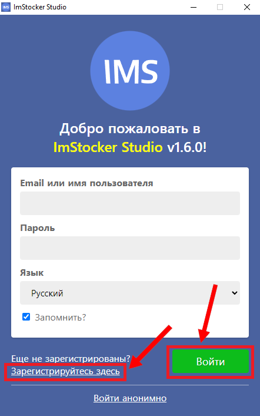

Откроется браузер с формой регистрации. Регистрация в сервисе быстрая и легкая, без заполнения длинных анкет.

  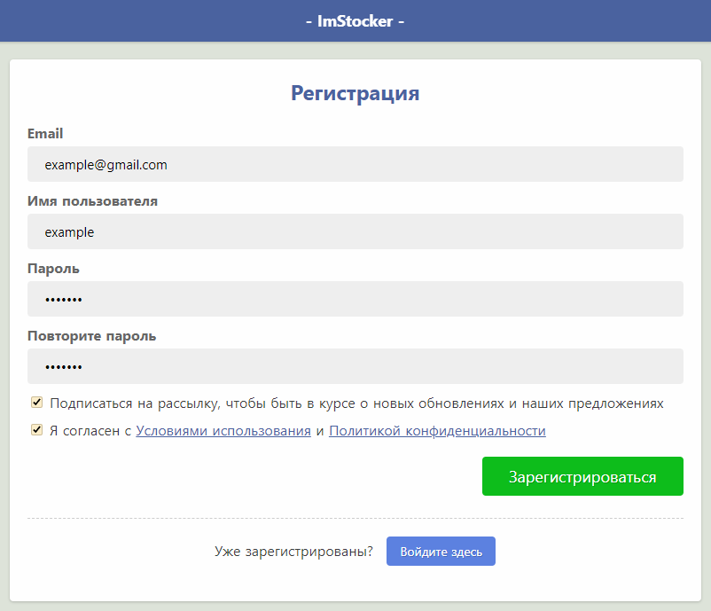

После регистрации вам на почту придет письмо для подтверждения адреса электронной почты. После подтверждения введите указанные при регистрации данные в форму входа в программе.

Если же вы сначала хотите просто осмотреться, то вы можете пропустить этап регистрации, нажав "Войти анонимно"

  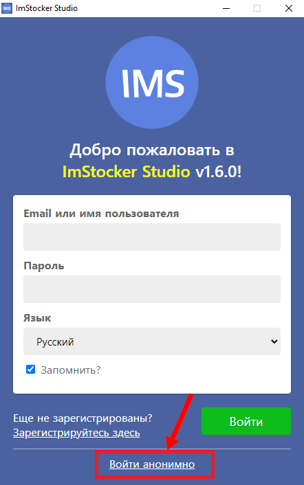

При первом входе в программу вы увидите **главное окно**, которое вежливо подскажет откуда начать вашу работу с **ImStocker Studio**:

  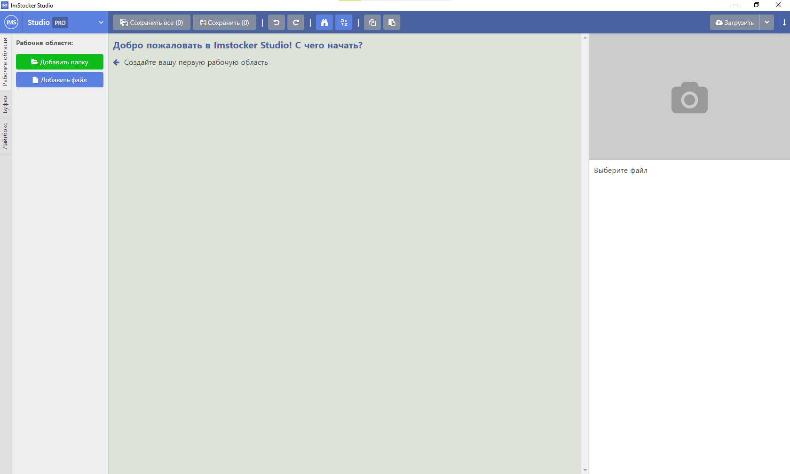

### Главное окно

Функционал главного окна разделен на следующие области:

  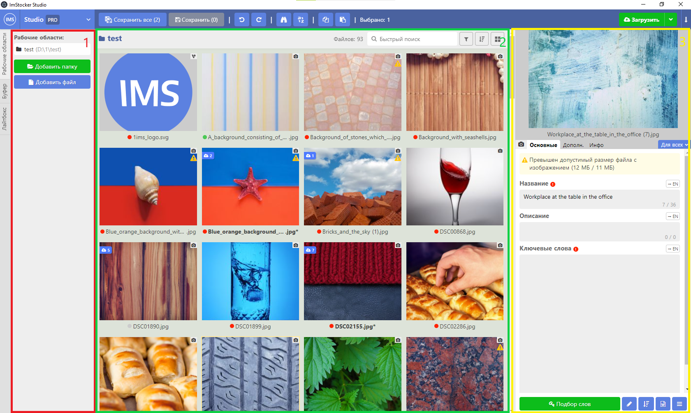

**1 - Левые боковые панели**. Здесь находится перечень [**рабочих областей**](#workspaces) (открытых папок), функция [**буфера**](#edit-copy-paste-metadata) для быстрого копирования метаданных между файлами и [**Лайтбокс**](#lightbox) - место, куда вы можете добавить избранные файлы, либо просто файлы из разных папок, с которыми вы хотите работать вместе

**2 - Содержимое текущей рабочей области** - Здесь происходит взаимодействие с вашими файлами. Вы можете выбрать способ отображения (плитки, список, таблица), задать сортировку и фильтр файлов 

**3 - Правые боковые панели**. Здесь находится блок предпросмотра выбранного файла (или файлов), поля заполнения метаданных: названия, описания и ключевых слов, - а также вкладки дополнительных функций работы с файлами. Подробнее об этом блоке описано в разделе ["Редактирование файлов"](#edit)

Вы можете настроить под себя размер (потянув за края) и положение боковых панелей (перетащив их заголовки или через меню **Настроек** в разделе "Рабочая область")

### Главное меню

  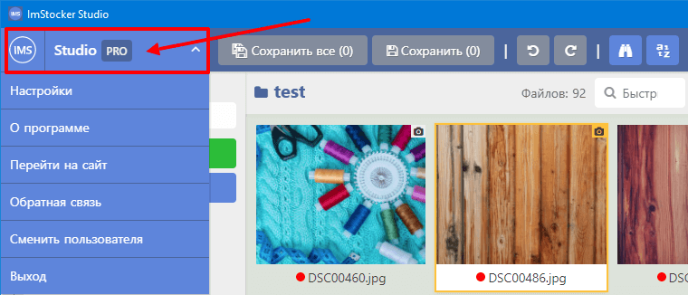

**Главное меню** меню программы расположено в левом верхнем углу окна и содержит **Настройки**, возможность обновить программу до **PRO** версии, краткую информацию о программе, кнопку быстрого перехода на сайт **imstocker.com**, кнопку обратной связи с нами, а также возможность сменить пользователя и закрыть программу.

В **Настройках** программы содержится внушительное количество возможностей. Например, можно поменять язык интерфейса и перевода, настроить размер и режим отображения миниатюр, настроить боковые панели, настроить отображение ключевых слов и поведение окна "Подбор слов", добавить наборы метаданных, позволяющие задавать разные ключевые слова, названия и описания для разных стоков, добавить статусы, позволяющие делать собственные заметки к файлам, очистить кеш превью, открыть папку с логами и т.д. Подробнее об этом разделе вы можете прочитать в разделе ["Настройки программы"](#settings)

  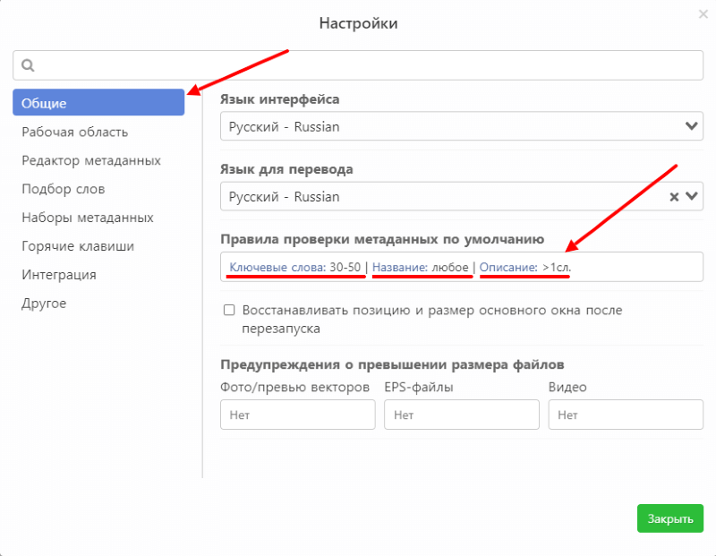

В диалоговом окне "О программе" отображаются текущая версия программы, ссылка на сайт, а также, если вы являетесь счастливым обладателем **PRO** версии **ImStocker Studio**, то срок действия вашей лицензии. Если срок лицензии подходит к концу, то программа также предупредит об этом с помощью специального значка в заголовке главного меню.

  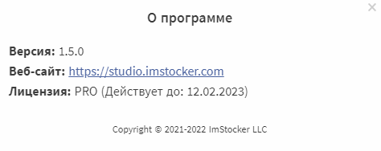

### Рабочие области

Основное взаимодействие с файлами в программе **ImStocker Studio** происходит через **Рабочие области**. Рабочая область - это папка, содержащая файлы для редактирования. 

Для добавления новой рабочей области нажмите “**Добавить папку**”:

  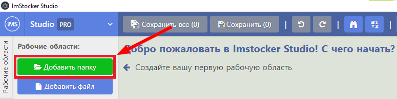

После добавления и выбора рабочей области в центральной части окна отобразятся фотографиии, иллюстрации, векторы и видео ([подробнее о форматах файлов](#files-types)), содержащиеся в ней. Если в папке находится два (или более) файла с одинаковым именем, но разными расширениями, например *image.jpg* и *image.eps*, то они будут отображаться как один файл *image.eps+jpg*.

Чтобы выбрать файл для дальнейшего взаимодействия с ним, кликните на нем левой кнопкой мыши. Вы можете одновременно выбирать сразу множество файлов. Для этого с помощью мыши выделите их рамкой, либо воспользуйтесь клавишами *Ctrl/Cmd* или *Shift* во время клика на файл. 

Если же вы кликните на файл правой кнопкой мыши, то откроется контекстное меню:

  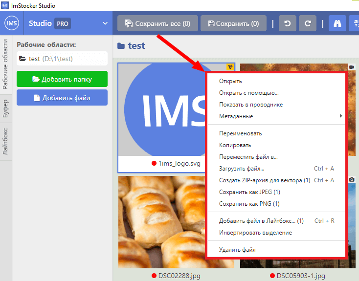

Оно позволяет быстро открыть файл для просмотра в проводнике, скопировать или вставить скопированные метаданные, а так же переназвать или переместить файл в другую Рабочую область/Папку и загрузить выбранный файл на сток. Важно отметить, что на все эти действия и на многие другие можно назначить горячие клавиши в **Настройках** в разделе "Горячие клавиши"

По умолчанию файлы в рабочей области отображаются в виде **плиток**, размер которых вы можете скорректировать с помощью *Сtrl/Сmd + Колесо мыши* или через меню **Настройки**. Кроме этого режима, в правом верхнем углу рабочей области вы можете выбрать режимы **"Список"** и **"Таблица"**.

  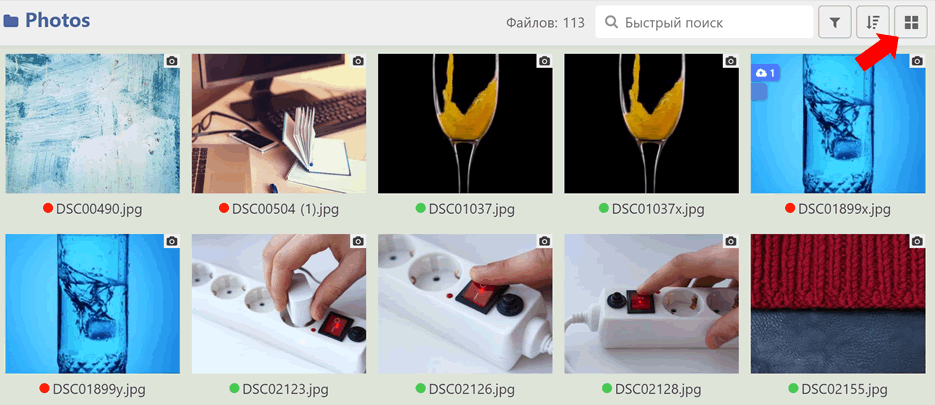

В режиме списка файлы отображаются друг за другом при этом сразу видны сохраненные в файлах метаданные.

  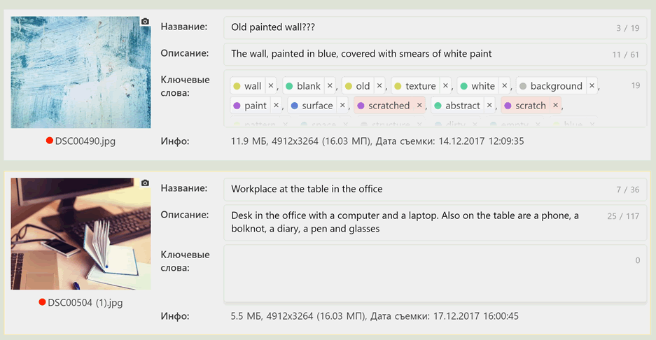

В режиме таблицы [[PRO]] каждый файл занимает всего одну строку. Вы можете быстро посмотреть и отредактировать метаданные одного или нескольких файлов, выбрав соответвующие ячейки таблицы. Кроме этого, потянув за край ячейки вы можете быстро заполнить соседние ячейки содержимым выбранных ячеек.

  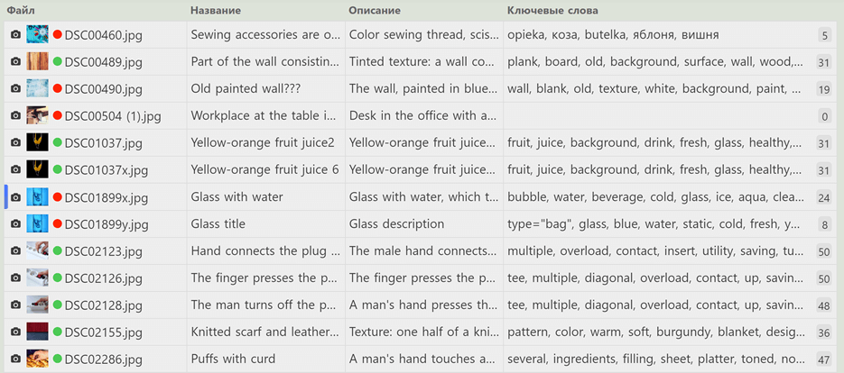

Также рядом с кнопкой смены режима отображения находится кнопка сортировки:

  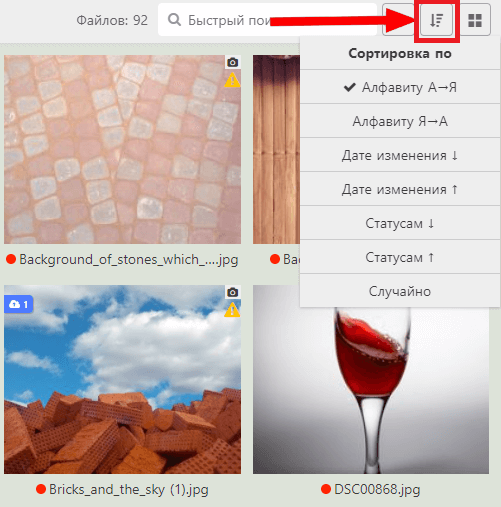

С помощью этой кнопки вы можете задать, в каком порядке должны отображаться файлы в рабочей области. Доступны следующие варианты:

* **По алфавиту** - файлы сортируются по имени

* **По дате изменения** - файлы сортируются по дате последнего изменения. По умолчанию, чтобы файлы не скакали во время редактирования, эта сортировка применяется только в момент открытия папки. Вы можете измененить это поведение, включив в настройках в разделе "Редактор метаданных" галочку *"Менять позицию файла после сохранения, если выбрана сортировка по дате изменения"*

* **По статусам** - файлы сортируются по наличию того или иного статуса. Подробнее про статусы в разделе ["Статусы файлов"](#file-statuses)

* **Случайно** - файлы отображаются в случайном порядке

Еще левее от кнопки сортировки находится кнопка включения фильтров и блок быстрого поиска. Фильтры позволяют на время скрыть ненужные файлы по какому-либо признаку. Подробнее про функционал фильтров описано в разделе ["Фильтр файлов"](#file-filters). Быстрый поиск позволят найти файлы по имени или по содержащимя в них метаднным (см. раздел ["Поиск и замена метаданных"](#file-search-and-replace))

### Значок готовности файлов

При загрузке содержимого рабочей области каждый файл получает индикатор заполненности метаданных (кругляшок слева от названия файла):

  

Возможные варианты:

* **Серый** - файл еще не заполнен

* **Красный** - файл заполнен частично

* **Зеленый** - файл полностью заполнен и готов к загрузке

По умолчанию "зеленым" файл становится при следующих условиях: у файла от 30 до 50 ключевых слов, в описании есть хотя бы одно слово и все метаданные заполнены на английском языке (латинице). Вы можете легко изменить правила под себя через раздел "Общие" в **Настройках** (см. ["Проверка готовности файлов"](#checking-readiness-of-files))

### Значок предупреждений

Кроме состояния готовности по метаданным, вы можете настроить также отображение значка предупреждений, если файл не соответвует заданным техническим ограничениям

  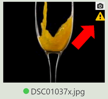

Настроить технические ограничения вы можете через раздел "Общие" в **Настройках** (см. ["Предупреждения по файлам"](#checking-warnings-of-files))

### Статусы файлов

Еще одними знаками отличия файлов являются статусы - отметки принадлежности файла какой-то группе

  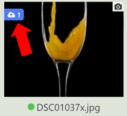

 Так, например, каждый раз, когда вы загружаете файл на микросток **ImStocker Studio** добавляет в файл специальную метку, которая поможет вам сориентироваться, какие файлы загружены, а какие нет. Кроме того, вы  можете  придумать и добавить собственные статусы к работам. Например, пометить те файлы, которые были приняты или отклонены стоками, либо выделить группу файлов по какому-то признаку.

Управлять перечнем таких статусами можно в разделе "Настройки - Статусы файлов". Подробнее ["здесь"](#settings-file-statuses)

Для ручного добавления статуса к файлу(-ам) нужно выбрать файлы, затем в разделе “Редактор метаданных” перейти на вкладку “Инфо” и нажать кнопку “Добавить статус”.

  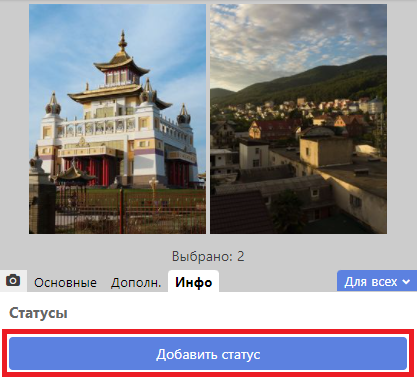

Появится диалоговое окно, где вы должны выбрать желаемый статус, дату (по умолчанию -  текущая) и, если требуется, один или несколько стоков, к которым он относится.

  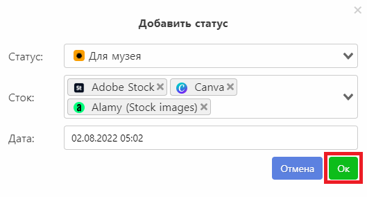

Помимо отметки в левом верхнем углу изображения, статусы также отображаются и во вкладке “Инфо” в “Редакторе метаданных”.

  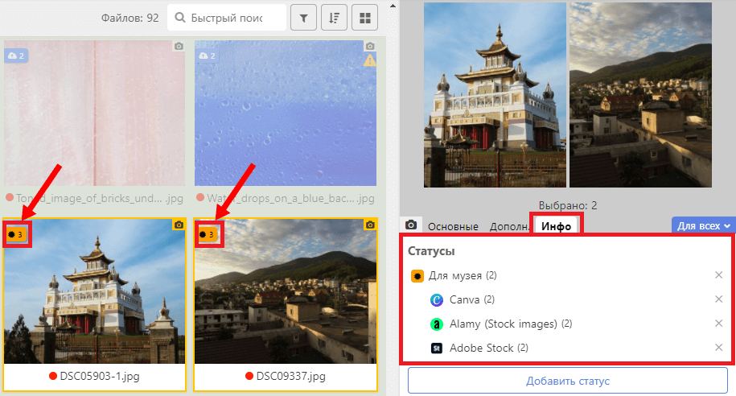

Готово! Но если Вы передумаете, то можете беспрепятственно удалить статус файла, нажав на крестик справа от названия статуса  в разделе “Редактор метаданных/Инфо”

Если Вы не хотите, чтобы значки статусов отображались, перейдите в раздел настроек “Рабочая область” и уберите галочку напротив пункта “Отображать значки статусов файлов в списке файлов”
  

  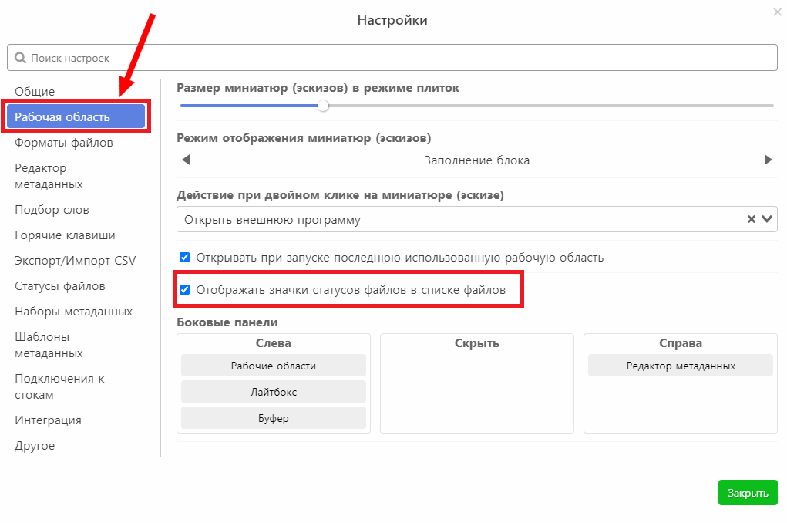

### Типы файлов

Программа настроена на следующие типы файлов:

**Фото** - подерживаются **JPG**, **JPEG**, **TIFF**, **RAW**-форматы. Так же есть есть возможность пересохранения фото в формат JPEG

**Иллюстрации** - подерживается **PNG**-формат

**Векторные файлы** - подерживаются **EPS**, **SVG** файлы (+ **JPEG**/**PNG**-превью)

**Видео-файлы** - подерживаются **MOV**, **MP4**, **AVI**, **MPG** файлы (+ **JPEG**-превью)

### Обратная связь

Если у Вас есть вопросы, жалобы или предложения, то сообщите нам через форму [обратной связи](https://imstocker.com/ru/page/feedback?product=ims-studio) или в специальный чат в [телеграме](https://t.me/ImStocker_chat_ru) 

А для того, чтобы оставаться на связи и узнавать первым о всех новых изменениях в программе, подпишитесь на нас в социальных сетях:

* [ВКонтакте](https://vk.com/ImStockercom)
* [Instagram](https://www.instagram.com/ImStocker.ru/)
* [Twitter](https://twitter.com/intent/follow?original_referer=https%3A%2F%2Fstudio.imstocker.com%2F&ref_src=twsrc%5Etfw%7Ctwcamp%5Ebuttonembed%7Ctwterm%5Efollow%7Ctwgr%5EImStocker&region=follow_link&screen_name=ImStocker)
* [Telegram](https://t.me/ImStocker_ru)

## Редактирование файлов

### Редактирование метаданных

Для редактирования метаданных выберите один или несколько файлов в рабочей области. Они отобразятся в правой боковой панели редактирования метаданных. 

Данная панель делится на две части: **блок предпросмотра** и **блок редактирования.**

В блоке предпросмотра отображается миниатюра текущего выбранного файла или файлов. Если файл один, то при клике на него, он раскроется на весь экран. Если файлов несколько, то вы можете переключаться между ними, нажав на соответвующую миниатюру или кнопки переключения влево и вправо (отображаются при наведении). Потянув за нижний край блока предпросмотра вы можете задать его высоту.

  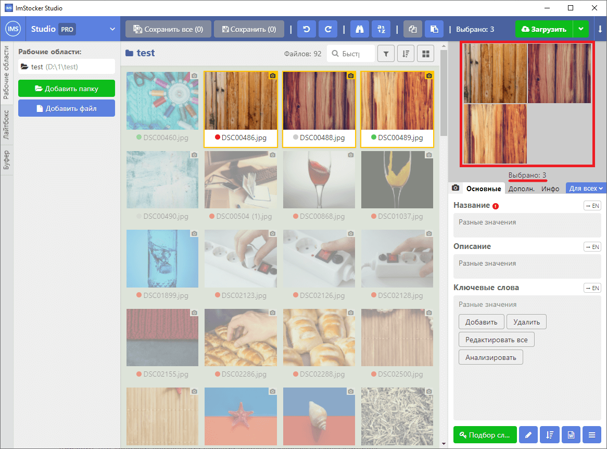

Блок редактирования же, в свою очередь, состоит из трех вкладок: 

* **Основные** - содержит 3 поля: **Название**, **Описание** и **Ключевые слова**

* **Дополнительные** - в данной вкладке вы можете посмотреть или удалить метатеги

* **Инфо** - содержит информацию по статусам и файлам выбранной работы

  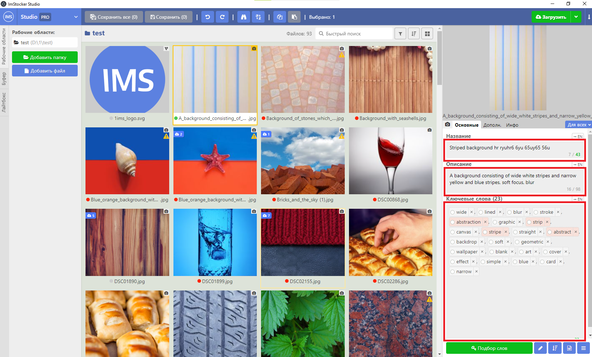

Для того, чтобы внести изменение в файл, выберите нужное поле для редактироваия и впишите новое значение. После изменения (и переключения на другой элемент) файл пометится как измененный, его название станет написано жирным шрифтом. Вы можете отменить сделанное изменение (а потом повторить его вновь), используя кнопки в верхней части приложения.

  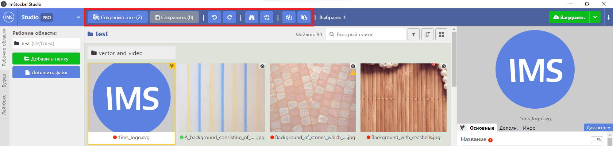

После завершения редактирования нажмите на кнопку "Сохранить" (*Ctrl/Cmd + S*), чтобы сохранить текущие выбранные файлы, или "Сохранить все" (*Ctrl/Cmd + Shift + S*), чтобы сохранить все измененные файлы, включая те, что сейчас не выбраны.

### Объединение названия и описания

Если вы привыкли писать одинаковые название и описание, то можно включить специальный режим, при котором эти два поля будут объединены. Для этого откройте раздел "Редактор метаданных" в **Настройках** и отметьте галочку *“Объединить название и описание в одно поле”*

  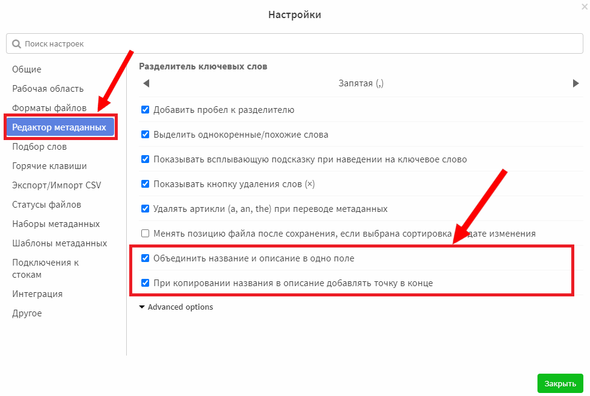

После активации поля будут объединены. При редактировании объединенного поля значение будет записано как в название, так и в описание.

  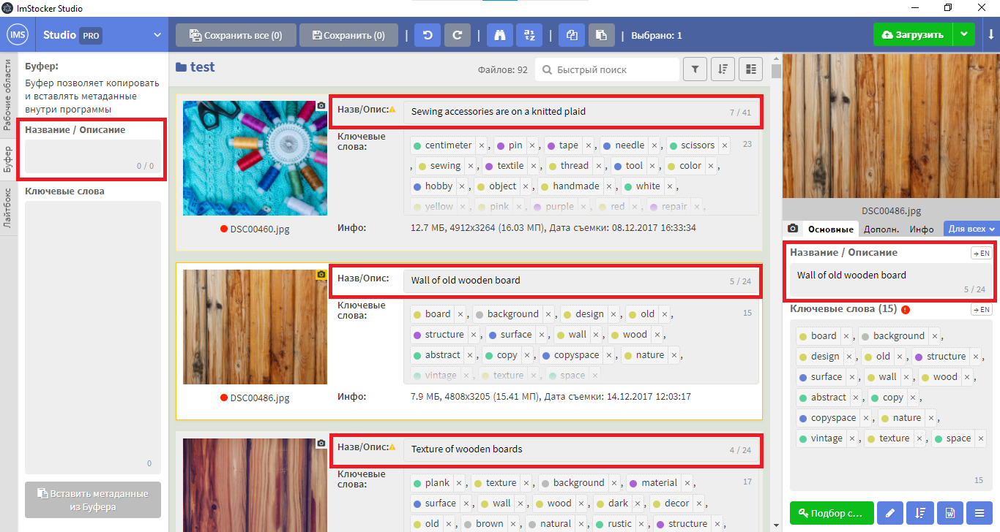

Если при объединении название и описание не будут совпадать,то появится предупреждение. 

Вы можете настроить программу также так, чтобы при вводе названия в объединенное поле, в описание оно копировалось с точкой на конце. Это может быть полезно, если Вы хотите, чтобы название и описание в точности не были равны. Для активации этой возможности выберите пункт *“При копировании названия в описание ставить точку в конце”*.

### Дополнительные функции редактирования

В правом нижнем углу программы находится несколько функций значительно упрощающих работу с ключевыми словами:

  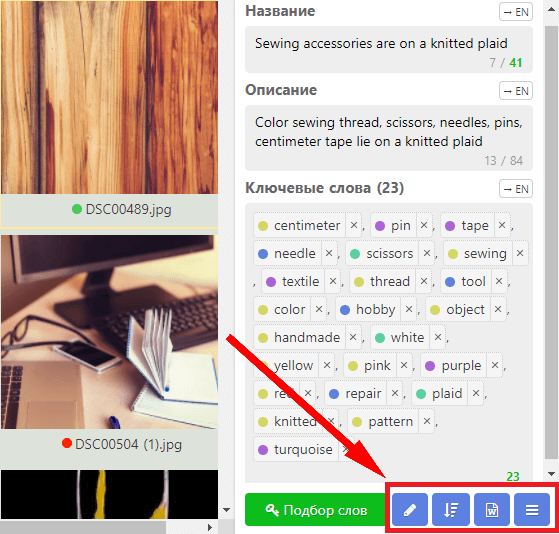

Кнопка “**Преобразовать ключевые слова**” позволяет вносить быстрые изменения во все ключевые слова одновременно: перевод слов в единичное/множественное число, а также возможность удалить однокоренные/похожие слова, слова превышающие установленный лимит и слова с ошибками. И много других полезных функций.

  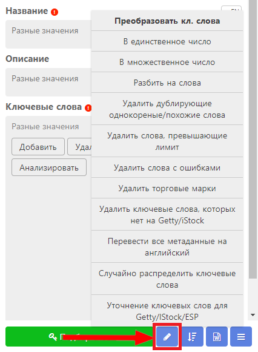

Одна из таких функций - *"Случайно распределить ключевые слова"*. Эта функция очень полезна при работе с симилярами, ключевые слова которых должны немного отличаться. Для ее использования вы записываете в один из файлов набор ключевых слов: первая часть из которых должна будет быть одинаковой для всех файлов, а вторая часть - случайно перераспределяться. После подготовки набора выбираете нужные файлы и нажимаете эту кнопку. После этого программа вас спросит, сколько первых ключевых слов должно остаться на месте и по сколько ключевых слов распределить остальные.

Рядом с кнопкой в виде карандаша располагается кнопка “**Отсортировать по..**”. Она позволяет отсортировать ключевые слова по популярности, количеству скачиваний, алфавиту в прямом и обратном порядке, а также случайным образом. 

  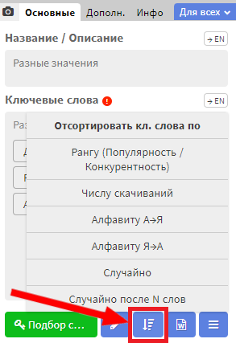

Кроме этого, в программе присутствует особый вид случайной сортировки ключевых слов, в которой можно также выбрать количество первых слов, которые останутся на месте. В отличие от функции *"Случайно распределить ключевые слова"* здесь ключевые слова не распределяются, а просто сортируются в рамках одного файла. Для активации функции нужно выбрать пункт “Случайно после N слов” и указать количество первых слов, которые должны остаться на месте. 

  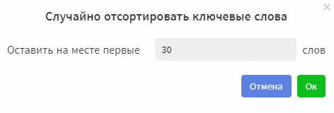

Кнопка “**Шаблоны**” позволяет создать ваш собственный набор ключевых слов, и быстро применить его в случае надобности, значительно упрощает работу с ключевыми словами в случае, если вы работаете с большим количеством однотипных картинок/фотографий. Более того, вы можете активировать шаблоны прямо во время ввода ключевых слов, если назначите ему горячую клавишу-цифру (активируется при зажатой клавиши *Alt*). Подробнее о шаблонах написано в разделе ["Шаблоны"](#edit-templates)

  

Кнопка “**Меню**” позволяет работать с функциями импорта/экспорта метаданных, а также с буфером метаданных. Здесь также можно выбрать функции перемещения файлов и копирования ключевых слов.

  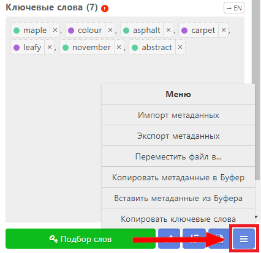

### Подбор ключевых слов

В правом нижнем углу программы можно также найти интегрированный сервис подбора **ImStocker Keyworder**, позволяющий быстро подобрать ключевые слова, использующиеся на стоках, с помощью ряда удобных фильтров.

Для того чтобы воспользоваться сервисом **ImStocker Keyworder**, необходимо выделить один или несколько файлов, к которым вы будете подбирать слова, и нажать кнопку “**Подбор слов**”:

  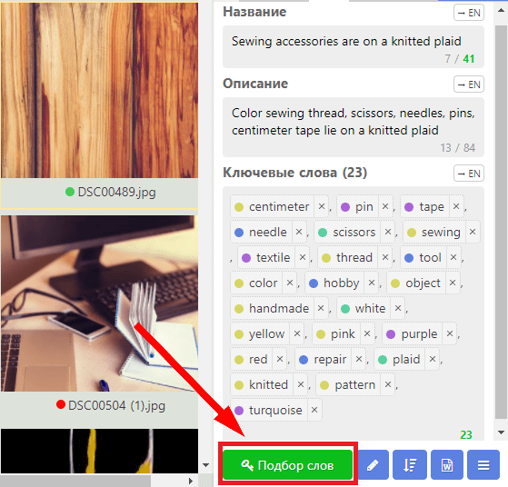

Для получения первых результатов, в окне поиска достаточно:

  **1.** Ввести одно ключевое слово и нажать клавишу  Enter или кнопку поиска

  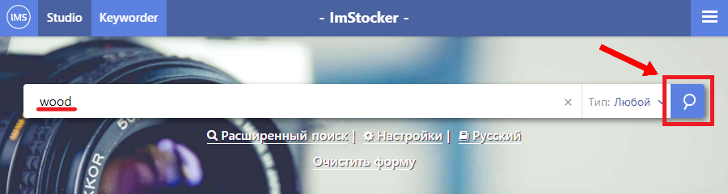

Для удобства пользователя существует механизм автозаполнения поисковой строки названием или описанием. Находится он в **Настройки - Подбор слов**:

  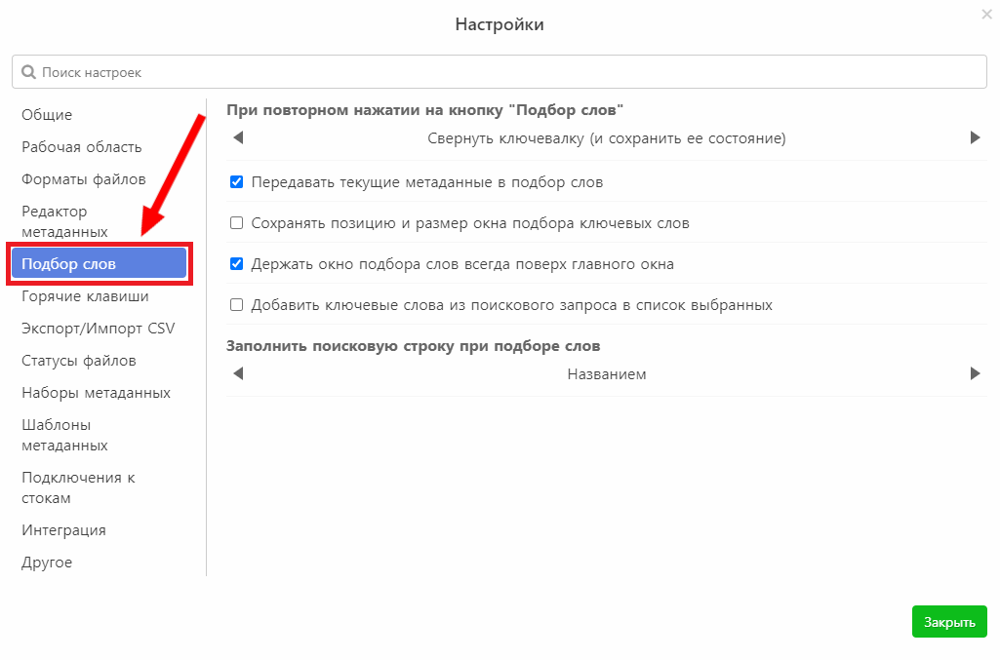

**2.** Выбрать одну или несколько картинок, которые похожи на ваши изображения:

  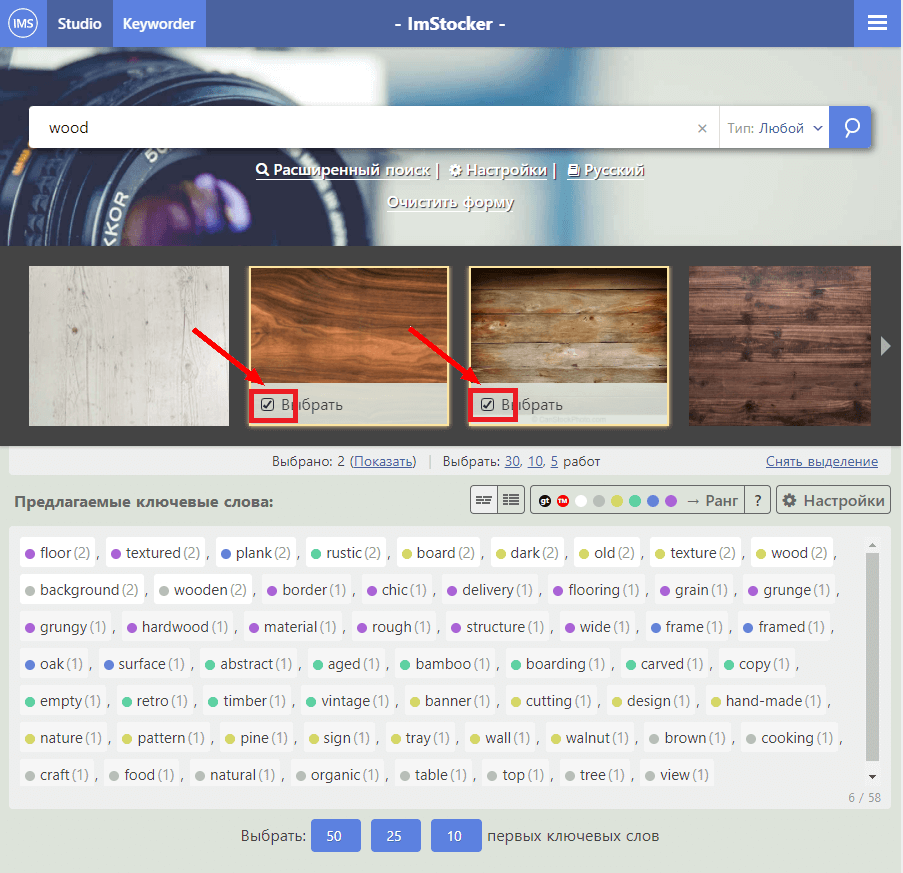

**3.** Выбрать подходящие ключевые слов

После того как список ключевых слов сформирован и полностью вас устраивает,  а работа с **ImStocker Keyworder** завершена, результат можно **Применить** к выбранным картинкам в рабочей области **ImStocker Studio** и выбрать что сделать с окном **ImStocker Keyworder**:

  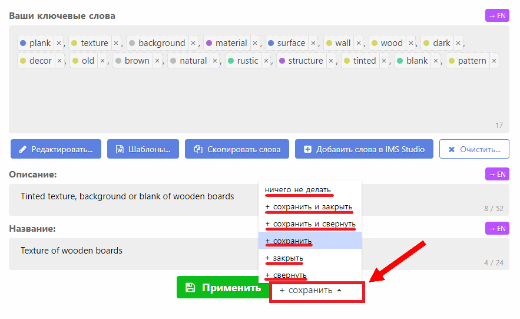

При любом из выбранных вариантов **Ваши ключевые слова**, а также содержание боксов **Описание** и **Название** применится к выбранному файлу/файлам рабочей области, действие из контекстного меню относится только к окну сервиса **ImStocker Keyworder**.

Небольшие настройки поведения окна **ImStocker Keyworder** можно поменять в **Главное меню/Настройки/Подбор слов**:

  

### Уточнение ключевых слов для Getty/IStock/ESP [[PRO]]

Как известно, у GettyImages (IStock/ESP) свое собственное представление о том, какие ключевые слова можно использовать при описании файлов. Сейчас пользователь может уточнять ключевые слова, не выходя из программы, подбирая к ним наиболее близкие слова из словаря Getty/IStock. 

Чтобы воспользоваться этой возможностью, необходимо выполнить следующее:

Выбрать нужные файл(-ы), нажать на синюю квадратную кнопку с карандашом внутри и в выпадающем списке выбрать “Уточнение ключевых слов для Getty/IStock/ESP”.

  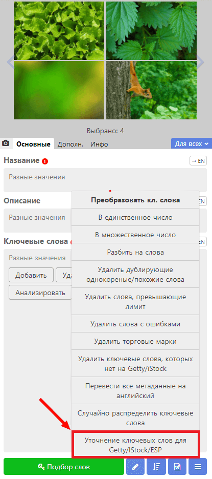

Откроется окно с ключевыми словами, их уточнениями и переводом. Выберите нужные уточнения, щелкнув левой кнопкой мыши по ним. Для 1 ключевого слова можно выбрать только 1 уточнение.

  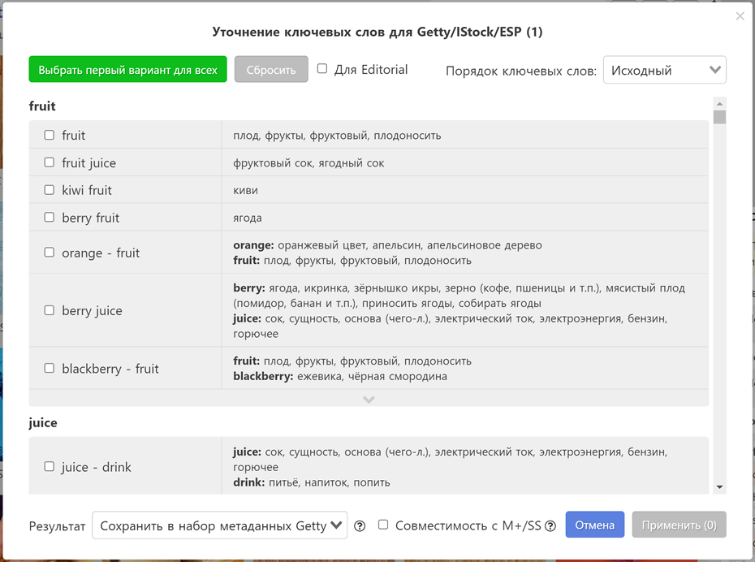

Если требуется, Вы можете выбрать первый вариант для всех или сбросить выбор, нажав на соответствующие кнопки

  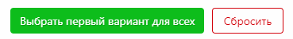

Также Вы можете с помощью галочки "Для Editorial" включать и выключать предложения ключевых слов, которые используются для editorial изображений.

После выбора всех нужных уточений вы можете выбрать, что делать с результатом:

* *Сохранить в набор метаданных Getty* - результат сохранится в отдельный набор метаданных, который будет использоваться для выгрузки метаданных в CSV для Getty

* *Сохранить в отдельный JPG-файл* - в папке рядом с файлом, для которого выполняется уточнение, появится новый файл с окончанием *_getty.jpg*, в который и будут записаны уточненные варианты ключевых слов

* *Заменить текущие ключевые слова* - вместо текущих ключевых слов будут записаны уточненные.

Кроме этого, если вы для сабмита файлов на микростоки использете сервис Microstock+ или программу StockSubmitter, то вы можете включить галочку *"Совместимость с M+/SS"*. В этом случае уточнения также будут записаны в JPG файл в специальном формате, который смогут прочитать эти программы.

В режиме совместимости с M+/SS вы также можете указать имя батча для ESP:

  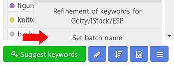

### Перевод метаданных [[PRO]]

**Перевод метаданных** - одно из преимуществ, доступное в **PRO** версии **ImStocker Studio**. Позволяет мгновенно перевести с вашего языка на английский язык метаданные файла. Вы можете переводить каждое поле отдельной кнопкой или использовать команду "Перевести все метаданные на английский" в меню с иконкой карандаша:

  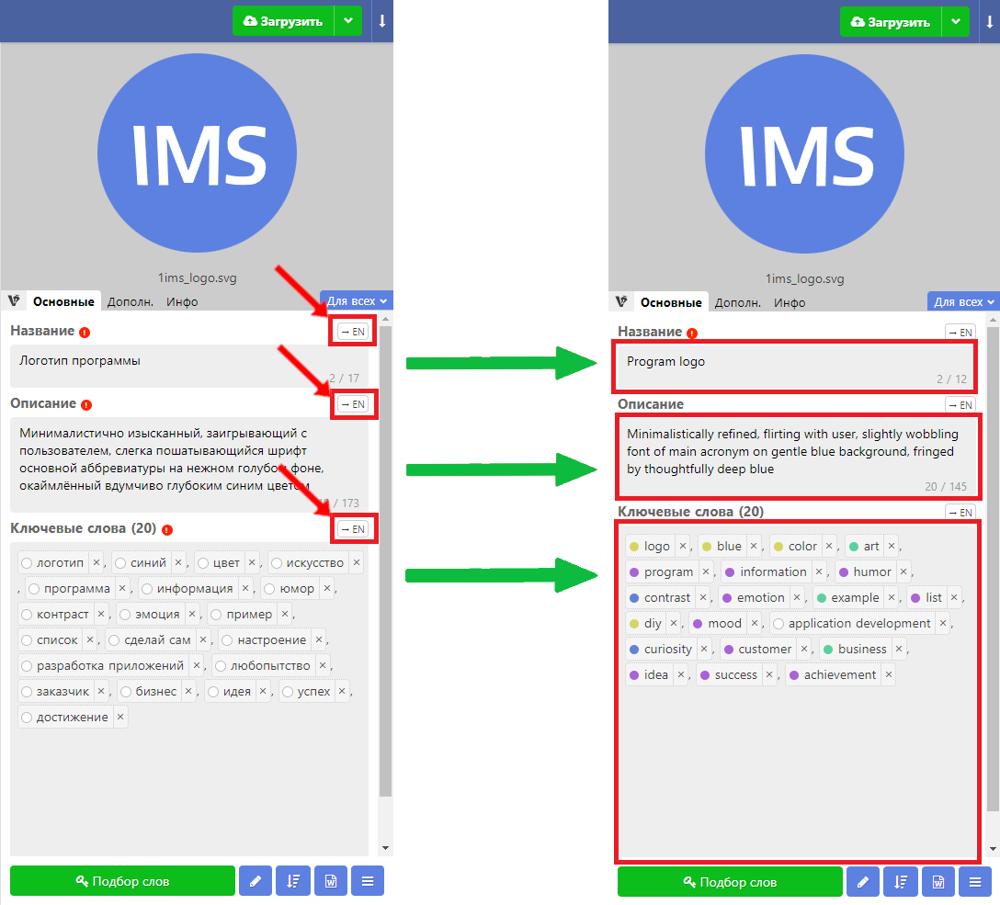

Кроме этого, вы можете переводить не только на английский язык, но и обратно на ваш родной язык. Это полезно, если нужно внести какие-то изменения в уже атрибутированный файл. 

Чтобы перевести обратно на ваш язык, зажмите клавишу **<Alt>** при нажатии на кнопку перевода. Это же можно сделать с помощью горячих клавиш: **ctrl+alt+T**. Чтобы перевести все метаданные, зажмите клавишу **<Shift>** при нажатии на кнопку перевода.

### Просмотр и удаление прочих метаданных [[PRO]]

Если вы хотите знать, какие именно метаданные вы отправляете на стоки во вкладке "Дополнительно" есть функция "Показать все метатеги".

  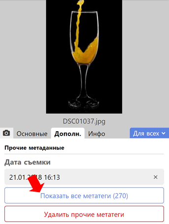

При нажатии на нее откроется следующий диалог

  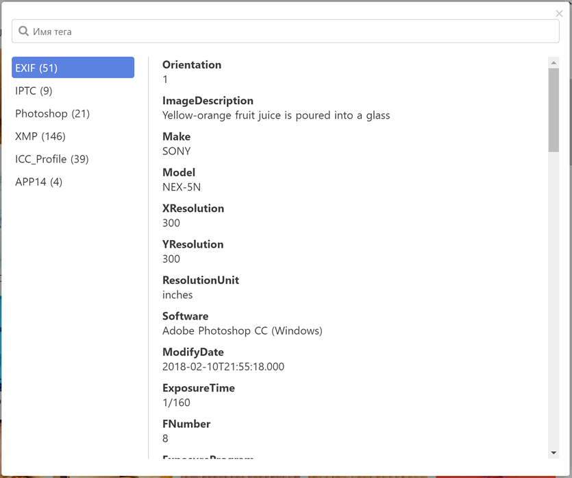

Здесь вы можете увидеть все теги, которые записаны внутри файла, сгруппированные по источнику. В наличии имеется также строка поиска тегов

Кроме этого, рядом с кнопкой просмотра всех метаданных есть кнопка "Удалить прочие метатеги", которая позволяет очистить файл от посторонних тегов (внимание, операция не может быть отменена).

### Наборы метаданных [[PRO]]

Наборы метаданных позволяют хранить разные значения метаданных для разных микростоках. Они применяются автоматически при экспорте метаданных и загрузке файлов. 

Переключиться между наборами метаданных можно через специальное меню справа снизу от блока предпросмотра:
  

  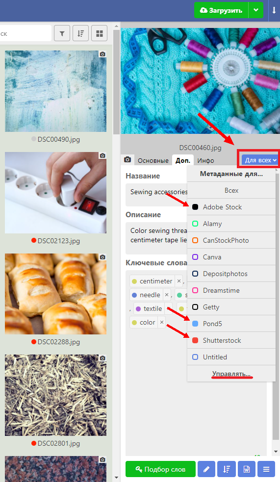

  
  
Закрашенные квадраты обозначают задействованные наборы метаданных (т.е. для них вы переопределили метаданные). 

С помощью кнопки “**Управлять**” можно создать новый или отредактировать уже созданные вами наборы метаданных. 

То же самое вы можете сделать в **Главное меню/Настройки/Наборы метаданных**:
  

  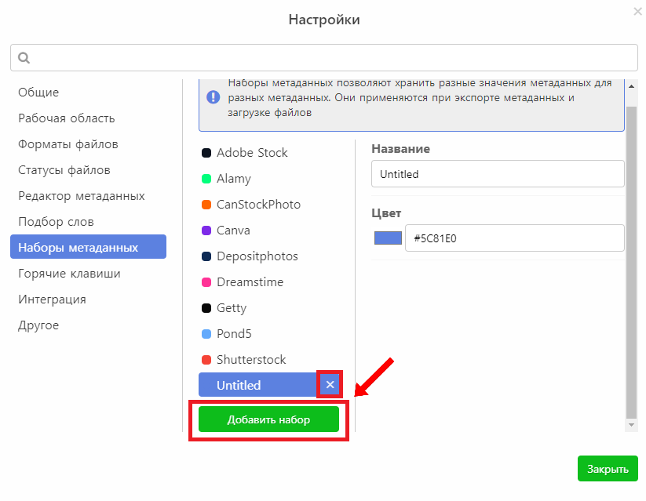

### Копирование/вставка метаданных

В программе **ImStocker Studio** реализован механизм копирования всех метаданных файла для применения к одному/нескольким файлам рабочей области, что позволяет сэкономить значительное количество времени при работе с большой библиотекой картинок/фотографий.

Скопировать метаданные файла можно несколькими способами:

Через контекстное меню: при нажатии правой кнопки мыши по выделенной картинке появится контекстное меню, переходим в раздел **Метаданные** и нажимаем **Скопировать метаданные в Буфер**:

  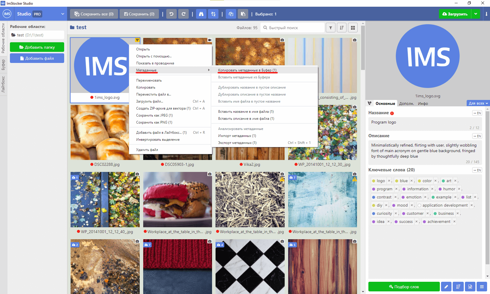

Для применения скопированных метаданных к одному или нескольким файлам, выделяем нужные картинки и нажимаем правой кнопкой мыши - **Метаданные** - **Вставить метаданные из буфера**:

  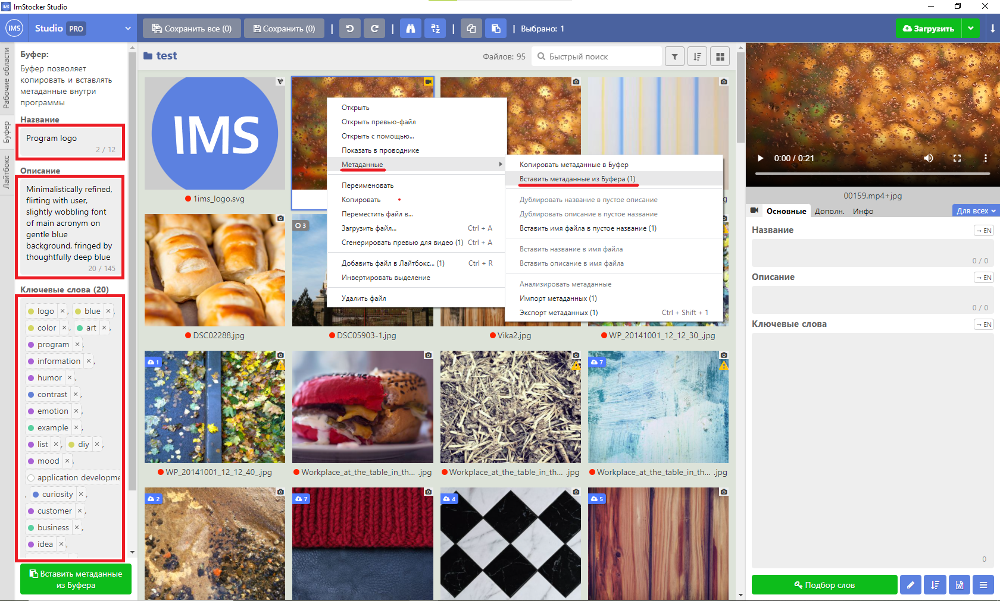

Метаданные скопируются и будут идентичны метаданным исходной картинки.
  

  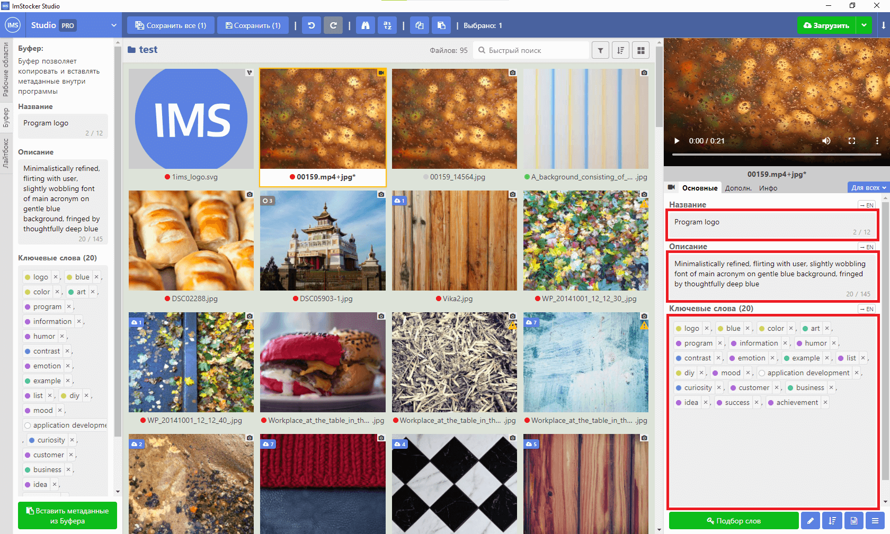

Второй способ скопировать метаданные - через панель редактирования в правом нижнем углу программы. Нажимаем кнопку **Меню** и выбираем пункт **Скопировать метаданные в Буфер**, далее выделяем один или несколько файлов куда необходимо скопировать метаданные и нажимаем **Вставить метаданные из Буфера**:

  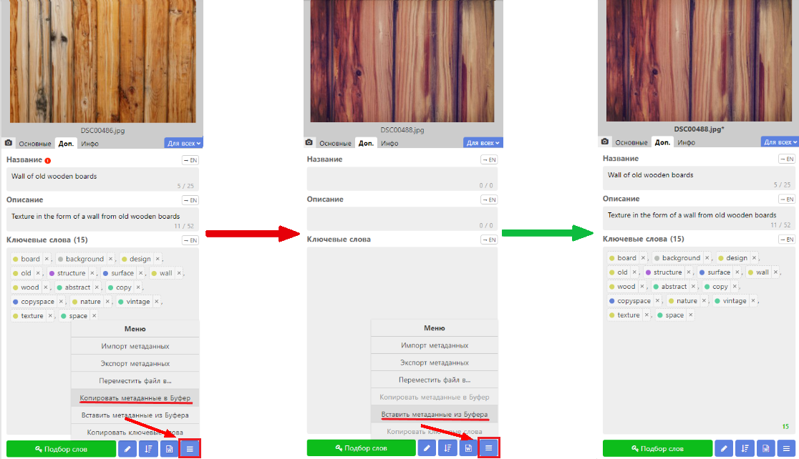

В любой момент работы с копированием метаданных вы можете посмотреть что на данный момент скопировано в буфер, а также в случае необходимости внести корректировки перед вставкой метаданных в другой файл. Для этого переходим в раздел **Буфер**:

  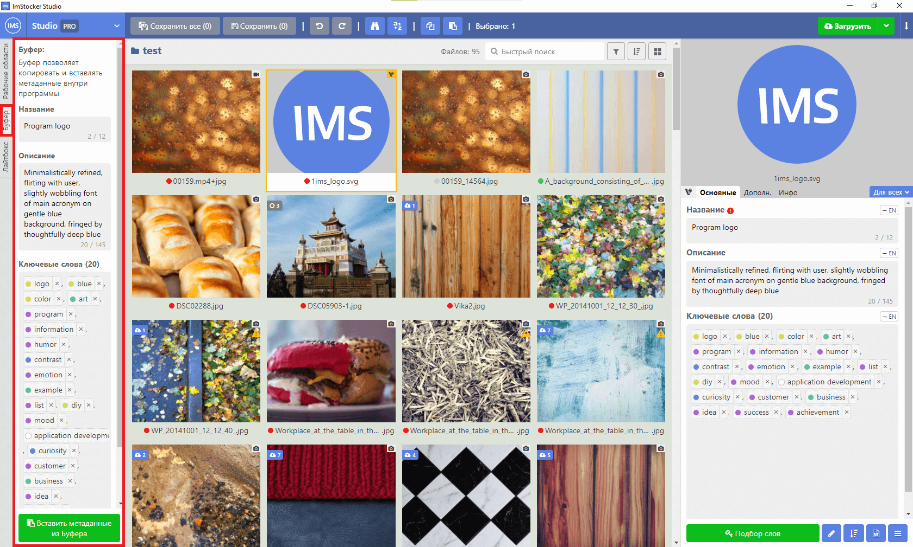

В данном разделе также присутствует кнопка **Вставить метаданные из Буфера** которая применит всё что есть в буфере к выбранному в середине экрана файла.

### Шаблоны

Работа с шаблонами в **ImStocker Studio** позволит вам значительно ускорить процесс добавления ключевых слов к файлам. Меню управления шаблонами находится в правом нижнем углу программы и появляется при выделении любой картинки из рабочей области:

  

В данном меню отображается список уже созданных шаблонов, кнопка для создания нового шаблона, а также кнопка управления перечнем шаблонов

При нажатии на кнопку со значком плюса рядом с именем шаблона он активируется и его содержимое вставляется в метаданные текущего файла. Если нажать на название, то сперва отобразится диалог, в котором вы можете либо выбрать только конкретные ключевые слова, либо все, либо N случайных

  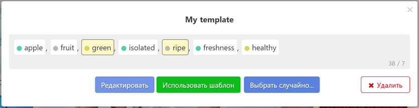

При нажатии на кнопку управления шаблонами отобразится следующий диалог:

  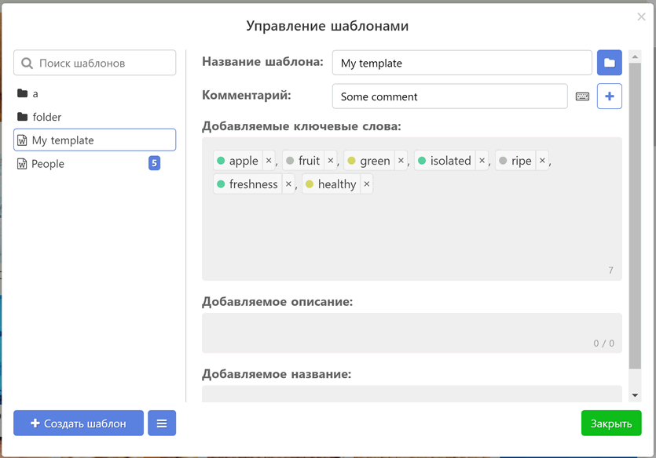

Здесь присутствует перечень всех шаблонов, которые были добавлены ранее и форма добавления/редактирования шаблона.

При создании шаблона необходимо указать имя и набор ключевых слов, которые он содержит. Если требуется, Вы можете дополнительно указать вставляемое при активации шаблона название и описание.

Вы можете группировать шаблоны в папки. Для этого нажмите на кнопку с соответсвующей иконкой и задайте имя папки. Если в названии папки будет присутсвовать символ слэша "/", то вы создадите вложенную структуру. Например, папка "a / b" означает, что шаблон будет помещен в папку "b", которая, в свою очередь, находится в папке "a"

Кроме этого, Вы можете добавить шаблону комментарий, который будет отображаться при наведении мышью на название шаблона в списке. А также горячую кнопку - цифру. Если нажать *Alt + указанная цифра*, когда курсор ввода будет помещен в поле ключевых слов, то содержимое шаблона вставится без дополнительных действий. Если нажать *Alt + Shift + указанная цифра*, то откроется диалог просмотра соответвующего шаблона

В меню рядом с кнопкой "Создать шаблон" содержатся функции **Импорта/Экспорта** шаблонов. Она позволит вам передавать шаблоны между своими устройствами или другими пользователями.

### Генерация превью для вектора и иллюстраций [[PRO]]
   
**ImStocker Studio** может сгенерировать превью для векторов (SVG и EPS) в формат JPG или PNG (с прозрачностью). Для этого кликните правой кнопкой мыши на вектор и нажмите соответвующую кнопку

  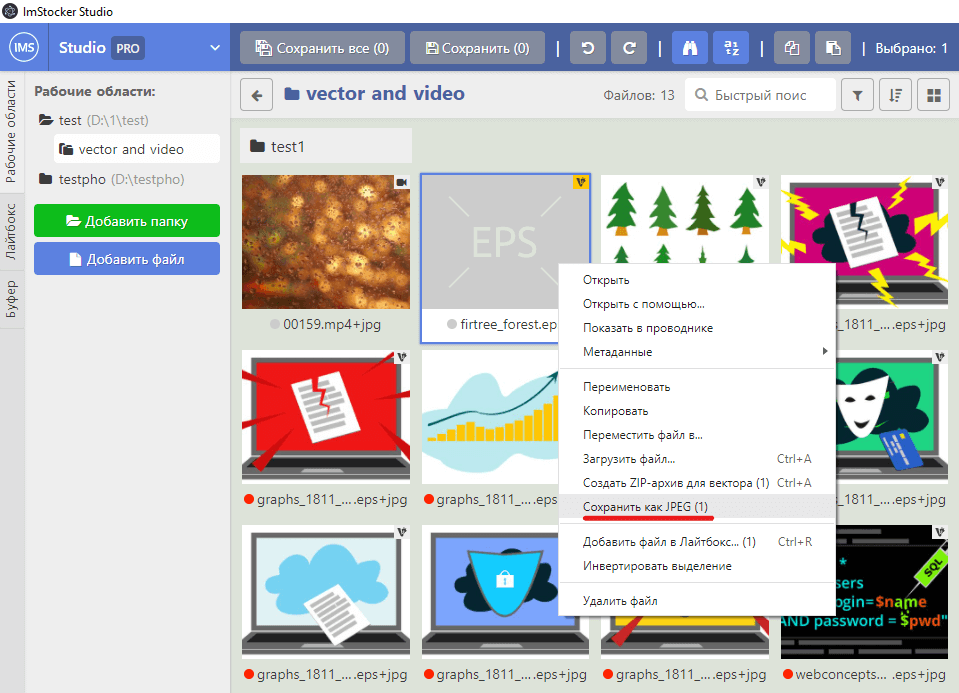

Создатся превью-файл:
  

  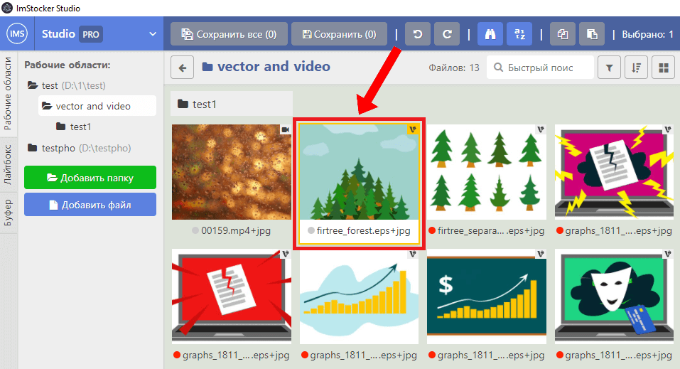

  
Вы можете регулировать ширину и высоту при генерации превью вектора в расширенных настройках раздела "Форматы файлов":
  

  

Аналогично вы можете сгенерировать JPG-превью для иллюстраций (PNG-файлов)

Важно отметить пару моментов:

* *Для пользователей Windows*: чтобы программа могла сгенерировать превью EPS файла, вы должны установить на компьютер Ghostscript и в настройках включить интеграцию (см. раздел ["Интеграция с Ghostscript (Windows)"](#settings-ghostscript-integration)) 

* В виду особенностей формата ESP не все такие файлы могут быть сохранены в PNG с сохранением прозрачности

Как и другие команды, эта команда может быть вызвана для множества файлов сразу

### Создание ZIP-архивов для векторов [[PRO]]
  
Программа **ImStocker Studio** также позволяет создать ZIP-архивы векторов с превью сразу, не выходя из программы. Для этого нужно нажать на файл в рабочей области правой кнопкой мыши и выбрать **Создать ZIP-архив для вектора**:

  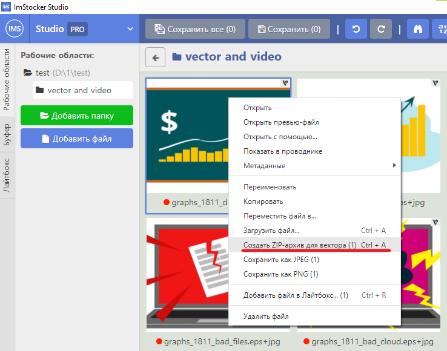

  
Для выбранного файла будет создан ZIP-архив:

  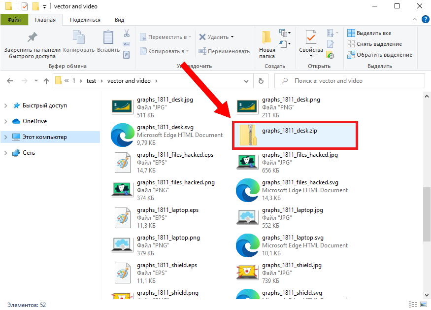

Как и другие команды, эта команда может быть вызвана для множества файлов сразу

### Генерация превью для видео [[PRO]]
  
Чтобы сгенерировать превью для видео, нужно нажать на видео в рабочей области правой кнопкой мыши и выбрать **Сгенерировать превью для видео**:
  

  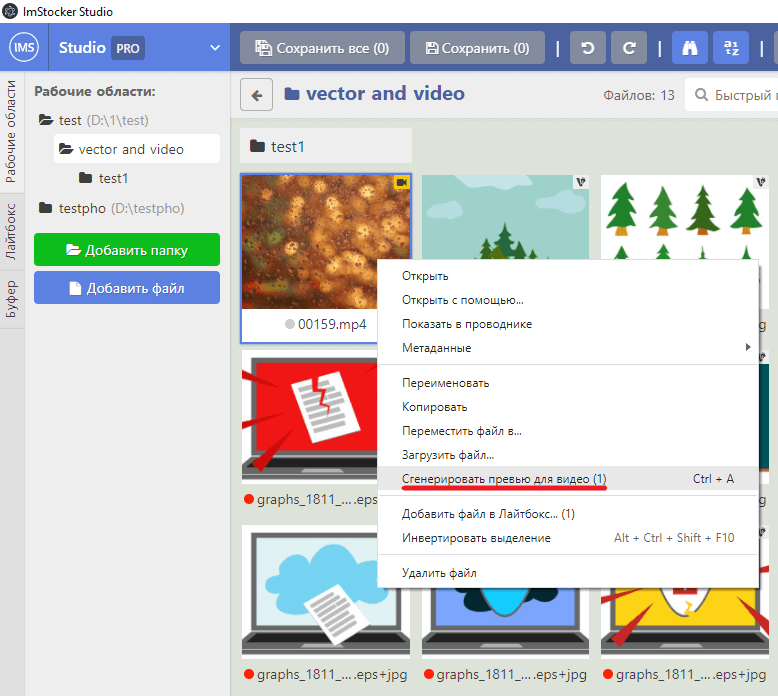

Откроется окно для выбора превью. Вы можете увеличивать превью, щелкнув мышкой по изображению. Чтобы выбрать определённый кадр видео, нужно задать момент времени с помощью ползунка или числа:
  

  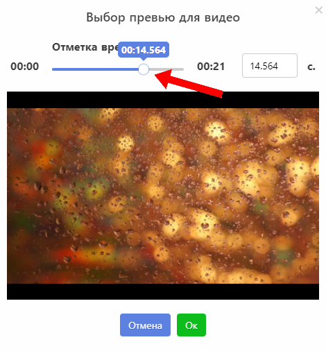

  
Будет создан файл формата **.jpg** с таким же названием, что и у видео:
  

  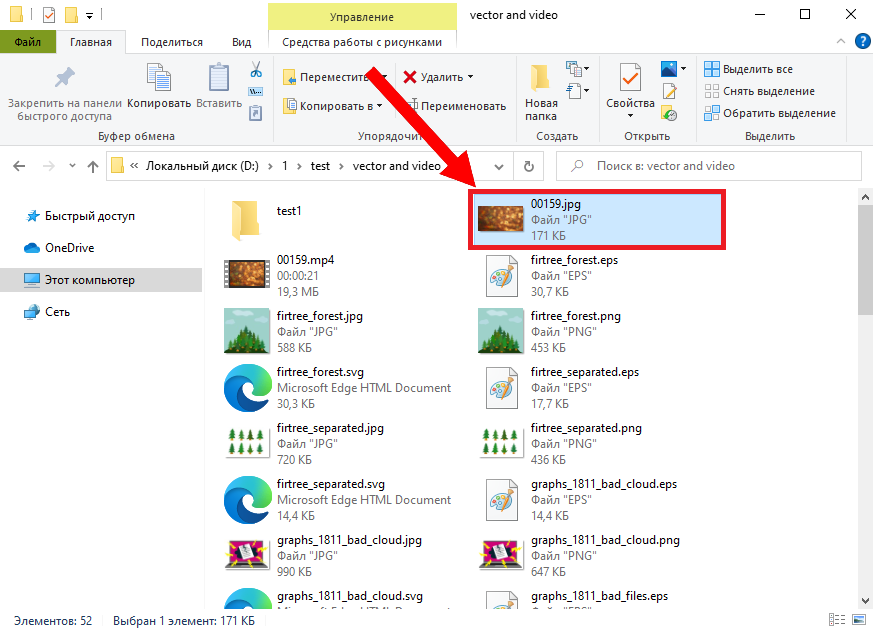

  
Вы можете сохранять превью в отдельном файле, не закрывая диалоговое окно. Просто нажмите правой кнопкой мыши на желаемый кадр, выберите в контекстном меню “Сохранить в отдельном файле” и нужный кадр у вас в кармане (на диске). В данном случае будет создан файл формата **.jpg** с названием, включающим в себя название видео и момент времени, выбранный Вами.
  

  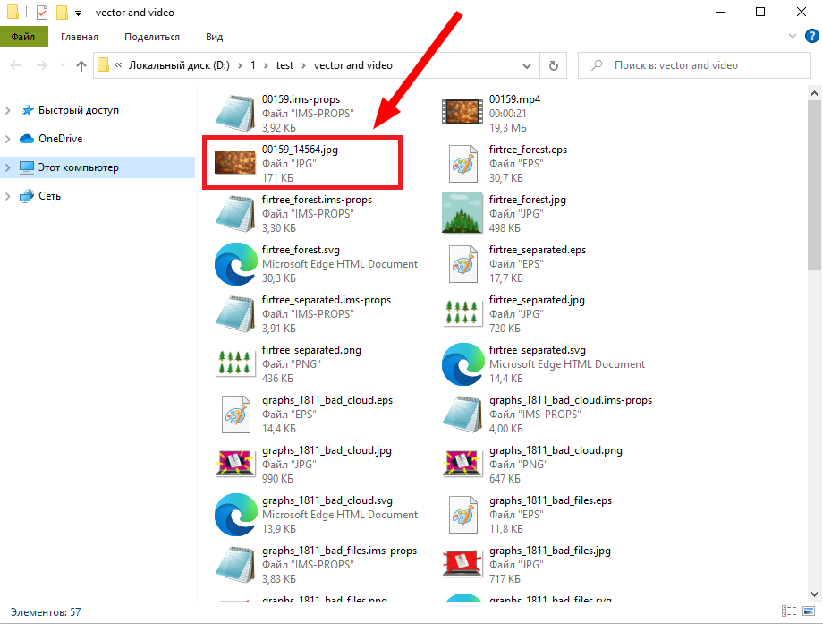

  
Как и другие команды, эта команда может быть вызвана для множества файлов сразу

## Управление файлами

### Фильтр файлов

Когда много файлов, трудно найти то, что нужно. Для удобства у Вас есть возможность искать нужные файлы с помощью фильтров.

  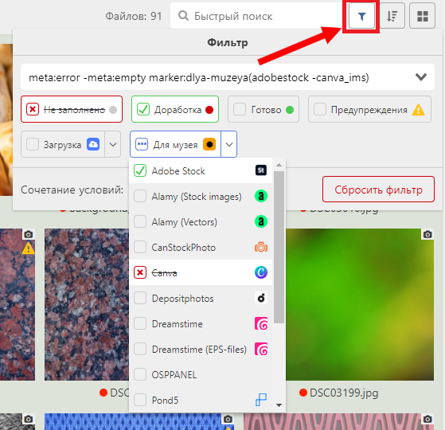

Вы можете фильтровать файлы по:

**1.** - Метаданным:

 * не заполнено (meta:empty) - в файле нет ни названия, ни описания, ни ключевых слов
  
 * доработка (meta:error) - хотя бы одно из полей метаданных заполнено, но файл не удовлетворяет всем правилам проверки метаданных (Вы можете задать их самостоятельно в настройках программы в разделе “Общие”)
  
 * готово (meta:ok) - все необходимые метаданные заполнены, файл готов к загрузке.

**2.** - Наличию предупреждений (warn). Перечень предупреждений Вы также можете задать через настройки программы, раздел “Общие”

**3.** - Статусам (marker:имя_статуса). Вы можете выбрать файлы, которые содержат или не содержат тот или иной статус. Например, загруженные хотя бы на один сток, или на определенные микростоки.

При первом клике на кнопку фильтра выбираются файлы, которые удовлетворяют его условиям, при втором - файлы, которые, наоборот, противоречат, а при третьем - он деактивируется и перестает влиять на файлы. Клик с зажатым ctrl соответствует двойному нажатию на фильтр.

Помимо выбора одного критерия поиска, вы можете выбрать сразу несколько, при этом указав, как они будут сочетаться:

* Любое из - файл должен соответствовать хотя бы одному из активных фильтров. Например, можно выбрать файлы, с незаполненными и частично заполненными метаданными (meta:empty meta:error)

* Все - файл должен соответствовать всем активным фильтрам одновременно. Скажем, можно выбрать файлы, которые готовы, но содержат предупреждения (and(meta:ok warn))  

* Не все - противоположный вариант сочетанию “Все”.

  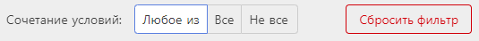

Для удобства фильтр можно задавать не только с помощью кнопок, но и ручным вводом в специальную строку поиска. Умный поиск запоминает последние использованные фильтры и предлагает только то, что Вам нужно.

Чтобы сбросить все фильтры вы можете просто очистить поле поиска или нажать на соответствующую кнопку.

### Поиск и замена метаданных [[PRO]]

Помимо быстрого поиска в **ImStocker Studio** есть функция расширенного. Она активируется при нажатии на кнопку с иконкой бинокля (1)

  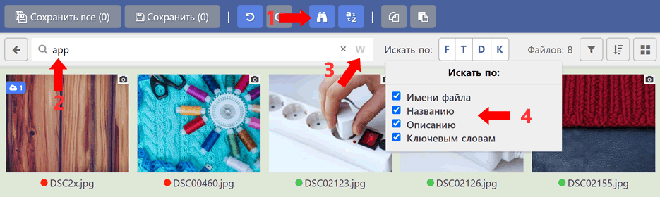

В поле (2) вводится поисковая строка

Кнопка (3) позволяет включать и выключать поиск по словам целиком

Блок (4) позволяет настроить, где будет вестись поиск: по имени файла, по названию, по описанию, по ключевым словам

Рядом с кнопкой функции расширенного поиска расположена кнопка активации функции замены (1): 

  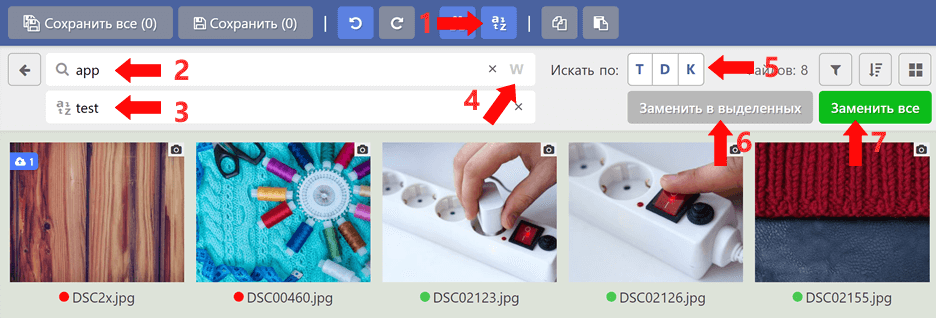

В поле (2) вводится искомый текст, в поле (3) - текст, на который нужно заменить искомый

Кнопка (4) позволяет включать и выключать поиск по словам целиком

Блок (5) позволяет настроить, где будет вестись поиск и замена: в названии, в описании, в ключевых словах

Кнопка (6) производит замену только в выделенных файлах, кнопка (7) - во всех найденных

### Экспорт метаданных [[PRO]]

Экспорт метаданных одна из ключевых особенностей **PRO** версии **ImStocker Studio**, позволяющая в несколько нажатий выгрузить метаданные выбранных работ в отдельный файл формата **.csv**.

Для того чтобы воспользоваться функцией экспорта нажимаем кнопку **Меню** в правом нижнем углу и выбираем пункт **Экспорт метаданных**:

  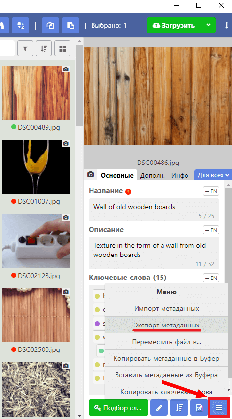

Окно экспорта предоставляет возможность выбрать один или несколько шаблонов использующийся микростоками, либо создать свой собственный под ваши потребности:

  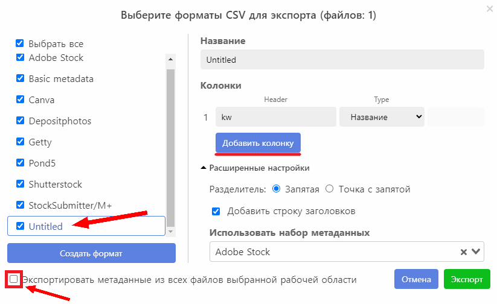

Для каждого выбранного шаблона будет создан файл формата **.csv**, содержащий метаданные выбранных файлов:

  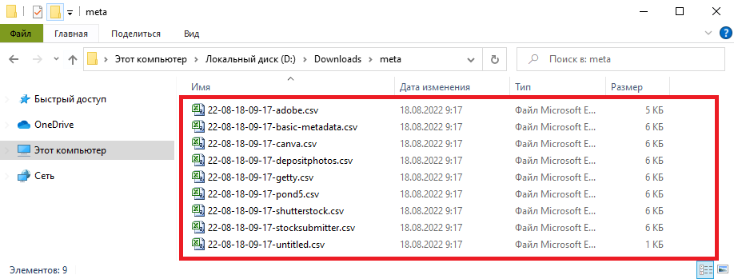

Если была включена галочка *"Экспортировать метаданные из всех файлов выбранной рабочей области"*, то в выходные файлы попадут метаданные всех файлов, которые находятся в той же папке, что и выбранные файлы.

Если вам требуется создать новый шаблон, то кроме ручной настройки всех полей, вы можете воспользоваться функцией автоматического создания формата экспорта по шаблону. Эта функция доступна в меню рядом с кнопкой "Создать формат"

### Импорт метаданных [[PRO]]

Импорт метаданных - ещё одна особенностей **PRO** версии **ImStocker Studio**, позволяющая быстро подгрузить метаданные из файла формата **.csv** к выделенным картинкам в рабочей области.

Чтобы воспользоваться: выделяем незаполненные картинки, для которых у нас приготовлен файл **.csv** и нажимаем **Меню** в правом нижнем углу и выбираем пункт **Импорт метаданных**: (проверка принадлежности метаданных к картинке осуществляется по названию картинки)

  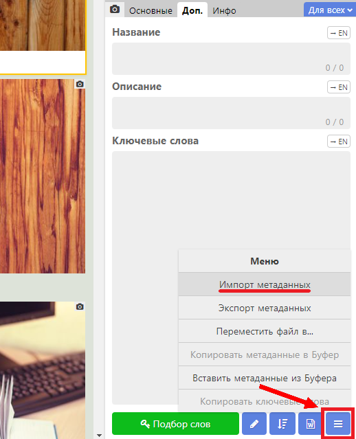

Выбираем файл **.csv** необходимого шаблона и нажимаем **Открыть**:

  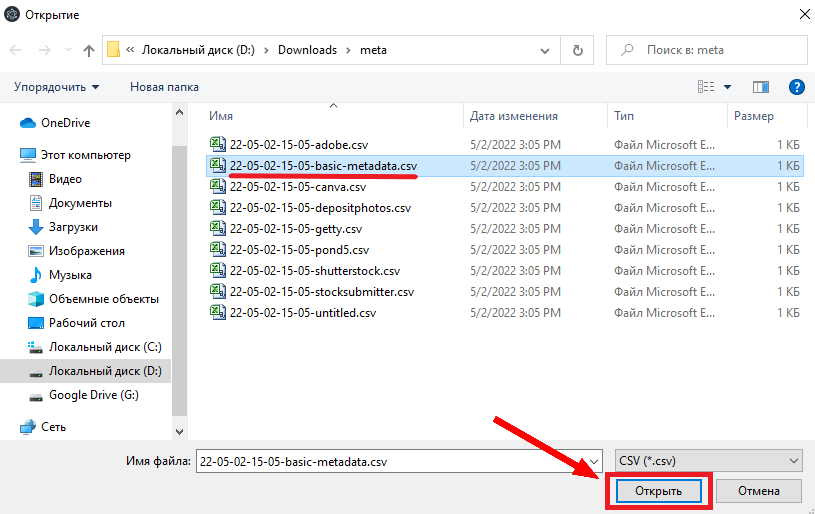

Исходя из содержащийся в файле метаданных программа попробует определить шаблон заполняемых данных и предложит его. Нажимаем **Импорт**:

  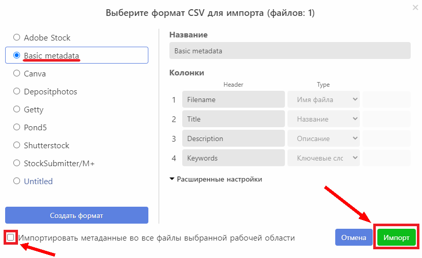

И проверяем что заполнились все поля для каждой из упомянутых в файле картинок:

  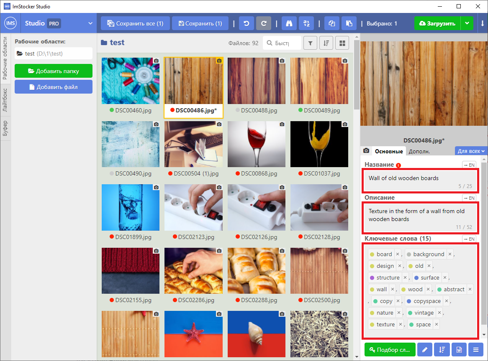

Если была включена галочка "Импортировать метаданные во все файлы выбранной рабочей области", то импорт будет произведен для всех файлов, лежащих в той же папке, что и выбранные

### Анализ метаданных [[PRO]]

Анализ метаданных - одна из самых полезных и наглядных функций **PRO** версии **ImStocker Studio**. Для того чтобы провести анализ метаданных, выделяем 2 или более файлов в рабочей области и нажимаем кнопку **Анализировать**, которая появится в поле **Ключевые слова**.

  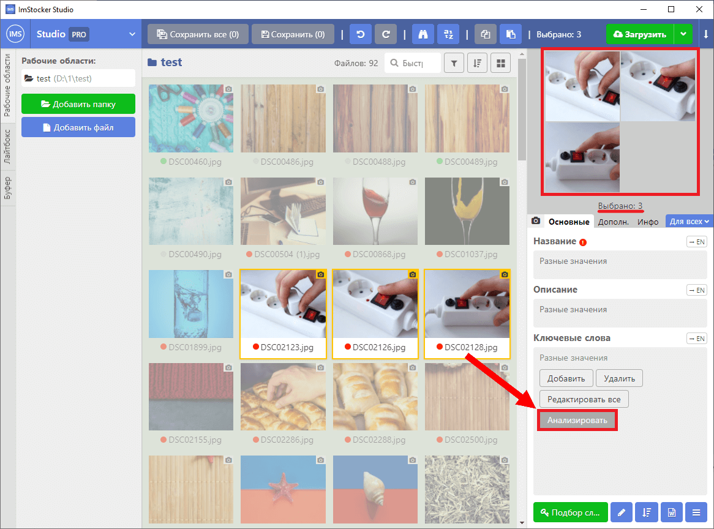

Откроется окно **Анализ метаданных**, содержащее две вкладки:

**По ключевым словам** - программа предоставит краткую статистическую сводку по 4 пунктам: минимальное кол-во слов, максимальное кол-во слов, среднее число слов и их средняя уникальность. Визуально отобразит количество ключевых слов каждого из выделенных файлов, их уникальность в процентах от общего количества слов и разобьет слова на ранговые группы, а так же посчитает их количество, числовое и процентное. Общие ключевые слова, слова, используемые только один раз, повторяющиеся слова, а так же общий список всех слов будет наглядно отображен в специальных боксах.

  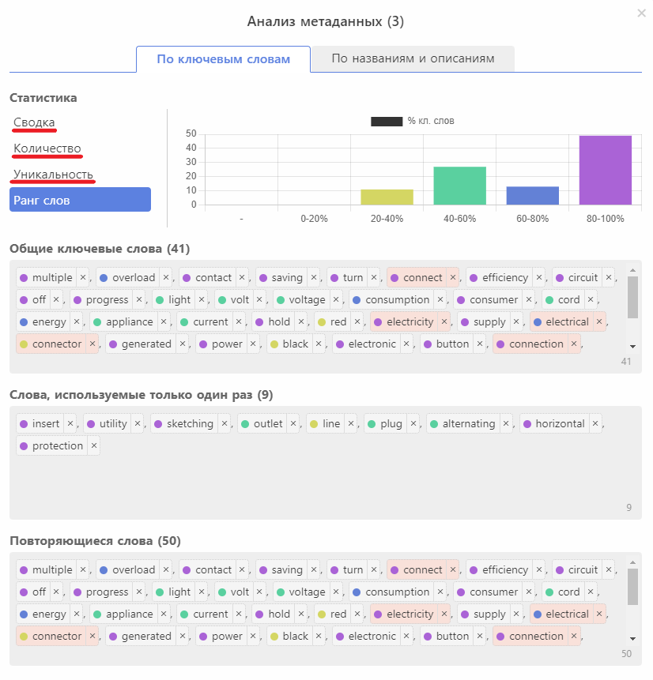
  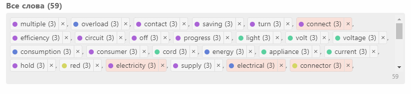

**По названиям и описаниям** - программа отобразит количество уникальных и заполненных, минимальную, среднюю и максимальную длину, общее число уникальных и совпадающих названий и описаний каждого из выделенных файлов. Предоставит списки наиболее часто встречаемых названий и описаний.

  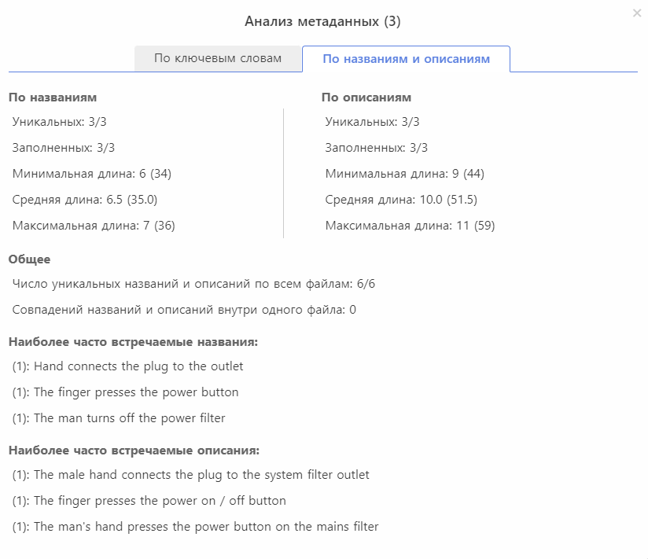

  

### Переименование файлов и папок

Программа **ImStocker Studio** позволяет переименовать файл не выходя из  программы. Для этого нужно нажать на файл в рабочей области правой кнопкой мыши и выбрать **Переименовать**:

  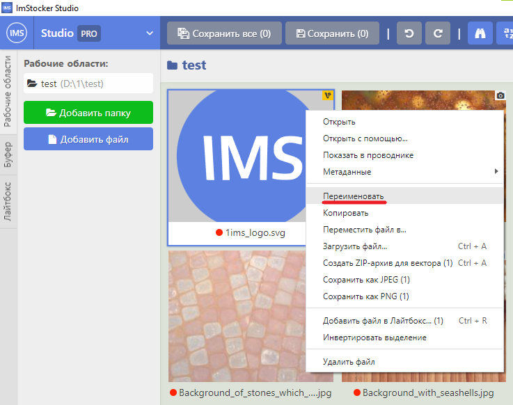

Либо дважды нажать на название картинки левой кнопкой мыши:

  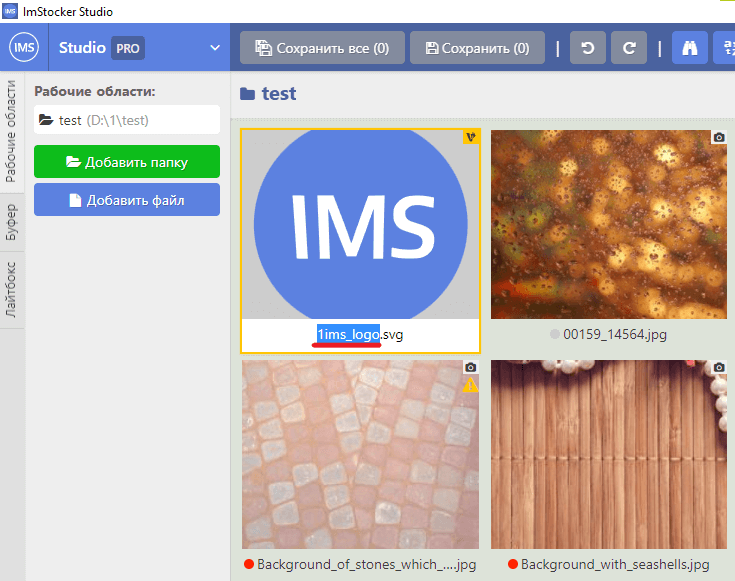

  
Для переименования папки нужно нажать на папку правой кнопкой мыши и выбрать **Переименовать папку**:  

  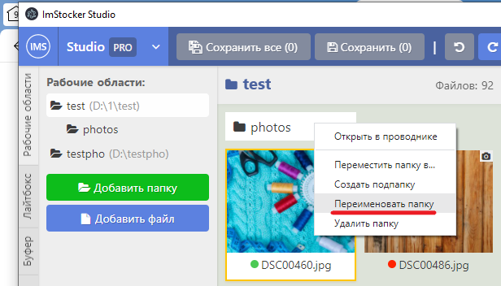

  
Откроется окно переименования, позволяющее задать папке новое название:

  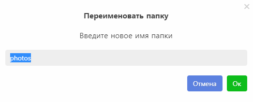

  
### Переименование файлов по названию и по описанию

Пользователь может переименовать файл с помощью названия или описания. Для этого нужно выбрать файл(-ы) и найти в контекстном меню пункт “Вставить название в имя файла” или “Вставить описание в имя файла”.

  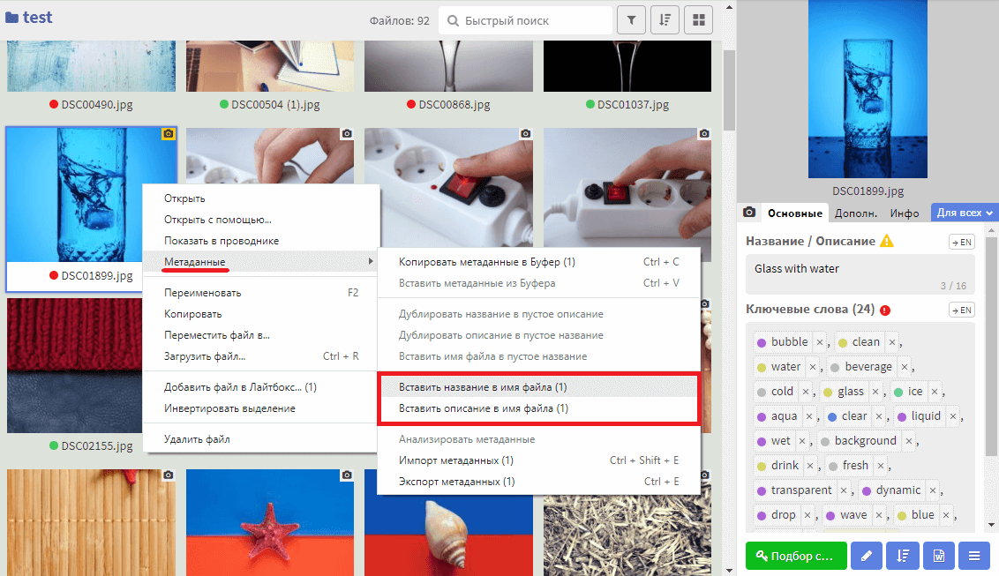

  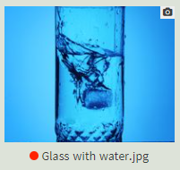

  
### Копирование файлов
  
Пользователь может копировать файлы, не выходя из программы. Для этого нужно выбрать файл и найти в контекстном меню пункт “Копировать”. 

  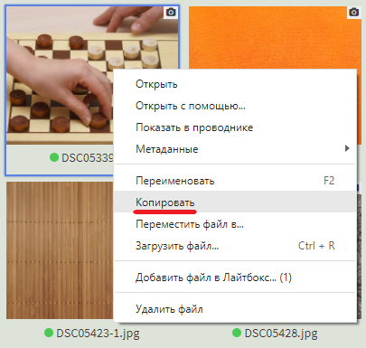

Откроется диалоговое окно с предлагаемым названием для копируемого файла. 

  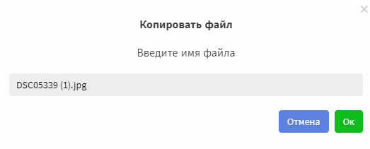

Копирование завершено.

  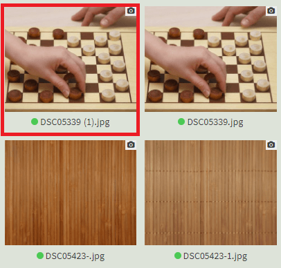

### Перемещение файлов и папок

Программа **ImStocker Studio** также позволяет переместить файл не выходя из  программы. Для этого нужно нажать на файл в рабочей области правой кнопкой мыши и выбрать **Переместить файл в**:
  

  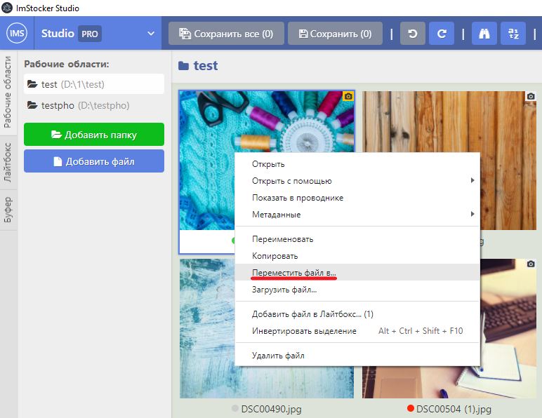

Либо выделить необходимые картинки для перемещения и воспользоваться кнопкой **Меню** в правом нижнем углу программы, затем нажать **Переместить файл в**:

  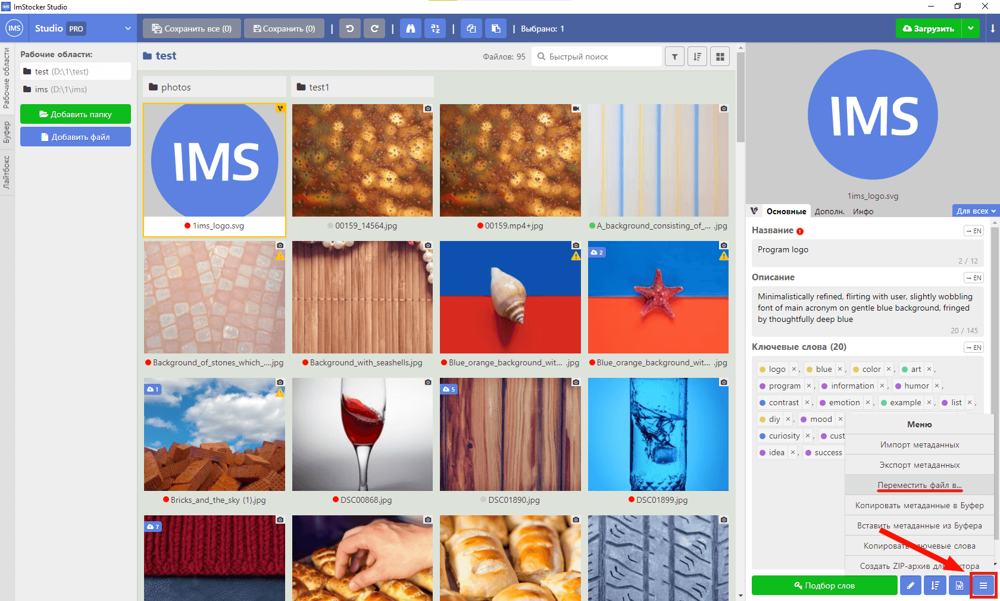

Для переименования папки нужно нажать на папку правой кнопкой мыши и выбрать **Переместить папку**:  

  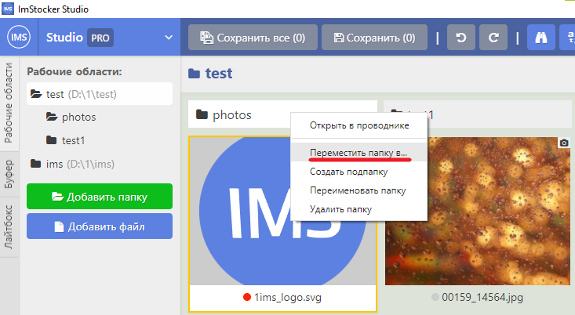

В любом случае откроется окно перемещения, позволяющее **Переместить** выделенные картинки или папку в одно из добавленных рабочий мест, либо в папку, созданную внутри них:

  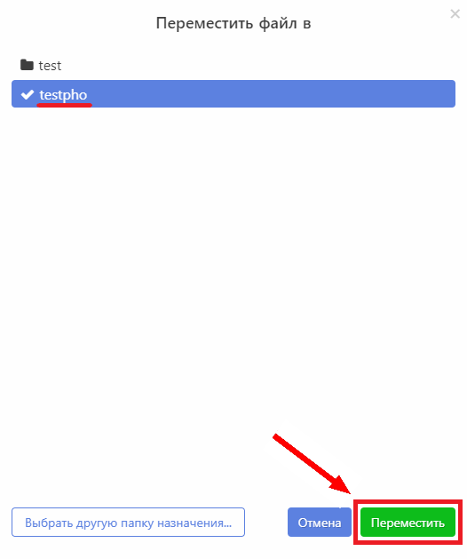

### Создание подпапок

Для создания подпапки нужно нажать на папку правой кнопкой мыши и выбрать **Создать подпапку**:  

  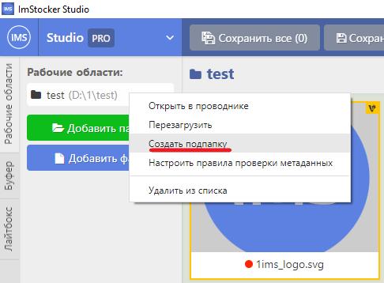

Откроется окно для выбора имени новой папки:

  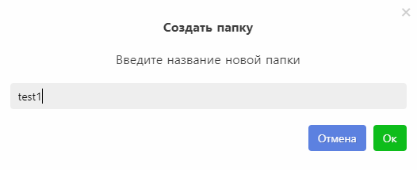

Подпапка может появиться не сразу. Чтобы обновить список папок, в **Рабочие области** нужно нажать на папку правой кнопкой мыши и выбрать **Перезагрузить**:
  

  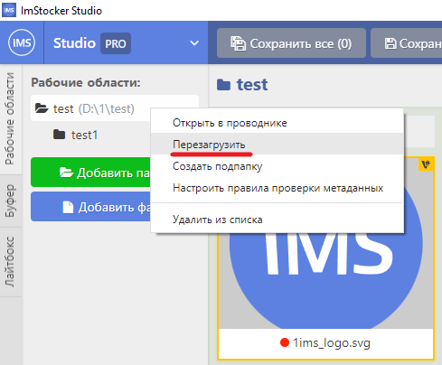

  
### Открыть файл с помощью…
  
Если вам нужно скорректировать или посмотреть файл в какой-либо внешней программе, теперь вы можете нажать в контекстном меню пункт “Открыть с помощью...”

  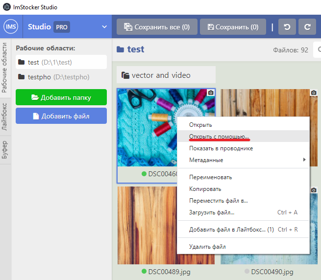

Если нажатая плитка включает в себя сразу несколько файлов (например EPS + JPEG), то программа уточнит, какой конкретно файл вы хотите открыть. 

Далее откроется окно выбора программы. Найдите нужную программу на своем компьютере и подтвердите выбор. После этого **ImStocker Studio** спросит, должна ли она запомнить эту программу для выбранного расширения файла. Если вы ответите утвердительно, то в следующий раз в контекстном меню появится соответствующий пункт:

  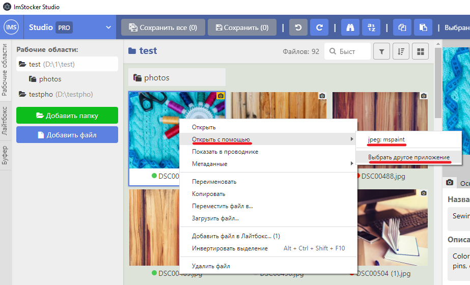

  
Вы также можете отредактировать список внешних программ в разделе **Настройки - Интеграция - Открыть с помощью**:

  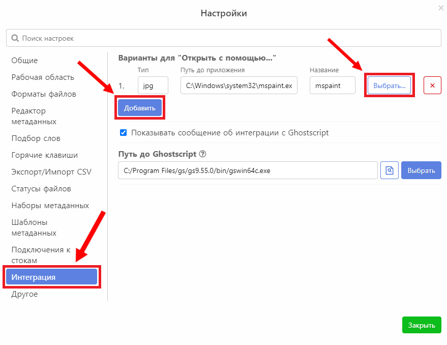

  
Вы можете настроить открытие внешней программы и при двойном клике на плитку. Для этого выберите соответствующую опцию в пункте “Действие при двойном клике на миниатюре (эскизе)”:

  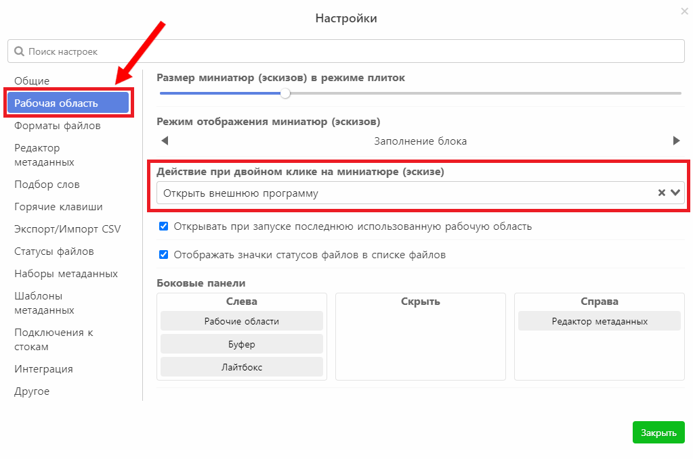

Теперь при двойном клике на плитку будет открываться первая подходящая по расширению программа из списка “Варианты для “Открыть с помощью...””. Если для одного расширения у вас выбрано несколько программ, вы можете их поменять местами, если потяните за номер пункта в этом списке.

### Загрузка файлов [[PRO]]

Прямая загрузка файлов на стоки это функция **PRO** версии **ImStocker Studio**, которая позволит вам не выходя из программы подготовить файлы с метаданными для публикации на стоках. Для того чтобы воспользоваться этой фукнцией, выбираем один или несколько файлов в рабочей области и нажимаем кнопку **Загрузить** в правом верхнем углу программы.

  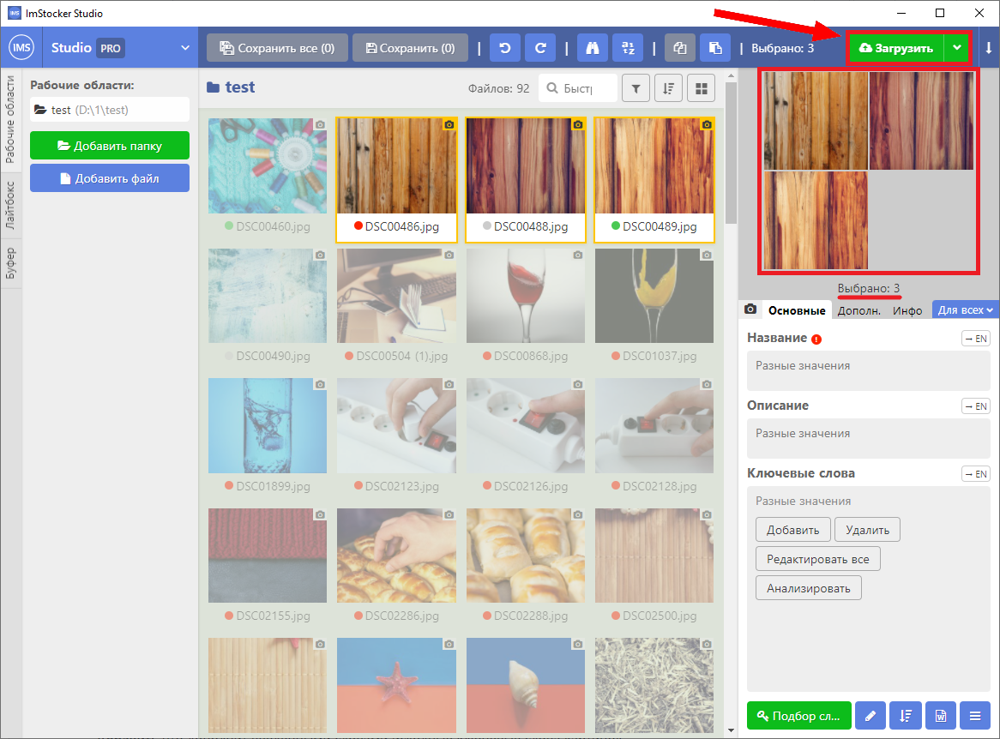

В открывшемся окне загрузки выбираем нужный или несколько нужных вам стоков из уже предложенных или добавляем новый, предпочитаемый вами.

  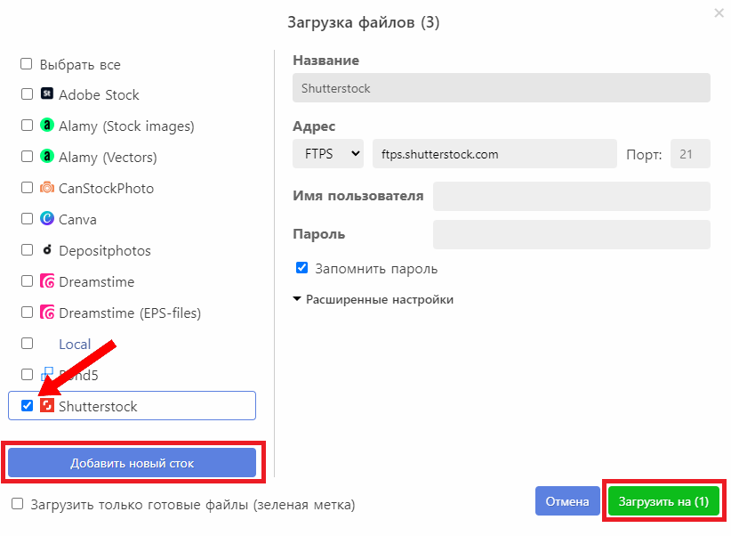

Вводим логин и пароль в окне загрузки или сразу нажимаем загрузить и вводим в открывшемся окне, подтверждаем начало загрузки.

  

Начнется процесс загрузки. Если для загрузки требовалось добавление превью-файлов или формирование ZIP-архивов, то они будут созданы автоматически

По завершению загрузки, заходим на сток и проверяем что выбранные вами файлы со своими метаданными уже ждут подтверждения отправки.

  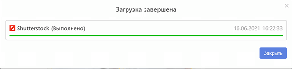

  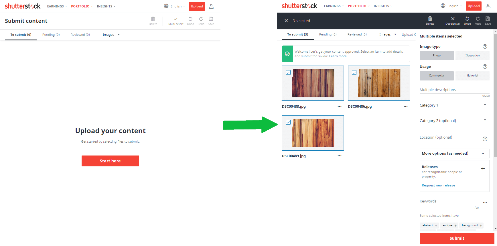

Важно отметить, что большинство микростоков не читают метаданные из видео-файлов. Для таких случаев, чтобы прикрепить метаданные к загруженным файлам, Вам нужно экспортировать их в CSV-файл нужного для микростока формата и загрузить его через web-интерфейс микростока.

Если же, микросток читает метаданные из видео, вы можете включить галочку *"Сохранять метаданные для видео в встроенную секцию XMP, если возможно"* в разделе "Форматы файлов" в **Настройках** программы, после чего пересохранить файл и отправить его на микросток. Эта галочка не учитывает специальные наборы метаданных для микростоков.
  
### Лайтбокс
  
**Лайтбокс** позволяет удобно работать с файлами, расположенными в разных рабочих областях, а также открывать файлы напрямую, не создавая рабочую область.  Вы можете добавить файлы в Лайтбокс одним из следующих способов:
  
**1** - Через контекстное меню "Добавить в Лайтбокс"
  
**2** - Перетащив файл в окно программы"
  
**3** - Нажав кнопку "Добавить файл"
  

  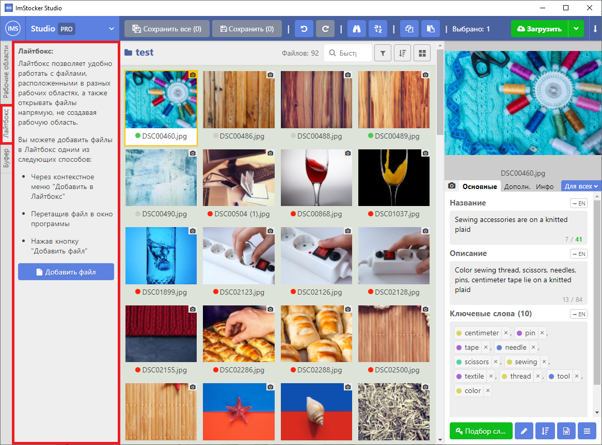

 
  
В **Лайтбокс** можно заносить файлы с компьютера, нажав на **+** в левом нижнем углу **Лайтбокса**, и из рабочих областей, для этого нужно нажать на файл правой кнопкой мыши и выбрать **Добавить в лайтбокс**:
  

  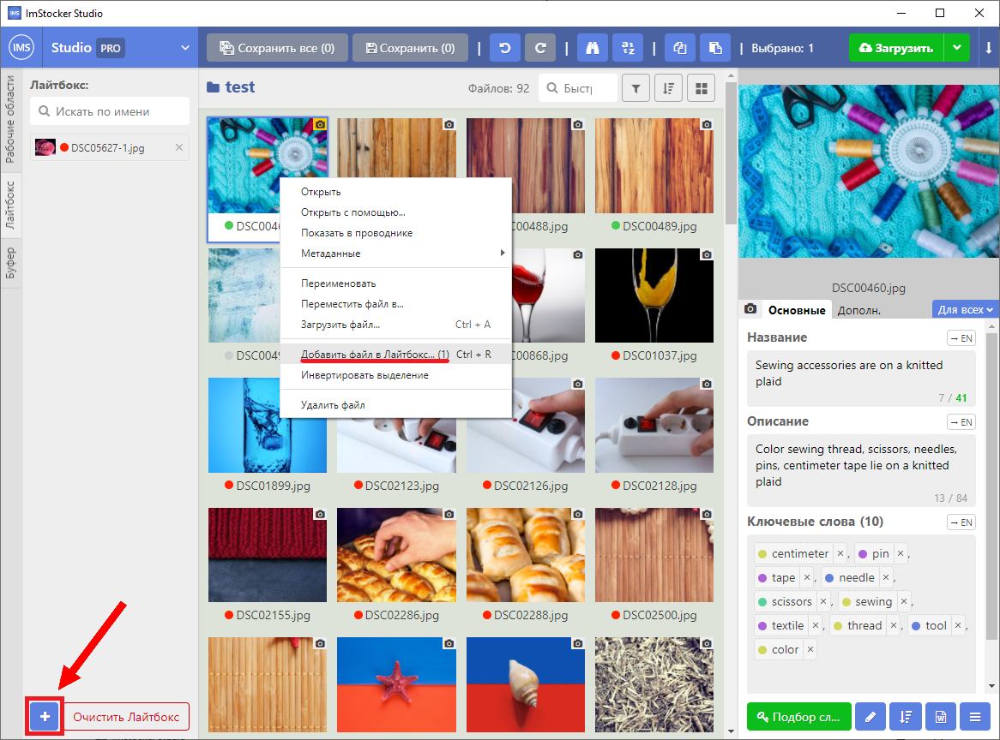

Файл появится в **Лайтбоксе**. Вы можете удалить файл с помощью крестика, который находится справа, либо очистить **Лайтбокс** с помощью кнопки **Очистить Лайтбокс** в правом нижнем углу **Лайтбокса**:
  

  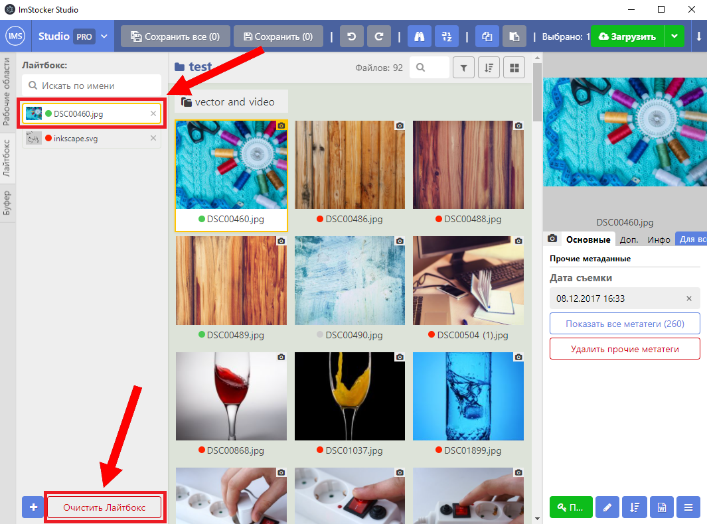

  
Вы можете быстро найти нужный файл с помощью строки поиска:
  

  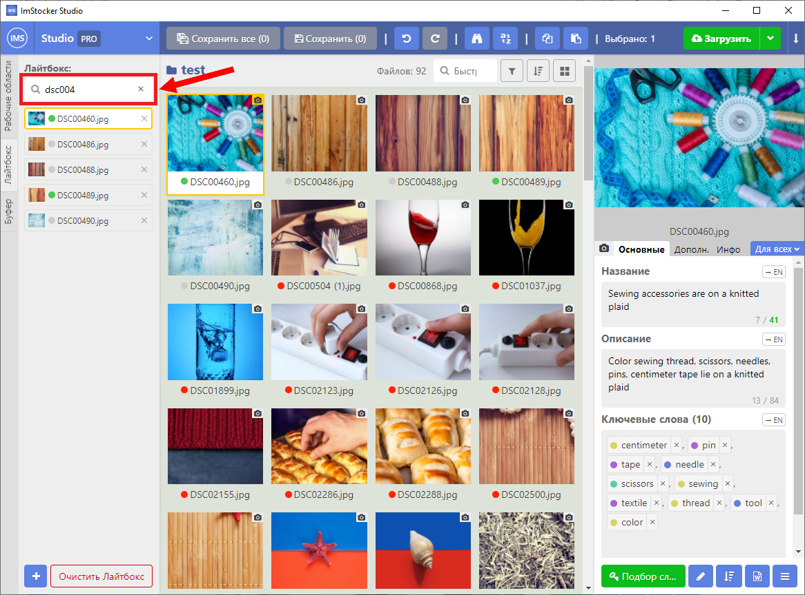

  
##  Настройки программы

### Обзор настроек

Окно **Настроек** состоит из следующих разделов:

* Общие

* Рабочая область

* Форматы файлов

* Редактор метаданных

* Подбор слов

* Горячие клавиши

* Экспорт/Импорт CSV

* Статусы файлов

* Наборы метаданных

* Подключения к стокам

* Интеграция

* Другое

Вы можете быстро найти нужную настройку с помощью строки поиска:
  

  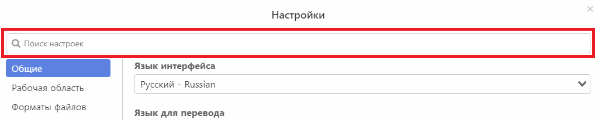

  
Вы можете управлять настройками подключений, шаблонами CSV и наборами метаданны. Например, если Вы захотите скрыть неиспользуемые элементы, то нужно нажать на перечеркнутый глаз, расположенный справа от выбранного элемента.

  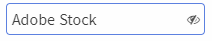

Если Вы решите восстановить элемент, перейдите в настройки, выберите нужный Вам раздел (шаблоны CSV, настройки подключений или наборы метаданных) и нажмите на стрелочку, расположенную справа от выбранного элемента.

  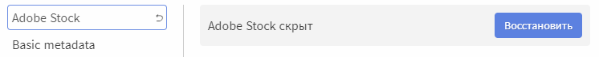

  
Если Вы захотите удалить статус, подключение, шаблон или набор, нажмите на крестик, расположенный справа от названия элемента.
  

  

### Общие 

В данном разделе можно настроить язык, правила проверки метаданных и предупреждения по файлам.
  

  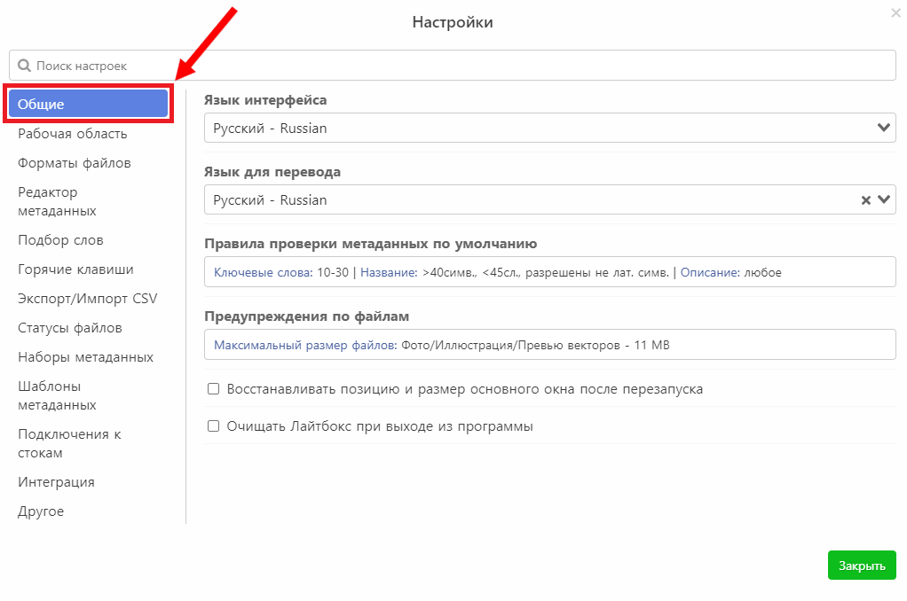

### Проверка готовности файлов

Настроить правила проверки метаданных по умолчанию можно в "Настройки - Общие - Правила проверки метаданных":

  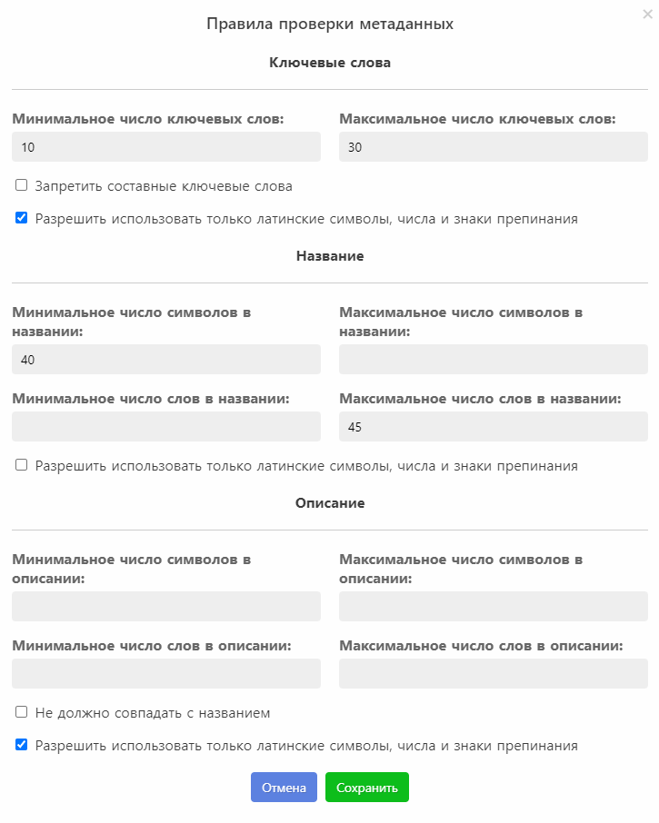

### Предупреждения по файлам

Настроить отображение технических предупреждений можно в разделе "Настройки - Общие - Предупреждения по файлам":

  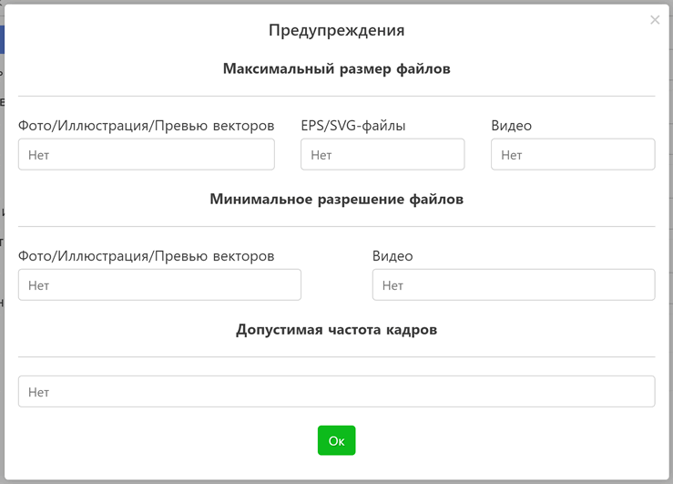

### Рабочая область 

В данном разделе можно управлять размером, режимом отображения миниатюр(эскизов) и боковыми панелями. Боковые панели можно перемещать слева направо, между собой и даже скрывать ненужные панели. 
  

  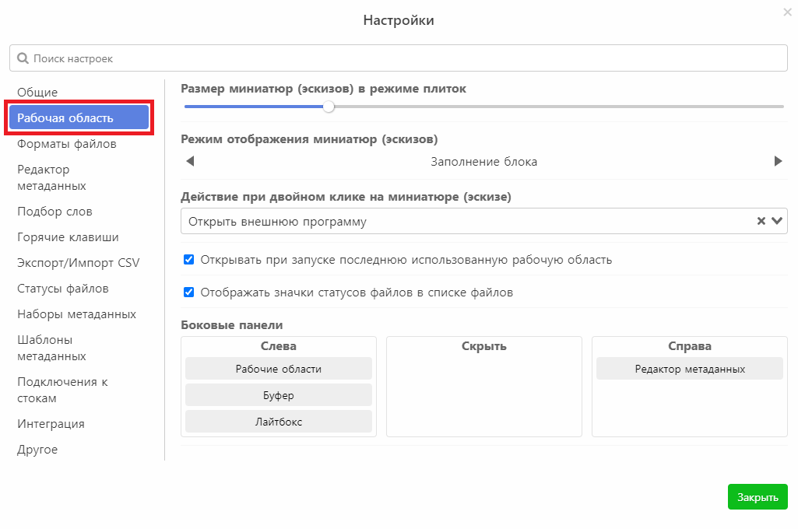

### Форматы файлов 

Позволяет настроить сохранение выбранной скорости воспроизведения при переключении видео и метаданных в встроенные секции, а также отображение значка типа файлов. Вы можете регулировать ширину и высоту при генерации превью вектора в расширенных настройках.

  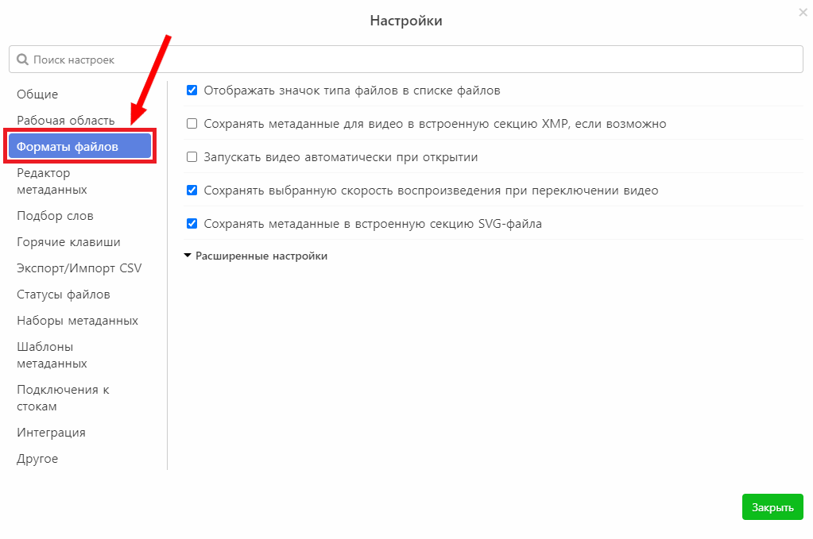

  
### Редактор метаданных

В разделе можно настроить показ кнопки удаления слов и всплывающей подсказки при наведении на ключевое слово, установить разделитель ключевых строк (либо новая строка, либо запятая, либо точка с запятой). 

  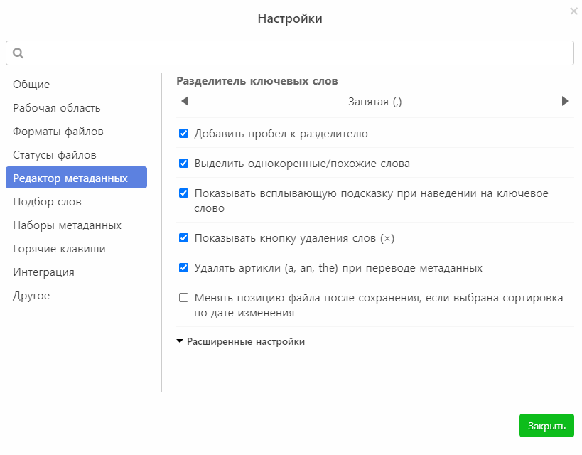

  
Вы можете добавить email, страну и копирайт автора в metadata при сохранении и настроить сохранение метаданных в отдельный XMP-файл в расширенных настройках.

  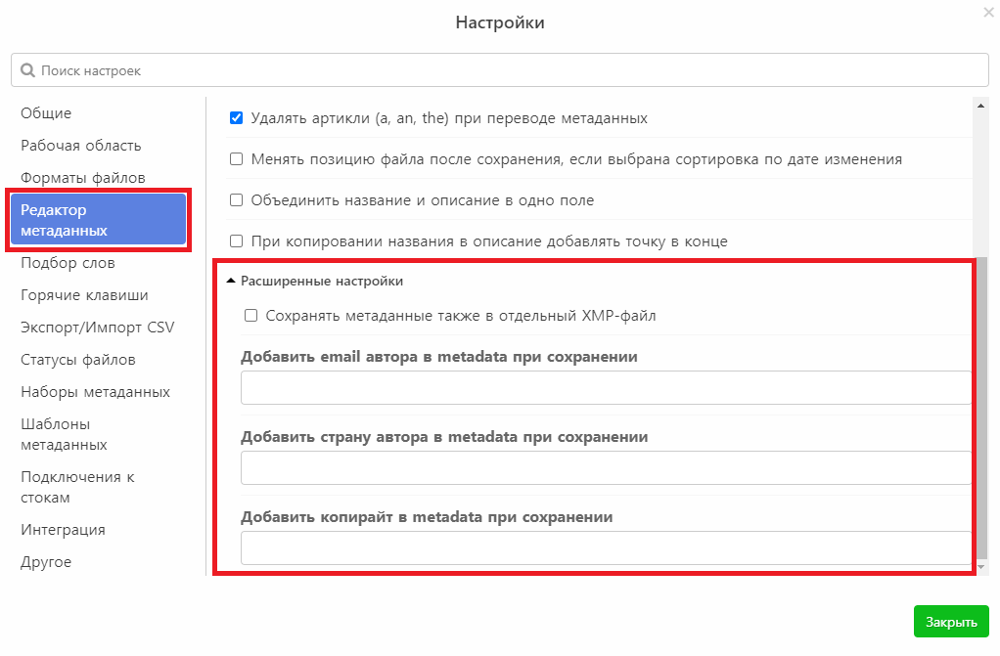

  
### Подбор слов

Здесь вы можете выбрать действия при нажатии на кнопку "Подбор слов", заполнять поисковую строку при подборе слов названием или описанием, выбрать расположение окна подбора слов и передаваемые метаданные.

  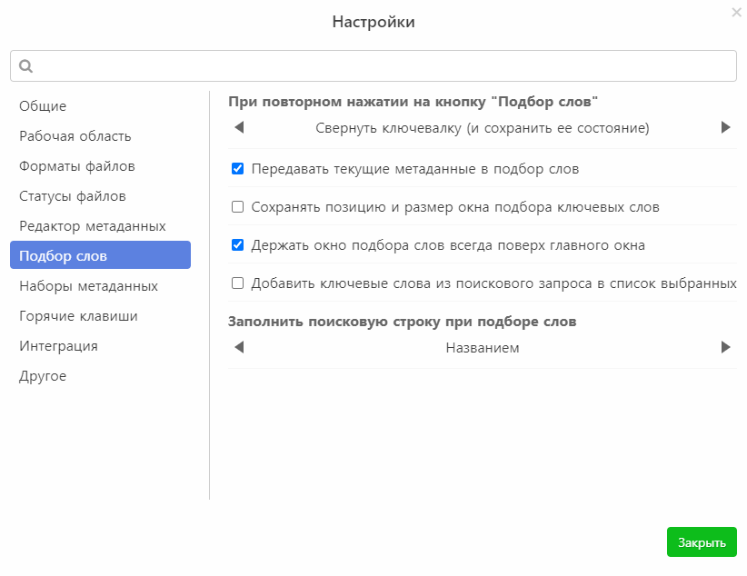

  
### Горячие клавиши

Невозможно представить рабочий инструмент без горячих клавиш, которые многократно ускоряют вашу работу. В ImStocker Studio они не только присутствуют, но и, более того, вы можете с легкостью настроить их, как вам угодно. Делается это в специальной вкладке “**Горячие клавиши - Назначить горячие клавиши**” в настройках программы:

  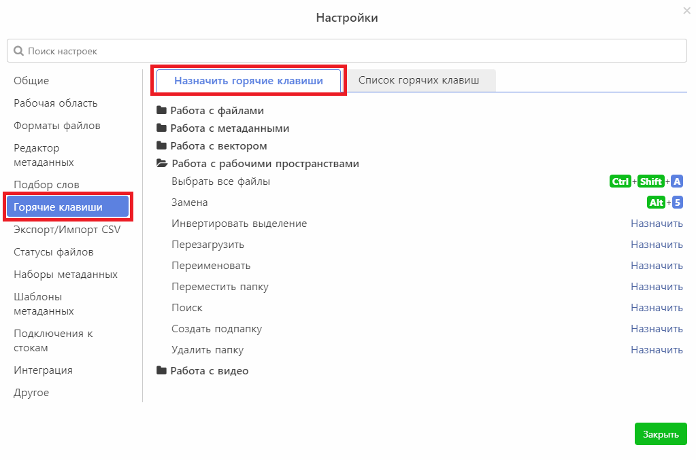

  
Всего на данный момент в программе доступно свыше 50 команд, разделенных на пять групп: работа с файлами, с метаданным, с вектором, с рабочими областями и с видео. Каждой их этих команд вы можете присвоить свою горячую клавишу. Чтобы сделать это, нажмите на интересующую вас команду и укажите сочетание клавиш во всплывающем окне:

  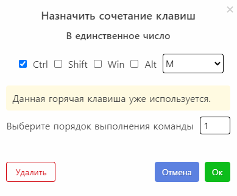

  
Кроме этого, при попытке назначить горячую клавишу, которая уже используется, выводится соответствующее предупреждение, а также предлагается указать порядок выполнения команд. Таким образом можно формировать своеобразные макрокоманды. Тогда одним нажатием клавиш можно будет автоматически выполнить несколько действий, например, 1) привести к ед. числу, 2) отсортировать ключевые слова по алфавиту А → Я, а затем 3) удалить слова, превышающие лимит.
  

  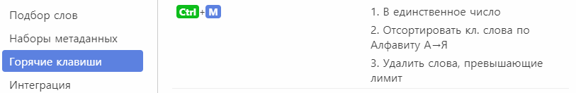

  
Если вы хотите назначить горячую клавишу какой-то конкретной команде, вы можете вписать ее название в строку поиска:

  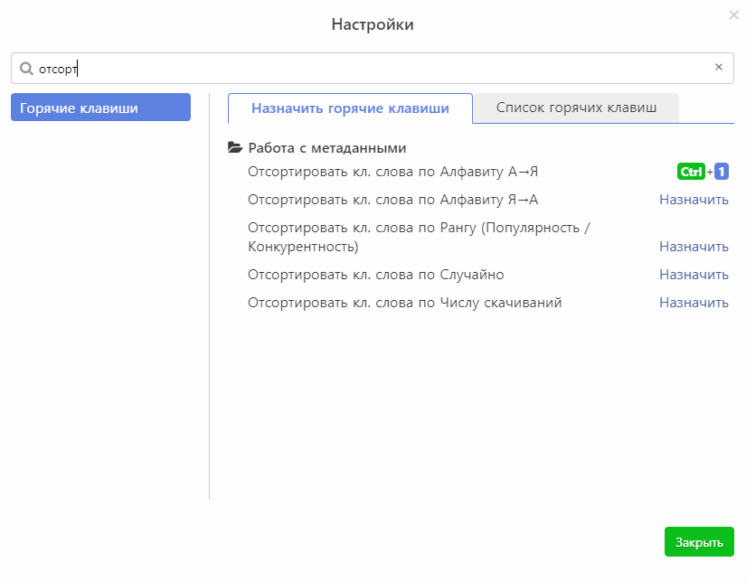

  
Чтобы посмотреть заданные горячие клавиши нужно открыть вкладку **Список горячих клавиш**.

  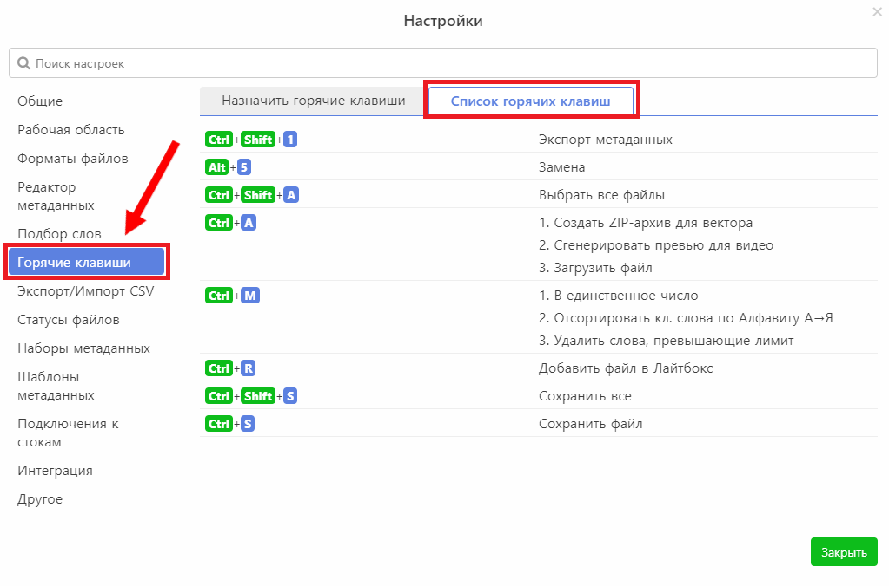

  
### Экспорт/Импорт CSV 

Раздел содержит csv-форматы для импорта/экспорта метаданных. Для добавления нового csv-формата нажмите на кнопку **Создать формат**. Также Вы можете создать шаблон, просто загрузив CSV-файл. Программа всё сделает за Вас. Для этого нажмите на синюю выпадающую кнопку с 3 белыми горизонтальными линиями и выберите в меню “Создать из шаблона”. 

  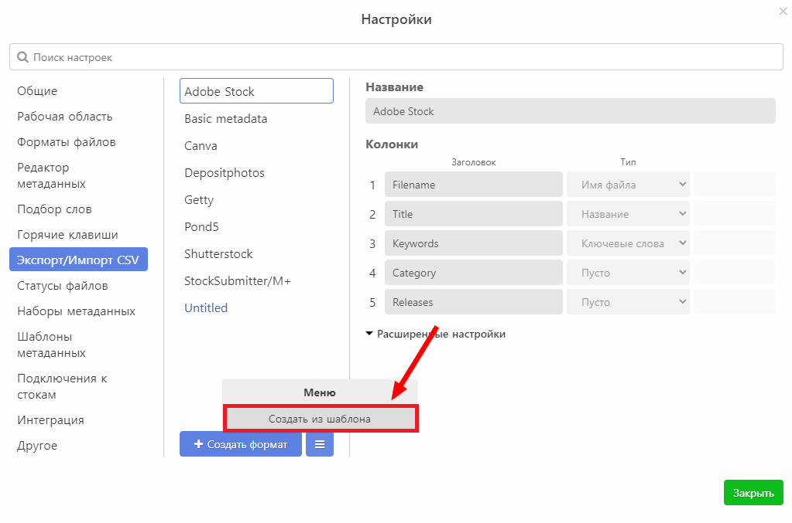

После этого выберите файл и нажмите кнопку “Открыть”.

  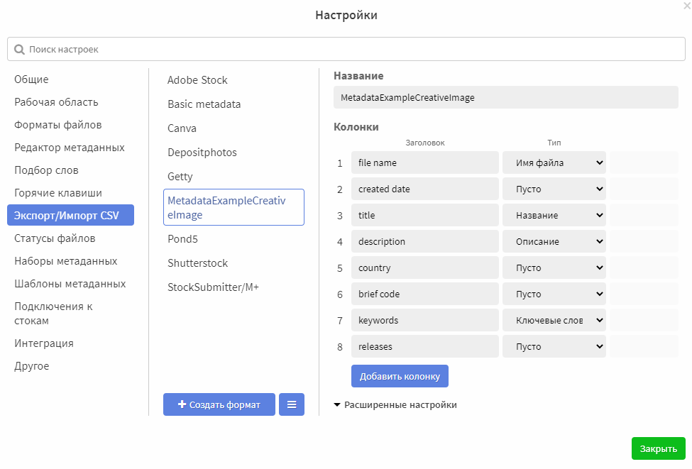

  

###  Статусы файлов

Для управления статусами файлов в настройках есть специальный раздел “Статусы файлов”, где Вы можете создать статус и выбрать ему понравившуюся Вам иконку, цвет, название, привязан ли он к стокам.
  

  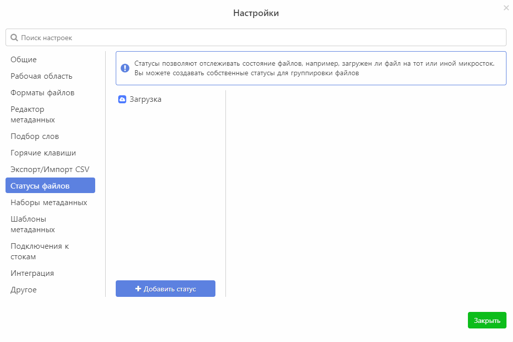

Для создания нажмите на синюю кнопку внизу диалогового окна “Добавить статус”.
  

  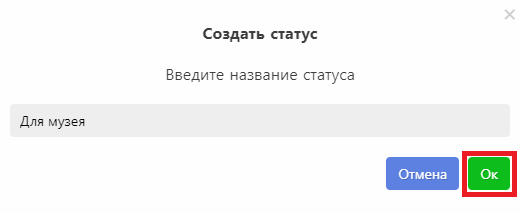

  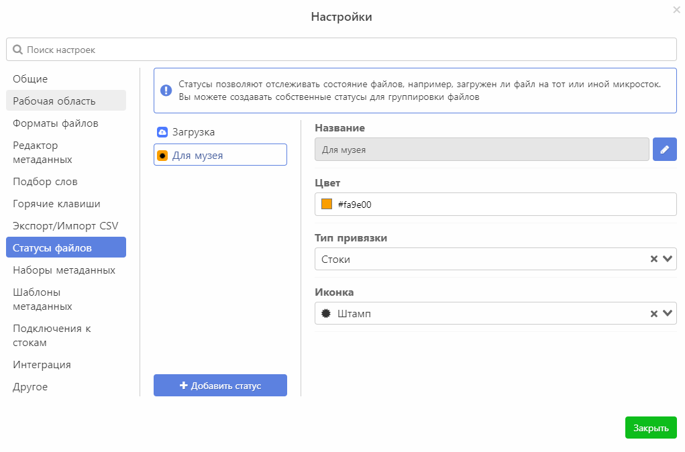

  
### Наборы метаданных

Содержит основные наборы метаданных. Для добавления нового набора метаданных нажмите на кнопку **Добавить набор**.

  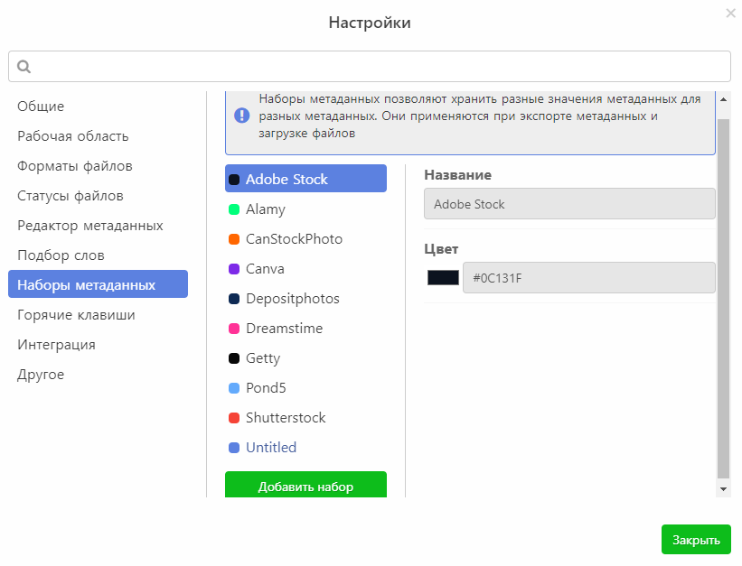

  
### Шаблоны метаданных

Содержит основные шаблоны метаданных. Для добавления нового шаблона нажмите на кнопку **Добавить шаблон**.
  

  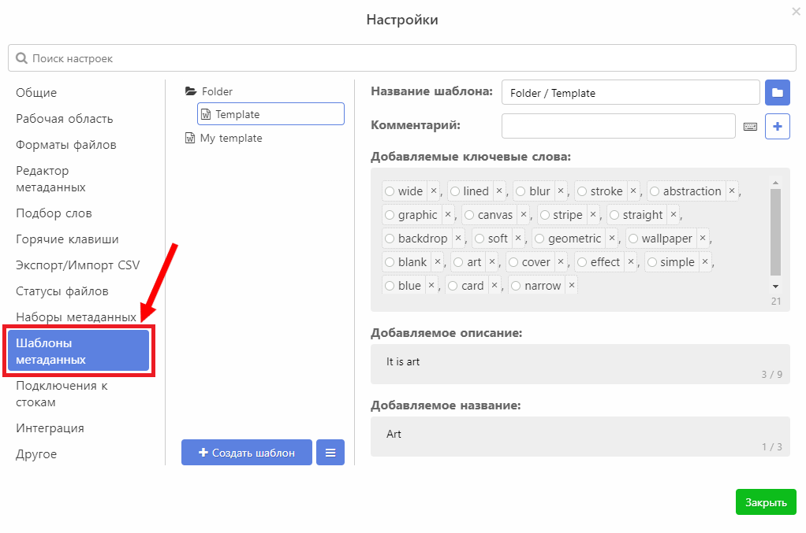

  
### Подключения к стокам

Содержит основные подключения к стокам. Для добавления нового подключения нажмите на кнопку **Добавить новый сток**.
  

  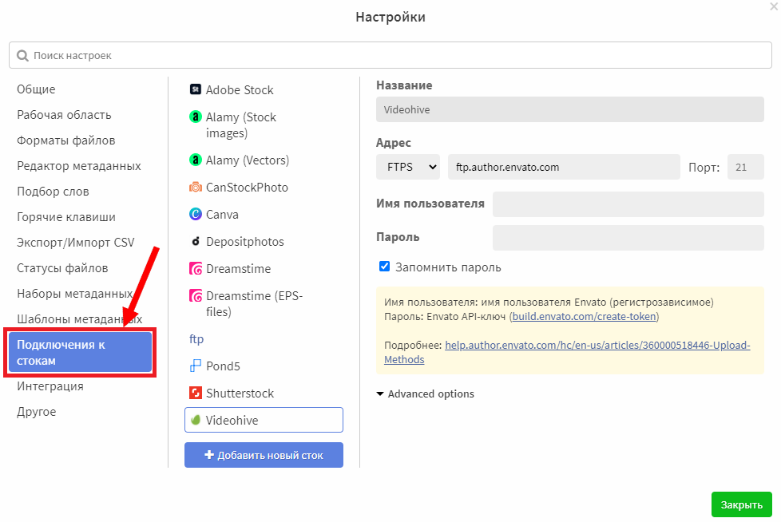

  
### Интеграция 

Позволяет вам сохранять приложения, которые вы часто используете для открытия файлов, а также даёт возможность задать путь до Ghostscript. Подробнее о Ghostscript можно узнать [здесь](#settings-ghostscript-integration).

  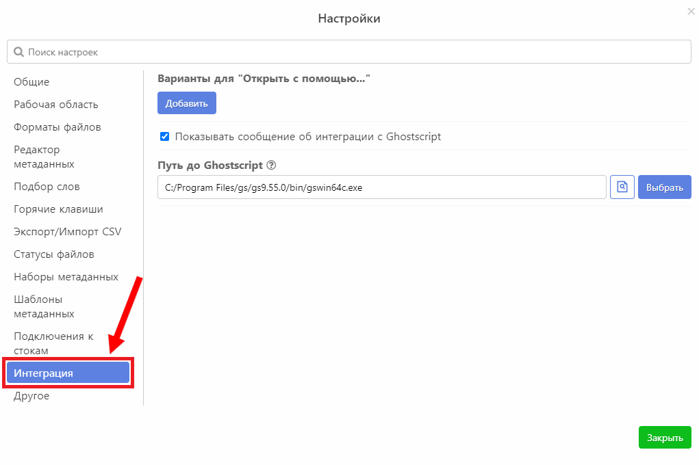

  
### Другое 

В разделе можно очистить кеш превью и открыть папку с логами.

  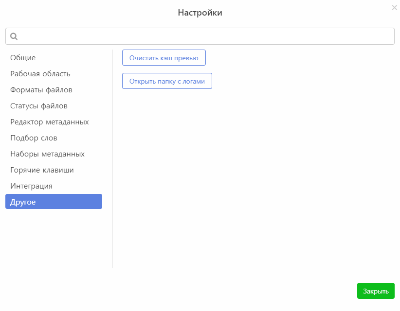

   
### Интеграция с Ghostscript (Windows)
  

  
Mac-версия **ImStocker Studio** поддерживает генерацию превью для EPS-файлов "из коробки", а чтобы этому научить Windows-версию, можно интегрировать IMS Studio с [Ghostscript](https://www.ghostscript.com/releases/gsdnld.html)

Для этого установите Ghostscript на компьютер, далее откройте раздел "Интеграция" и нажмите кнопку автопоиска

  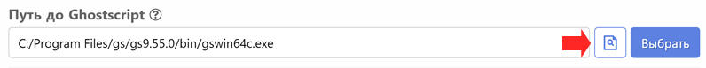

Если он не смог определить место установки Ghostscript, то вы можете задать его вручную, нажав кнопку "Выбрать". Вы должны найти и выбрать исполняемый файл **gswin64c.exe** (но не gswin64.exe)

